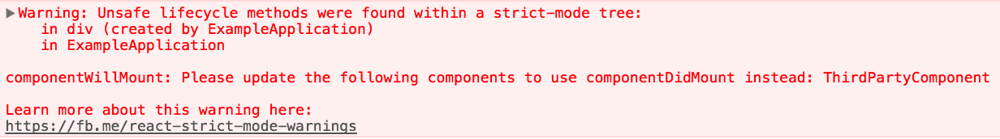

# HTML

## 入门

推荐使用线上 [CodePan]( https://codepen.io/pen?editors=1010 )

默认框架：

```html
<!DOCTYPE html>
<html>
  <head>
    <meta charset="utf-8">
    <title>我的测试站点</title>
  </head>
  <body>
    <p>这是我的页面</p>
  </body>
</html>
```

特殊字符：

| 原义字符 | 等价字符引用 |
| :------- | :----------- |
| <        | &lt;         |
| >        | &gt;         |
| "        | &quot;       |
| '        | &apos;       |
| &        | &amp;        |

注释：

```html
<!-- <p>我在注释内！</p> -->
```

在HTML中应用CSS和JavaScript :

-  link 元素经常位于文档的头部。这个link元素有2个属性，rel="stylesheet"表明这是文档的样式表，而 href包含了样式表文件的路径：

  ```html
  <link rel="stylesheet" href="my-css-file.css">
  ```

- script 部分没必要非要放在文档头部；实际上，把它放在文档的尾部（在`</body>` 标签之前）是一个更好的选择，这样可以确保在加载脚本之前浏览器已经解析了HTML内容（如果脚本加载某个不存在的元素，浏览器会报错）。

  ```html
  <script src="my-js-file.js"></script>
  ```

## 文字处理

段落：p

标题：h1

列表：

- 无序：

  ```html
  <ul>
    <li>豆浆</li>
    <li>油条</li>
    <li>豆汁</li>
    <li>焦圈</li>
  </ul>
  ```

  

- 有序：

  ```html
  <ol>
    <li>沿着条路走到头</li>
    <li>右转</li>
    <li>直行穿过第一个十字路口</li>
    <li>在第三个十字路口处左转</li>
    <li>继续走 300 米，学校就在你的右手边</li>
  </ol>
  ```

- 自定义列表： 以 dl 标签开始。每个自定义列表项以 dt 开始。每个自定义列表项的定义以 dd 开始。 

  ```html
  <dl>
    <dt>内心独白</dt>
      <dd>戏剧中，某个角色对自己的内心活动或感受进行念白表演，这些台词只面向观众，而其他角色不会听到。</dd>
    <dt>语言独白</dt>
      <dd>戏剧中，某个角色把自己的想法直接进行念白表演，观众和其他角色都可以听到。</dd>
    <dt>旁白</dt>
      <dd>戏剧中，为渲染幽默或戏剧性效果而进行的场景之外的补充注释念白，只面向观众，内容一般都是角色的感受、想法、以及一些背景信息等。</dd>
  </dl>
  ```

斜体：em或i

粗体：strong或b

下划线：u

换行：br

 水平分割线 ：hr

## 链接

 通过将文本（或其他内容)转换为a元素内的链接来创建基本链接 。

- href：链接地址

- title： 关于链接的补充有用信息 。 当鼠标指针悬停在链接上时，标题将作为提示信息出现 

-  块状链接：想要将一个图像转换为链接，你只需把图像元素放到a标签中间。 

  ```html
  <a href="https://www.mozilla.org/en-US/">
    
  </a>
  ```

-  download : 默认的保存文件名 

文档片段： 链接到HTML文档的特定部分 。 要做到这一点，你必须首先给要链接到的元素分配一个`id`属性。例如，如果你想链接到一个特定的标题，可以这样做： 

```html
<h2 id="Mailing_address">Mailing address</h2>

<!-->链接到那个特定的id，您可以在URL的结尾使用一个井号指向它<-->
<p>Want to write us a letter? Use our <a href="contacts.html#Mailing_address">mailing address</a>.</p>

<!-->甚至可以在同一份文档下，通过链接文档片段，来链接到同一份文档的另一部分：<-->
<p>The <a href="#Mailing_address">company mailing address</a> can be found at the bottom of this page.</p>
```

电子邮件链接 ： mailto:link （链接）  。链接简单说明收件人的电子邮件地址。 

```html
<a href="mailto:nowhere@mozilla.org">Send email to nowhere</a>
```

 实际上，邮件地址甚至是可选的。如果你忘记了（也就是说，你的`href`仅仅只是简单的"`mailto:`"），一个新的发送电子邮件的窗口也会被用户的邮件客户端打开，只是没有收件人的地址信息，这通常在“分享”链接是很有用的，用户可以发送给他们选择的地址邮件 

 除了电子邮件地址，您还可以提供其他信息。事实上，任何标准的邮件头字段可以被添加到你提供的邮件URL。 其中最常用的是主题(subject)、抄送(cc)和主体(body) (这不是一个真正的头字段，但允许您为新邮件指定一个短内容消息)。 每个字段及其值被指定为查询项。 

```html
<a href="mailto:nowhere@mozilla.org?cc=name2@rapidtables.com&bcc=name3@rapidtables.com&subject=The%20subject%20of%20the%20email&body=The%20body%20of%20the%20email">
  Send mail with cc, bcc, subject and body
</a>
```

>  **注意:** 每个字段的值必须是URL编码的。 也就是说，不能有非打印字符（不可见字符比如制表符、换行符、分页符）和空格 [percent-escaped](http://en.wikipedia.org/wiki/Percent-encoding). 同时注意使用问号（`?`）来分隔主URL与参数值，以及使用&符来分隔`mailto:`中的各个参数。 这是标准的URL查询标记方法。阅读 [The GET method](https://developer.mozilla.org/en-US/docs/Learn/HTML/Forms/Sending_and_retrieving_form_data#The_GET_method) 以了解哪种URL查询标记方法是更常用的。 

## 图片

 用img元素来把图片放到网页上。它是一个空元素（它不需要包含文本内容或闭合标签），最少只需要一个 src（一般读作其全称 *source）*来使其生效。

-  src 属性：包含了指向我们想要引入的图片的路径，可以是相对路径或绝对URL，就像a 元素的href属性一样。
- alt： 对图片的文字描述，用于在图片无法显示或不能被看到的情况。 
- width：宽度
- height：高度
- title： 给我们一个鼠标悬停提示，看起来就像链接标题 

```html
<div class="figure">
  
  <p>曼彻斯特大学博物馆展出的一只霸王龙的化石</p>
</div>
```

 有一个更好的做法是使用 HTML5 的figure和$ <figcaption元素，它正是为此而被创造出来的：为图片提供一个语义容器，在标题和图片之间建立清晰的关联。我们之前的例子可以重写为: 

```html
<figure>
  
  <figcaption>曼彻斯特大学博物馆展出的一只霸王龙的化石</figcaption>
</figure>
```

 这个figcaption元素 告诉浏览器和其他辅助的技术工具这段说明文字描述了figure元素的内容. 

注意figure里不一定要是一张图片，只要是一个这样的独立内容单元：

- 用简洁、易懂的方式表达意图。
- 可以置于页面线性流的某处。
- 为主要内容提供重要的补充说明。

 figure可以是几张图片、一段代码、音视频、方程、表格或别的。

## 音频和视频

视频video： 嵌入一段视频。 

- src： 指向你想要嵌入网页当中的视频资源 

- controls： 用户必须能够控制视频和音频的回放功能。你可以使用 `controls` 来包含浏览器提供的控件界面，同时你也可以使用合适的JavaScript API 创建自己的界面。界面中至少要包含开始、停止以及调整音量的功能。 

- video **标签内的内容** ： 这个叫做**后备内容** — 当浏览器不支持 video  标签的时候，就会显示这段内容  ，这使得我们能够对旧的浏览器提供回退内容。你可以添加任何后备内容，在这个例子中我们提供了一个指向这个视频文件的链接，从而使用户至少可以访问到这个文件，而不会局限于浏览器的支持。 

  ```html
  <video src="rabbit320.webm" controls>
    <p>你的浏览器不支持 HTML5 视频。可点击<a href="rabbit320.mp4">此链接</a>观看</p>
  </video>
  ```

 如果你尝试使用像 Safari 或者 Internet Explorer 这些浏览器来访问上面的链接。视频并不会播放，这是因为不同的浏览器对视频格式的支持不同。像 MP3、MP4、WebM这些术语叫做容器格式。他们定义了构成媒体文件的音频轨道和视频轨道的储存结构，其中还包含描述这个媒体文件的元数据，以及用于编码的编码译码器等等。 

- WebM 容器通常包括了 Opus 或 Vorbis 音频和 VP8/VP9 视频。这在所有的现代浏览器中都支持，除了他们的老版本。
- MP4 容器通常包括 AAC 以及 MP3 音频和 H.264 视频。这在所有的现代浏览器中都支持，还有 Internet Explorer。
- 老式的 Ogg 容器往往支持 Ogg Vorbis  音频和 Ogg Theora 视频。主要在 Firefox 和 Chrome 当中支持，不过这个容器已经被更强大的 WebM 容器所取代。

 使用几个不同格式的文件来兼容不同的浏览器。 

```html
<video controls>
  <source src="rabbit320.mp4" type="video/mp4">
  <source src="rabbit320.webm" type="video/webm">
  <p>你的浏览器不支持 HTML5 视频。可点击<a href="rabbit320.mp4">此链接</a>观看</p>
</video>
```

 在这个例子当中，浏览器将会检查source标签，并且播放第一个与其自身 codec 相匹配的媒体。你的视频应当包括 WebM 和 MP4 两种格式，这两种在目前已经足够支持大多数平台和浏览器。  每个source标签页含有一个 type 属性，这个属性是可选的，但是建议你添加上这个属性 — 它包含了视频文件的MIME types，同时浏览器也会通过检查这个属性来迅速的跳过那些不支持的格式。如果你没有添加 type属性，浏览器会尝试加载每一个文件，直到找到一个能正确播放的格式，这样会消耗掉大量的时间和资源。 

新的特征：

- width和height：视频尺寸
- autoplay： 这个属性会使音频和视频内容立即播放，即使页面的其他部分还没有加载完全。建议不要应用这个属性在你的网站上，因为用户们会比较反感自动播放的媒体文件。 
- loop： 可以让音频或者视频文件循环播放。同样不建议使用，除非有必要。 
- muted： 导致媒体播放时，默认关闭声音。 
- poster： 指向了一个图像的URL，这个图像会在视频播放前显示。通常用于粗略的预览或者广告。 
- preload：用来缓冲较大的文件，有3个值可选：
  - `"none"` ：不缓冲
  - `"auto"` ：页面加载后缓存媒体文件
  - `"metadata"` ：仅缓冲文件的元数据

```html
<video controls width="400" height="400"
       autoplay loop muted
       poster="poster.png">
  <source src="rabbit320.mp4" type="video/mp4">
  <source src="rabbit320.webm" type="video/webm">
  <p>你的浏览器不支持 HTML5 视频。可点击<a href="rabbit320.mp4">此链接</a>观看</p>
</video>
```

audio和video 使用方式几乎完全相同，有一些细微的差别。

-  不支持 `width`/`height` 属性 — 由于其并没有视觉部件，也就没有可以设置 `width`/`height` 的内容。 
-  也不支持 `poster` 属性 — 同样，没有视觉部件。 

## 其他嵌入

iframe 元素旨在允许您将其他Web文档嵌入到当前文档中。这很适合将第三方内容纳入您的网站 ， 例如来自在线视频提供商的视频等评论系统，在线地图提供商，广告横幅等。 

- allowfullscreen： 可以通过全屏API 设置为全屏模式（稍微超出本文的范围）。 
- frameborder： 如果设置为1，则会告诉浏览器在此框架和其他框架之间绘制边框，这是默认行为。0删除边框。不推荐这样设置，因为在 CSS中 可以更好地实现相同的效果。 （border：none）
- src：URL路径
- width和height：宽度和高度
- 备选内容： 可以在iframe></iframe标签之间包含备选内容，如果浏览器不支持iframe，将会显示备选内容，这种情况下，我们已经添加了一个到该页面的链接。现在您几乎不可能遇到任何不支持iframe的浏览器。 
- sandbox: 该属性需要在已经支持其他iframe功能（例如IE 10及更高版本）但稍微更现代的浏览器上才能工作，该属性可以提高安全性设置。 给嵌入的内容仅能完成自己工作的权限*。*  一个允许包含在其里的代码以适当的方式执行或者用于测试，但不能对其他代码库（意外或恶意）造成任何损害的容器称为sandbox。  应该使用没有参数的`sandbox`属性来强制执行所有可用的限制 。 如果绝对需要，您可以逐个添加权限（`sandbox=""`属性值内）  其中重要的一点是，你**永远不应该**同时添加`allow-scripts`和`allow-same-origin`到你的`sandbox`属性中-在这种情况下，嵌入式内容可以绕过阻止站点执行脚本的同源安全策略，并使用JavaScript完全关闭沙盒。 

 **注意**：为了提高速度，在主内容完成加载后，使用JavaScript设置iframe的`src`属性是个好主意。这使您的页面可以更快地被使用，并减少您的官方页面加载时间 

embed和object 是用来嵌入多种类型的外部内容的通用嵌入工具，其中包括像Java小程序和Flash，PDF（可在浏览器中显示为一个PDF插件）这样的插件技术，甚至像视频，SVG和图像的内容！ 

 然而，您不太可能使用这些元素 - Applet几年来一直没有被使用；由于许多原因，Flash不再受欢迎  ；PDF更倾向于被链接而不是被嵌入；其他内容，如图像和视频都有更优秀、更容易元素来处理。插件和这些嵌入方法真的是一种传统技术，我们提及它们主要是为了以防您在某些情况下遇到问题，比如内部网或企业项目等。 

 如果您发现自己需要嵌入插件内容，那么您至少需要一些这样的信息： 


注意：object需要data属性，type属性或两者。 如果您同时使用这两个，您也可以使用该`typemustmatch`属性  。`typemustmatch`保持嵌入文件不运行，除非`type`属性提供正确的媒体类型。`typemustmatch`因此，当您嵌入来自不同来源的内容（可以防止攻击者通过插件运行任意脚本）时，可以赋予重要的安全优势。 

[举例1]( https://mdn.github.io/learning-area/html/multimedia-and-embedding/other-embedding-technologies/embed-flash.html )和[举例2](http://mdn.github.io/learning-area/html/multimedia-and-embedding/other-embedding-technologies/object-pdf.html)：

```html
<!-->使用该embed元素嵌入Flash影片的示例<-->
<embed src="whoosh.swf" quality="medium"
       bgcolor="#ffffff" width="550" height="400"
       name="whoosh" align="middle" allowScriptAccess="sameDomain"
       allowFullScreen="false" type="application/x-shockwave-flash"
       pluginspage="http://www.macromedia.com/go/getflashplayer">
       
<!-->一个object将PDF嵌入一个页面的例子<-->
<object data="mypdf.pdf" type="application/pdf"
        width="800" height="1200" typemustmatch>
  <p>You don't have a PDF plugin, but you can <a href="myfile.pdf">download the PDF file.</a></p>
</object>
```

canvas用于JavaScript生成的2D和3D图形 . 默认情况下 canvas 元素没有边框和内容。 

```html
<canvas id="myCanvas" width="200" height="100"
style="border:1px solid #000000;">
</canvas>
```

 canvas 元素本身是没有绘图能力的。所有的绘制工作必须在 JavaScript 内部完成： 

```javascript
var c=document.getElementById("myCanvas"); //找到canvas元素
var ctx=c.getContext("2d"); //创建context对象
//再对context对象进行处理
```

## 矢量图形

 在网上，你会和两种类型的图片打交道 — 位图和矢量图: 

- 位图使用像素网格来定义 — 一个位图文件精确得包含了每个像素的位置和它的色彩信息。流行的位图格式包括 Bitmap (`.bmp`), PNG (`.png`), JPEG (`.jpg`), and GIF (`.gif`.)
- 矢量图使用算法来定义 — 一个矢量图文件包含了图形和路径的定义，电脑可以根据这些定义计算出当它们在屏幕上渲染时应该呈现的样子。SVG格式可以让我们创造用于 Web 的精彩的矢量图形。

 我们来一个例子 , 并排展示了两个看起来一致的图像，一个红色的五角星以及黑色的阴影。不同的是，左边的是 PNG，而右边的是 SVG 图像。  当你放大网页的时候，区别就会变得明显起来 — 随着你的放大，PNG 图片变得像素化了，因为它存储是每个像素的颜色和位置信息 — 当它被放大时，每个像素就被放大以填满屏幕上更多的像素，所以图像就会开始变得马赛克感觉。矢量图像看起来仍然效果很好且清晰，因为无论它的尺寸如何，都使用算法来计算出图像的形状，仅仅是根据放大的倍数来调整算法中的值。 


 此外，矢量图形相较于同样的位图，通常拥有更小的体积，因为它们仅需储存少量的算法，而不是逐个储存每个像素的信息。 

SVG是用于描述矢量图像的XML语言。 它基本上是像HTML一样的标记，只是你有许多不同的元素来定义要显示在图像中的形状，以及要应用于这些形状的效果。 SVG用于标记图形，而不是内容。 非常简单，你有一些元素来创建简单图形，如circle和rect。更高级的SVG功能包括feColorMatrix（使用变换矩阵转换颜色）animate（矢量图形的动画部分）和mask（在图像顶部应用模板） 

```html
<svg version="1.1"
     baseProfile="full"
     width="300" height="200"
     xmlns="http://www.w3.org/2000/svg">
  <rect width="100%" height="100%" fill="black" /> //黑色矩形
  <circle cx="150" cy="100" r="90" fill="blue" /> //蓝色圆形
</svg>
```

 从上面的例子可以看出，SVG很容易手工编码。  但是对于复杂的图像，这很快就开始变得非常困难。  为了创建SVG图像，大多数人使用矢量图形编辑器，如 [Inkscape](https://inkscape.org/en/) 或 [Illustrator](https://en.wikipedia.org/wiki/Adobe_Illustrator)。 这些软件包允许您使用各种图形工具创建各种插图，并创建照片的近似值（例如Inkscape的跟踪位图功能）。 

SVG除了迄今为止所描述的以外还有其他优点：

- 矢量图像中的文本仍然可访问。
- SVG 可以很好地适应样式/脚本，因为图像的每个组件都是可以通过CSS或通过JavaScript编写的样式的元素。

那么为什么会有人想使用光栅图形而不是SVG？ 其实 SVG 确实有一些缺点：

- SVG非常容易变得复杂，这意味着文件大小会增加; 复杂的SVG也会在浏览器中占用很长的处理时间。
- SVG可能比栅格图像更难创建，具体取决于您尝试创建哪种图像。
- 旧版浏览器不支持SVG，因此如果您需要在网站上支持旧版本的 IE，则可能不适合（SVG从IE9开始得到支持）。

由于上述原因，光栅图形更适合照片那样复杂精密的图像。


将SVG添加到页面：

快捷方式： 需要一个`height`或`width`属性（或者如果您的SVG没有固有的宽高比）。 

```html

```

优点：

- 快速，熟悉的图像语法与`alt`属性中提供的内置文本等效。
- 可以通过在img元素嵌套`src`，使图像轻松地成为超链接。

缺点：

- 无法使用JavaScript操作图像。
- 如果要使用CSS控制SVG内容，则必须在SVG代码中包含内联CSS样式。 （从SVG文件调用的外部样式表不起作用）
- 不能用CSS伪类来重设图像样式（如`:focus`）。

 对于不支持SVG（IE 8及更低版本，Android 2.3及更低版本）的浏览器，您可以从`src`属性引用PNG或JPG，并使用`srcset`属性 只有最近的浏览器才能识别）来引用SVG。 

```html

```

 还可以在文本编辑器中打开SVG文件，复制SVG代码，并将其粘贴到HTML文档中 - 这有时称为将**SVG内联**或**内联SVG**。确保您的SVG代码在svg></svg标签中（不要在外面添加任何内容）。 

```html
<svg width="300" height="200">
    <rect width="100%" height="100%" fill="green" />
</svg>
```

优点:

- 将 SVG 内联减少 HTTP 请求，可以减少加载时间。
- 您可以为 SVG 元素分配`class`和`id`，并使用 CSS 修改样式，无论是在SVG中，还是 HTML 文档中的 CSS 样式规则。 实际上，您可以使用任何SVG外观属性作为CSS属性。
- 内联SVG是唯一可以让您在SVG图像上使用CSS交互（如`:focus`）和CSS动画的方法（即使在常规样式表中）。
- 您可以通过将 SVG 标记包在<a>元素中，使其成为超链接。

缺点:

- 这种方法只适用于在一个地方使用的SVG。多次使用会导致资源密集型维护（resource-intensive maintenance）。
- 额外的 SVG 代码会增加HTML文件的大小。
- 浏览器不能像缓存普通图片一样缓存内联SVG。
- 您可能会在foreignObject元素中包含回退，但支持 SVG 的浏览器仍然会下载任何后备图像。你需要考虑仅仅为支持过时的浏览器，而增加额外开销是否真的值得。


可以使用iframe 嵌入 SVG 文档 :

```html
<iframe src="triangle.svg" width="500" height="500" sandbox>
    
</iframe>
```

这绝对不是最好的方法：

缺点:

- 如你所知， `iframe`有一个回退机制，如果浏览器不支持`iframe`，则只会显示回退。
- 此外，除非 SVG 和您当前的网页具有相同的origin，否则你不能在主页面上使用 JavaScript 来操纵 SVG。

## 响应式图片

不同屏幕上图片大小不一样。实际上，CSS是比HTML更好的响应式设计的工具。

 我们可以使用两个新的属性——`srcset` 和 `sizes`——来提供更多额外的资源图像和提示 

```html

```

**srcset**定义了我们允许浏览器选择的图像集，以及每个图像的大小。在每个逗号之前，我们写：

1. 一个**文件名** (`elva-fairy-480w.jpg`.)
2. 一个空格
3. **图像的固有宽度**（以像素为单位）（480w）——注意到这里使用`w`单位，而不是你预计的`px`。这是图像的真实大小，可以通过检查你电脑上的图片文件找到（例如，在Mac上，你可以在Finder上选择这个图像，然后按 Cmd + I 来显示信息）。

 **sizes**定义了一组媒体条件（例如屏幕宽度）并且指明当某些媒体条件为真时，什么样的图片尺寸是最佳选择 。有了这些属性，浏览器会：

1. 查看设备宽度
2. 检查`sizes`列表中哪个媒体条件是第一个为真
3. 查看给予该媒体查询的槽大小
4. 加载`srcset`列表中引用的最接近所选的槽大小的图像

## 表格

最好不要用html设计表格。

```html
<table>
  <tr>
    <td>&nbsp;</td>
    <td>Knocky</td>
    <td>Flor</td>
    <td>Ella</td>
    <td>Juan</td>
  </tr>
  <tr>
    <td>Breed</td>
    <td>Jack Russell</td>
    <td>Poodle</td>
    <td>Streetdog</td>
    <td>Cocker Spaniel</td>
  </tr>
  <tr>
    <td>Age</td>
    <td>16</td>
    <td>9</td>
    <td>10</td>
    <td>5</td>
  </tr>
  <tr>
    <td>Owner</td>
    <td>Mother-in-law</td>
    <td>Me</td>
    <td>Me</td>
    <td>Sister-in-law</td>
  </tr>
  <tr>
    <td>Eating Habits</td>
    <td>Eats everyone's leftovers</td>
    <td>Nibbles at food</td>
    <td>Hearty eater</td>
    <td>Will eat till he explodes</td>
  </tr>
</table>
```

结果显示：


 使用 `colspan` 让 "Animals", "Hippopotamus", 和 "Crocodile" 占 2 个单元格的宽度。  使用 `rowspan` 让 "Horse" 和 "Chicken" 占 2 个单元格的高度。 

```html
    <table>
      <tr>
        <th colspan="2">Animals</th>
      </tr>
      <tr>
        <th colspan="2">Hippopotamus</th>
      </tr>
      <tr>
        <th rowspan="2">Horse</th>
        <td>Mare</td>
      </tr>
      <tr>
        <td>Stallion</td>
      </tr>
      <tr>
        <th colspan="2">Crocodile</th>
      </tr>
      <tr>
        <th rowspan="2">Chicken</th>
        <td>Hen</td>
      </tr>
      <tr>
        <td>Rooster</td>
      </tr>
    </table>

```


 HTML有一种方法可以定义整列数据的样式信息：就是col和 colgroup 元素。 它们存在是因为如果你想让一列中的每个数据的样式都一样，那么你就要为每个数据都添加一个样式 .

```html
<table>
  <colgroup>
    <col> //第一列没什么
    <col style="background-color: yellow"> //第二列是黄的
  </colgroup>
  <tr>
    <th>Data 1</th>
    <th>Data 2</th>
  </tr>
  <tr>
    <td>Calcutta</td>
    <td>Orange</td>
  </tr>
  <tr>
    <td>Robots</td>
    <td>Jazz</td>
  </tr>
</table>
```


 可以为你的表格增加一个标题，通过caption元素，再把caption元素放入table元素中. 

```html
<table>
  <caption>Dinosaurs in the Jurassic period</caption>

  ...
</table>
```

 使用thead,tfoot ,和 tbody, 这些元素允许你把表格中的部分标记为表头、页脚、正文部分。 

- thead需要嵌套在 table 元素中，放置在头部的位置，因为它通常代表第一行，第一行中往往都是每列的标题，但是不是每种情况都是这样的。如果你使用了 col>/<colgroup 元素，那么thead> $元素就需要放在它们的下面。
-  tfoot需要嵌套在 table 元素中，放置在底部 (页脚)的位置，一般是最后一行，往往是对前面所有行的总结，比如，你可以按照预想的方式将 tfoot放在表格的底部，或者就放在 thead的下面。(浏览器仍将它呈现在表格的底部)
-  tbody需要嵌套在 table 元素中，放置在 thead的下面或者是 tfoot的下面，这取决于你如何设计你的结构。(tfoot放在thead下面也可以生效.)

```html
<!DOCTYPE html>
<html>
  <head>
    <meta charset="utf-8">
    <title>My spending record</title>
    <link href="minimal-table.css" rel="stylesheet" type="text/css">
    <style>
        tbody {
          font-size: 90%;
          font-style: italic;
        }

        tfoot {
          font-weight: bold;
        }
    </style>
  </head>
  <body>
    <h1>My spending record</h1>

      <table>
        <caption>How I chose to spend my money</caption>
        <thead>
          <tr>
            <th>Purchase</th>
            <th>Location</th>
            <th>Date</th>
            <th>Evaluation</th>
            <th>Cost (€)</th>
          </tr>
        </thead>
        <tfoot>
          <tr>
            <td colspan="4">SUM</td>
            <td>118</td>
          </tr>
        </tfoot>
        <tbody>
          <tr>
            <td>Haircut</td>
            <td>Hairdresser</td>
            <td>12/09</td>
            <td>Great idea</td>
            <td>30</td>
          </tr>
          <tr>
            <td>Lasagna</td>
            <td>Restaurant</td>
            <td>12/09</td>
            <td>Regrets</td>
            <td>18</td>
          </tr>
          <tr>
            <td>Shoes</td>
            <td>Shoeshop</td>
            <td>13/09</td>
            <td>Big regrets</td>
            <td>65</td>
          </tr>
          <tr>
            <td>Toothpaste</td>
            <td>Supermarket</td>
            <td>13/09</td>
            <td>Good</td>
            <td>5</td>
          </tr>
        </tbody>
    </table>

  </body>
</html>
```


 scope 属性 :标注是行标题或列标题。

```html
<thead>
  <tr>
    <th scope="col">Purchase</th>
    <th scope="col">Location</th>
    <th scope="col">Date</th>
    <th scope="col">Evaluation</th>
    <th scope="col">Cost (€)</th>
  </tr>
</thead>

<tr>
  <th scope="row">Haircut</th>
  <td>Hairdresser</td>
  <td>12/09</td>
  <td>Great idea</td>
  <td>30</td>
</tr>
```

 `scope` 还有两个可选的值 ： `colgroup` 和 `rowgroup`。这些用于位于多个列或行的顶部的标题。 

如果要替代 `scope` 属性，可以使用 `id` 和 `headers` 属性来创造标题与单元格之间的联系。使用方法如下:

1. 为每个` 元素添加一个唯一的 `id 。
2. 为每个 ` 元素添加一个 `headers` 属性。每个单元格的`headers 属性需要包含它从属于的所有标题的id，之间用空格分隔开。

这会给你的HTML表格中每个单元格的位置一个明确的定义。像一个电子表格一样，通过 headers 属性来定义属于哪些行或列。为了让它工作良好，表格同时需要列和行标题。

```html
<thead>
  <tr>
    <th id="purchase">Purchase</th>
    <th id="location">Location</th>
    <th id="date">Date</th>
    <th id="evaluation">Evaluation</th>
    <th id="cost">Cost (€)</th>
  </tr>
</thead>
<tbody>
<tr>
  <th id="haircut">Haircut</th>
  <td headers="location haircut">Hairdresser</td>
  <td headers="date haircut">12/09</td>
  <td headers="evaluation haircut">Great idea</td>
  <td headers="cost haircut">30</td>
</tr>

  ...

</tbody>
```

 **注意**: 这个放进为标题单元格和数据单元格之间创造了非常精确的联系。但是这个方法使用了大量的标记，所以容错率比较低。 

# JavaScript

## 基础

内部 JavaScript：在html内， 在 `</body>` 标签结束前插入以下代码 

```html
<script>

  // 在此编写 JavaScript 代码

</script>
```

外部 JavaScript：

```html
<script src="script.js" async></script>
```

async 和 defer：

浏览器遇到 `async` 脚本时不会阻塞页面渲染，而是直接下载然后运行。这样脚本的运行次序就无法控制，只是脚本不会阻止剩余页面的显示。**当页面的脚本之间彼此独立，且不依赖于本页面的其它任何脚本时**，`async` 是最理想的选择。 

```html
<script async src="js/vendor/jquery.js"></script>

<script async src="js/script2.js"></script>

<script async src="js/script3.js"></script>
```

 可使用 `defer` 属性，**脚本将按照在页面中出现的顺序加载和运行**： 

```html
<script defer src="js/vendor/jquery.js"></script>

<script defer src="js/script2.js"></script>

<script defer src="js/script3.js"></script>
```

注释：

```javascript
// 我是一条注释
/*
  我也是
  一条注释
*/
```

创建对象： 你可以使用关键字 `let` （旧代码中使用 `var`）和一个名字来创建变量（请参阅 [let 和 var 之间的区别](https://developer.mozilla.org/zh-CN/docs/Learn/JavaScript/First_steps/Variables#var_与_let_的区别)）。常量用于存储不希望更改的数据，用关键字 `const` 创建 。

函数：

```javascript
function checkGuess() {
  alert('我是一个占位符');
}
```

比较运算符：`===` 和 `!==`

事件： 侦听事件发生的结构称为**事件监听器（Event Listener）**，响应事件触发而运行的代码块被称为**事件处理器（Event Handler）**。 

```javascript
//guessSubmit 按钮添加了一个事件监听器，监听事件的类型（本例中为“click”），和当事件发生时我们想要执行的代码（本例中为 checkGuess() 函数）
guessSubmit.addEventListener('click', checkGuess);
```

变量： 声明一个变量的语法是在 **`var` 或 `let` 关键字**之后加上这个变量的名字 。

**var 与 let 的区别**：1. var支持变量提升（在任意位置 声明变量总是等效于在代码开头声明 ， 这意味着变量可以在声明之前使用 ）2.  当你使用 `var` 时，可以根据需要多次声明相同名称的变量，但是 `let` 不能。 

变量类型：Number  String   Boolean   Array   Object 

 **匿名函数** — 它没有函数名! 它也不会自己做任何事情。 你通常使用匿名函数以及事件处理程序 .

```javascript
var myButton = document.querySelector('button');

myButton.onclick = function() {
  alert('hello');
}
```

 **事件**是您在编程时系统内发生的动作或者发生的事情——系统会在事件出现时产生或触发某种信号，并且会提供一个自动加载某种动作（列如：运行一些代码）的机制 。 如果您想看看更多其他的事件 ，请移步至MDN的[Event reference](https://developer.mozilla.org/en-US/docs/Web/Events)。 

 每个可用的事件都会有一个**事件处理器**，也就是事件触发时会运行的代码块。当我们定义了一个用来回应事件被激发的代码块的时候，我们说我们**注册了一个事件处理器**。注意事件处理器有时候被叫做**事件监听器**——从我们的用意来看这两个名字是相同的，尽管严格地来说这块代码既监听也处理事件。监听器留意事件是否发生，然后处理器就是对事件发生做出的回应。 

 访问属性的方式 ：

```javascript
//点表示法
person.age
person.name.first

//括号表示法
person['age']
person['name']['first']
```


# DOM

 文档对象模型 (DOM) 是HTML和XML文档的编程接口。它提供了对文档的结构化的表述，并定义了一种方式可以使从程序中对该结构进行访问，从而改变文档的结构，样式和内容。  文档对象模型（DOM）提供了对同一份文档的另一种表现，存储和操作的方式。 DOM是web页面的完全的面向对象表述，它能够使用如 JavaScript等脚本语言进行修改。 

 例如，W3C DOM 中指定下面代码中的`getElementsByTagName`方法必须要返回所有`<p>` 元素的列表： 

```javascript
paragraphs = document.getElementsByTagName("P");
// paragraphs[0] is the first <p> element
// paragraphs[1] is the second <p> element, etc.
alert(paragraphs[0].nodeName);
```

 所有操作和创建web页面的属性，方法和事件都会被组织成对象的形式（例如， `document `对象表示文档本身， `table` 对象实现了特定的 `HTMLTableElement` DOM 接口来访问HTML 表格等）。 

## DOM 和 JavaScript

虽然是用JavaScript编写的， 却可以通过 DOM 来访问文档和其中的元素。DOM 并不是一个编程语言，但如果没有DOM， JavaScript 语言也不会有任何网页，XML页面以及涉及到的元素的概念或模型。 

JavaScript可以访问和操作存储在DOM中的内容 ，因此我们可以写成这个近似的等式：
$$
API (web 或 XML 页面) = DOM + JS (脚本语言)
$$

 DOM 被设计成与特定编程语言相独立，使文档的结构化表述可以通过单一，一致的API获得。尽管我们在本参考文档中会专注于使用JavaScript， 但DOM 也可以使用其他的语言来实现 .

## 访问DOM

 当您在创建一个脚本时-无论是使用内嵌 `<script>`元素或者使用在web页面脚本加载的方法— 您都可以使用 `document`或 `window` 元素的API来操作文档本身或获取文档的子类 .

 当文档被装载（以及当整个DOM可以被有效使用时），JavaScript可以设定一个函数来运行。下面的函数会创建一个新的 H1元素，为元素添加文本，并将H1添加在文档树中。  

```html
<html>
  <head>
    <script>
    // run this function when the document is loaded
       window.onload = function() {
    // create a couple of elements 
    // in an otherwise empty HTML page
       heading = document.createElement("h1");
       heading_text = document.createTextNode("Big Head!");
       heading.appendChild(heading_text);
       document.body.appendChild(heading);
      }
    </script>
  </head>
  <body>
  </body>
</html>
```

## 数据类型

|数据类型|描述|
| -------------- | ------------------------------------------------------------ |
| `document`     | 当一个成员返回 `document` 对象 （例如，元素的 `**ownerDocument**` 属性返回它所属于 `document` ) ，这个对象就是root `document` 对象本身。 [DOM `document` Reference](https://developer.mozilla.org/en-US/docs/DOM/document) 一章对 `document` 对象进行了描述。 |
| `element`      | `element` 是指由 DOM API 中成员返回的类型为 `element` 的一个元素或节点。 例如， document.createElement()方法会返回一个 `node` 的对象引用，也就是说这个方法返回了在DOM中创建的 `element`。 `element` 对象实现了 DOM `Element` 接口以及更基本的 `Node` 接口，参考文档将两者都包含在内。 |
| `nodeList`     | `nodeList` 是一个元素的数组，如从 document.getElementsByTagName() 方法返回的就是这种类型。 `nodeList` 中的条目由通过下标有两种方式进行访问：<br> - list.item(1)<br>- list[1]<br>两种方式是等价的，第一种方式中 **`item()`** 是 `nodeList` 对象中的单独方法。 后面的方式则使用了经典的数组语法来获取列表中的第二个条目。 |
| `attribute`    | 当 `attribute` 通过成员函数 (例如，通过 **`createAttribute()`**方法) 返回时，它是一个为属性暴露出专门接口的对象引用。DOM中的属性也是节点，就像元素一样，只不过您可能会很少使用它。 |
| `namedNodeMap` | `namedNodeMap` 和数组类似，但是条目是由name或index访问的，虽然后一种方式仅仅是为了枚举方便，因为在 list 中本来就没有特定的顺序。 出于这个目的，  `namedNodeMap` 有一个 item() 方法，你也可以从  `namedNodeMap` 添加或移除条目。 |

## DOM接口

 可以用来操作DOM层级的对象以及事物进行了介绍。例如， `HTML form` 元素从 `HTMLFormElement` 接口中获取它的 **`name`** 属性，从 `HTMLElement` 接口中获取 **`className`** 属性。在上面情况中，您要获取的属性都只在form对象中。 

许多对象都实现了多个接口。例如，table对象实现了 [HTML Table Element Interface](https://developer.mozilla.org/en-US/docs/DOM/HTMLTableElement), 其中包括 `createCaption` 和 `insertRow` 方法。但由于table对象也是一个HTML元素， `table` 也实现了 `Element` 接口（在  [DOM `element` Reference](https://developer.mozilla.org/en-US/docs/DOM/element) 一章有对应描述）。最后，由于HTML元素对DOM来说也是组成web页面或XML页面节点树中的一个节点， table元素也实现更基本的  `Node` 接口， `Element` 对象也继承这个接口。

正如下面的例子，当你得到一个  `table` 对象的引用时，你经常会轮流使用对象实现的三个不同接口的方法，但并不知其所以然。

```javascript
var table = document.getElementById("table");
var tableAttrs = table.attributes; // Node/Element interface
for (var i = 0; i < tableAttrs.length; i++) {
  // HTMLTableElement interface: border attribute
  if(tableAttrs[i].nodeName.toLowerCase() == "border")
    table.border = "1"; 
}
// HTMLTableElement interface: summary attribute
table.summary = "note: increased border";
```

 本节列出了在DOM中最常用的一些接口。此处并不会描述这些API在做什么，但是会让你了解当你使用DOM时常用的各种方法和属性。 

 您在DOM编程时，通常使用的最多的就是 `Document` 和 `window` 对象。简单的说， `window` 对象表示浏览器中的内容，而 `document` 对象是文档本身的根节点。`Element` 继承了通用的 `Node` 接口,  将这两个接口结合后就提供了许多方法和属性可以供单个元素使用。在处理这些元素所对应的不同类型的数据时，这些元素可能会有专用的接口， 

下面是在web和XML页面脚本中使用DOM时，一些常用的API简要列表。

- `document.getElementById(id)`： 返回一个`Element`对象，该对象表示其`id`属性与指定字符串匹配的元素。由于如果指定了元素ID，则它们必须是唯一的。 如果您需要访问没有ID的元素，则可以使用[`querySelector()`](https://developer.mozilla.org/en-US/docs/Web/API/Document/querySelector)任何选择器来查找该元素。 

  ```javascript
  //句法
  var element = document.getElementById(id);
  
  //举例
  <html>
  <head>
    <title>getElementById example</title>
  </head>
  <body>
    <p id="para">Some text here</p>
    <button onclick="changeColor('blue');">blue</button>
    <button onclick="changeColor('red');">red</button>
  </body>
  </html>
  
  function changeColor(newColor) {
    var elem = document.getElementById('para');
    elem.style.color = newColor;
  }
  ```

   `getElementById()`它仅可用作全局`document`对象的方法，*而不*适用于DOM中所有元素对象的方法。  请注意，该`id`参数区分大小写 。

   **文档**中未包含的**元素不会**被搜索`getElementById()`。创建元素并为其分配ID时，必须先使用[`Node.insertBefore()`](https://developer.mozilla.org/en-US/docs/Web/API/Node/insertBefore)或类似方法将元素插入文档树中，然后才能使用`getElementById()`。

- `document.getElementsByTagName(name)`： 返回[`HTMLCollection`](https://developer.mozilla.org/en-US/docs/Web/API/HTMLCollection)具有给定[标签名](https://developer.mozilla.org/en/DOM/element.tagName)的元素的实时内容。搜索指定元素的所有后代，但不搜索元素本身。 

  - `elements`是具有匹配标签名称的元素的*实时*`HTMLCollection`显示顺序。如果未找到任何元素，`HTMLCollection`则为空。
  - `element`是搜索开始的元素。仅包括元素的后代，不包括元素本身。
  - `tagName`是要查找的合格名称。特殊字符串`"*"`代表所有元素。为了与XHTML兼容，应使用小写字母。

  ```javascript
  //句法
  elements = element.getElementsByTagName(tagName)
  
  //举例
  // Check the status of each data cell in a table
  const table = document.getElementById('forecast-table'); 
  const cells = table.getElementsByTagName('td');
  
  for (let cell of cells) {
    let status = cell.getAttribute('data-status');
    if (status === 'open') {
      // Grab the data 
    }
  }
  ```

- `document.createElement(name)`： 创建由tagName指定的HTML元素 

  ```javascript
  <!DOCTYPE html>
  <html>
  <head>
    <title>||Working with elements||</title>
  </head>
  <body>
    <div id="div1">The text above has been created dynamically.</div>
  </body>
  </html>
  
  document.body.onload = addElement;
  
  function addElement () { 
    // create a new div element 
    var newDiv = document.createElement("div"); 
    // and give it some content 
    var newContent = document.createTextNode("Hi there and greetings!"); 
    // add the text node to the newly created div
    newDiv.appendChild(newContent);  
  
    // add the newly created element and its content into the DOM 
    var currentDiv = document.getElementById("div1"); 
    document.body.insertBefore(newDiv, currentDiv); 
  }
  ```

- `parentNode.appendChild(node)`: 将一个节点添加到指定父节点的子节点列表的末尾。 

- `element.innerHTML`: 获取或设置元素中包含的HTML或XML标记。 

  ```javascript
  const content = element.innerHTML;
  
  element.innerHTML = htmlString;
  ```

- `element.style`: 用于获取和设置元素的*内联* 样式。获取时，它将返回一个`CSSStyleDeclaration`对象，该对象包含该元素的所有样式属性的列表，并为该元素的inline `style`attribute中定义的属性分配了值。 

  不应通过直接向`style`属性分配字符串来设置样式 , 而是可以通过将值分配给的属性来设置样式`style`。为了在不更改其他样式值的情况下向元素添加特定样式，最好使用的单个属性`style`（如中的`elt.style.color = '...'`） 

  ```javascript
  // Set multiple styles in a single statement
  elt.style.cssText = "color: blue; border: 1px solid black"; 
  // Or
  elt.setAttribute("style", "color:red; border: 1px solid blue;");
  
  // Set specific style while leaving other inline style values untouched
  elt.style.color = "blue";
  ```

- `element.setAttribute()`: 设置指定元素上的属性的值。如果属性已经存在，则更新值；否则，将更新该值。否则，将添加具有指定名称和值的新属性。  要获取属性的当前值，请使用[`getAttribute()`](https://developer.mozilla.org/en-US/docs/Web/API/Element/getAttribute); 要删除属性，请调用[`removeAttribute()`](https://developer.mozilla.org/en-US/docs/Web/API/Element/removeAttribute)。 

- `element.addEventListener()`: 通过在调用[`EventListener`](https://developer.mozilla.org/en-US/docs/Web/API/EventListener)事件的指定事件类型上向事件侦听器列表添加实现的函数或对象来工作[`EventTarget`](https://developer.mozilla.org/en-US/docs/Web/API/EventTarget)。 

- `window.onload`： `load`加载给定资源后将触发该事件。 

  ```javascript
  target.onload = functionRef; //functionRef是load触发窗口事件时要调用的处理函数。
  ```

- `window.scrollTo()`: 滚动到文档中的一组特定坐标。 

## 测试

```javascript
<html>
  <head>
    <title>DOM Tests</title>
    <script type="application/javascript">
    function setBodyAttr(attr,value){
    if (document.body) 
        eval('document.body.'+attr+'="'+value+'"'); //eval() 是全局对象的一个函数属性
    else notSupported();
    }
    </script>
  </head> 
  <body>
    <div style="margin: .5in; height: 400;"> 
      <p><b><tt>text</tt>color</b></p> 
      <form>
          <!-->document.body.text变色<-->
        <select onChange="setBodyAttr('text',
        this.options[this.selectedIndex].value);">
          <option value="black">black 
          <option value="darkblue">darkblue 
        </select>
        <p><b><tt>bgColor</tt></b></p>
		<!-->document.body.bgColor变色<-->
        <select onChange="setBodyAttr('bgColor',
        this.options[this.selectedIndex].value);"> 
          <option value="white">white 
          <option value="lightgrey">gray
        </select>
        <p><b><tt>link</tt></b></p> 
		<!-->document.body.link变色<-->
        <select onChange="setBodyAttr('link',
        this.options[this.selectedIndex].value);">
          <option value="blue">blue
          <option value="green">green
        </select>  <small>
        <a href="http://www.brownhen.com/dom_api_top.html" id="sample">
        (sample link)</a></small><br>
      </form>
      <form>
        <input type="button" value="version" onclick="ver()" />
      </form>
    </div>
  </body>
</html>

```

# TypeScript

# React

 如果您最近几年没有使用JavaScript，那么以下三点应该为您提供足够的知识，让您轻松阅读React文档： 

- 我们使用let和const语句定义变量。就React文档而言，您可以将它们视为与等效var。
- 我们使用`class`关键字定义JavaScript类。关于它们，有两件事值得记住。首先，不同于对象，你*不要*需要把类的方法定义之间的逗号。其次，与许多其他带有类的语言不同，在JavaScript中`this`，方法的值取决于调用方法的方式。
- 有时我们`=>`用来定义箭头功能。它们就像常规函数，但更短。例如，`x => x * 2`大致等于`function(x) { return x * 2; }`。重要的是，箭头函数没有自己的this值，因此当您希望`this`从外部方法定义中保留值时，它们非常方便。

## 核心概念

### JSX

 JSX 可以很好地描述 UI 应该呈现出它应有交互的本质形式。 React 认为渲染逻辑本质上与其他 UI 逻辑内在耦合，比如，在 UI 中需要绑定处理事件、在某些时刻状态发生变化时需要通知到 UI，以及需要在 UI 中展示准备好的数据。React 并没有采用将*标记与逻辑进行分离到不同文件*这种人为地分离方式，而是通过将二者共同存放在称之为“组件”的松散耦合单元之中，来实现关注点分离。

 在 JSX 语法中，你可以在大括号内放置任何有效的 JavaScript表达式。

```javascript + html
function formatName(user) {
  return user.firstName + ' ' + user.lastName;
}

const user = {
  firstName: 'Harper',
  lastName: 'Perez'
};

const element = (
  <h1>
    Hello, {formatName(user)}!
  </h1>
);

ReactDOM.render(
  element,
  document.getElementById('root')
);
```

 可以通过使用引号，来将属性值指定为字符串字面量： 

```javascript
const element = <div tabIndex="0"></div>;
```

 也可以使用大括号，来在属性值中插入一个 JavaScript 表达式：  假如一个标签里面没有内容，你可以使用 `/>` 来闭合标签 

```javascript
const element = </img>;
或
const element = ;
```

 在属性中嵌入 JavaScript 表达式时，不要在大括号外面加上引号。你应该仅使用引号（对于字符串值）或大括号（对于表达式）中的一个，对于同一属性不能同时使用这两种符号。 

 JSX 标签里能够包含很多子元素: 

```javascript
const element = (
  <div>
    <h1>Hello!</h1>
    <h2>Good to see you here.</h2>
  </div>
);
```

 Babel 会把 JSX 转译成一个名为 `React.createElement()` 函数调用。 

```javascript
const element = (
  <h1 className="greeting">
    Hello, world!
  </h1>
);
//等效于
const element = React.createElement(
  'h1',
  {className: 'greeting'},
  'Hello, world!'
);
//实际上它创建了一个这样的对象
const element = {
  type: 'h1',
  props: {
    className: 'greeting',
    children: 'Hello, world!'
  }
};
```

 这些对象被称为 “React 元素”。它们描述了你希望在屏幕上看到的内容。React 通过读取这些对象，然后使用它们来构建 DOM 以及保持随时更新。 

 实际上，JSX 仅仅只是 `React.createElement(component, props, ...children)` 函数的语法糖。 

```javascript
<MyButton color="blue" shadowSize={2}>
  Click Me
</MyButton>

//会编译为：
React.createElement(
  MyButton,
  {color: 'blue', shadowSize: 2},
  'Click Me'
)
```

如果你想测试一些特定的 JSX 会转换成什么样的 JavaScript，你可以尝试使用 [在线的 Babel 编译器](https://babeljs.io/repl/#?presets=react&code_lz=GYVwdgxgLglg9mABACwKYBt1wBQEpEDeAUIogE6pQhlIA8AJjAG4B8AEhlogO5xnr0AhLQD0jVgG4iAXyJA)。

指定 React 元素类型：

JSX 标签的第一部分指定了 React 元素的类型。**大写字母开头的 JSX 标签意味着它们是 React 组件**。这些标签会被编译为对命名变量的直接引用，所以，当你使用 JSX ` <Foo /> ` 表达式时，`Foo` 必须包含在作用域内。

 由于 JSX 会编译为 `React.createElement` 调用形式，所以 `React` 库也必须包含在 JSX 代码作用域内。  如果你不使用 JavaScript 打包工具而是直接通过 `  <script>  ` 标签加载 React，则必须将 `React` 挂载到全局变量中。 

 在 JSX 中，你也可以使用点语法来引用一个 React 组件。当你在一个模块中导出许多 React 组件时，这会非常方便。例如，如果 `MyComponents.DatePicker` 是一个组件，你可以在 JSX 中直接使用： 

```javascript
import React from 'react';

const MyComponents = {
  DatePicker: function DatePicker(props) {
    return <div>Imagine a {props.color} datepicker here.</div>;
  }
}

function BlueDatePicker() {
  return <MyComponents.DatePicker color="blue" />;
}
```

**==用户定义的组件必须以大写字母开头==**

 以小写字母开头的元素代表一个 HTML 内置组件， 大写字母开头的元素则对应着在 JavaScript 引入或自定义的组件 。  我们建议使用大写字母开头命名自定义组件。如果你确实需要一个以小写字母开头的组件，则在 JSX 中使用它之前，必须将它赋值给一个大写字母开头的变量。 

在运行时选择类型：

 你不能将通用表达式作为 React 元素类型。如果你想通过通用表达式来（动态）决定元素类型，你需要首先将它赋值给大写字母开头的变量。这通常用于根据 prop 来渲染不同组件的情况下: 

```javascript
import React from 'react';
import { PhotoStory, VideoStory } from './stories';

const components = {
  photo: PhotoStory,
  video: VideoStory
};

function Story(props) {
  // 正确！JSX 类型可以是大写字母开头的变量。
  const SpecificStory = components[props.storyType];
  return <SpecificStory story={props.story} />;
}
```

有多种方式可以在 JSX 中指定 props。

**JavaScript 表达式作为 Props：**

 你可以把包裹在 `{}` 中的 JavaScript 表达式作为一个 prop 传递给 JSX 元素。 

```html
<MyComponent foo={1 + 2 + 3 + 4} />
```

 `if` 语句以及 `for` 循环不是 JavaScript 表达式，所以不能在 JSX 中直接使用。但是，你可以用在 JSX 以外的代码中。比如： 

```javascript
function NumberDescriber(props) {
  let description;
  if (props.number % 2 == 0) {
    description = <strong>even</strong>;
  } else {
    description = <i>odd</i>;
  }
  return <div>{props.number} is an {description} number</div>;
}
```

**字符串字面量：**

 你可以将字符串字面量赋值给 prop.  当你将字符串字面量赋值给 prop 时，它的值是未转义的。 

```html
<!-->如下两个 JSX 表达式是等价的<-->
<MyComponent message="hello world" />
<MyComponent message={'hello world'} />

<!-->如下两个 JSX 表达式是等价的<-->
<MyComponent message="&lt;3" />
<MyComponent message={'<3'} />
```

**Props 默认值为 “True”：**

```html
<!-->如下两个 JSX 表达式是等价的<-->
<MyTextBox autocomplete />
<MyTextBox autocomplete={true} />
```

 如果你没给 prop 赋值，它的默认值是 `true`。  通常，我们不建议不传递 value 给 prop，因为这可能与 [ES6 对象简写](https://developer.mozilla.org/en/docs/Web/JavaScript/Reference/Operators/Object_initializer#New_notations_in_ECMAScript_2015)混淆，`{foo}` 是 `{foo: foo}` 的简写，而不是 `{foo: true}`。这样实现只是为了保持和 HTML 中标签属性的行为一致。 

**属性展开：**

 如果你已经有了一个 props 对象，你可以使用展开运算符 `...` 来在 JSX 中传递整个 props 对象。 

```javascript
//如下两个 JSX 表达式是等价的
function App1() {
  return <Greeting firstName="Ben" lastName="Hector" />;
}

function App2() {
  const props = {firstName: 'Ben', lastName: 'Hector'};
  return <Greeting {...props} />;
}
```

 你还可以选择只保留当前组件需要接收的 props，并使用展开运算符将其他 props 传递下去。 

```javascript
const Button = props => {
  const { kind, ...other } = props;
  const className = kind === "primary" ? "PrimaryButton" : "SecondaryButton";
  return <button className={className} {...other} />;
};

const App = () => {
  return (
    <div>
      <Button kind="primary" onClick={() => console.log("clicked!")}>
        Hello World!
      </Button>
    </div>
  );
};
```

在上述例子中，`kind` 的 prop 会被安全的保留，它将*不会*被传递给 DOM 中的 ` <button> ` 元素。 所有其他的 props 会通过 `...other` 对象传递，使得这个组件的应用可以非常灵活。你可以看到它传递了一个 `onClick` 和 `children` 属性。

属性展开在某些情况下很有用，但是也很容易将不必要的 props 传递给不相关的组件，或者将无效的 HTML 属性传递给 DOM。我们建议谨慎的使用该语法。

**JSX 中的子元素：** 

包含在开始和结束标签之间的 JSX 表达式内容将作为特定属性 `props.children` 传递给外层组件。 

 你可以将字符串放在开始和结束标签之间，此时 `props.children` 就只是该字符串。这对于很多内置的 HTML 元素很有用。 

```html
<MyComponent>Hello world!</MyComponent>
```

 你可以采用编写 HTML 的方式来编写 JSX。  JSX 会移除行首尾的空格以及空行。与标签相邻的空行均会被删除，文本字符串之间的新行会被压缩为一个空格。 

 子元素允许由多个 JSX 元素组成。这对于嵌套组件非常有用： 

```html
<MyContainer>
  <MyFirstComponent />
  <MySecondComponent />
</MyContainer>
```

 你可以将不同类型的子元素混合在一起，因此你可以将字符串字面量与 JSX 子元素一起使用。这也是 JSX 类似 HTML 的一种表现 . React 组件也能够返回存储在数组中的一组元素 :

```javascript
render() {
  // 不需要用额外的元素包裹列表元素！
  return [
    // 不要忘记设置 key :)
    <li key="A">First item</li>,
    <li key="B">Second item</li>,
    <li key="C">Third item</li>,
  ];
}
```

 JavaScript 表达式可以被包裹在 `{}` 中作为子元素。 这对于展示任意长度的列表非常有用。例如，渲染 HTML 列表： 

```javascript
function Item(props) {
  return <li>{props.message}</li>;
}

function TodoList() {
  const todos = ['finish doc', 'submit pr', 'nag dan to review'];
  return (
    <ul>
      {todos.map((message) => <Item key={message} message={message} />)}
    </ul>
  );
}
```

  JavaScript 表达式也可以和其他类型的子元素组合。这种做法可以方便地替代模板字符串： 

```javascript
function Hello(props) {
  return <div>Hello {props.addressee}!</div>;
}
```

 通常，JSX 中的 JavaScript 表达式将会被计算为字符串、React 元素或者是列表。不过，`props.children` 和其他 prop 一样，它可以传递任意类型的数据，而不仅仅是 React 已知的可渲染类型。例如，如果你有一个自定义组件，你可以把回调函数作为 `props.children` 进行传递：  你可以将任何东西作为子元素传递给自定义组件，只要确保在该组件渲染之前能够被转换成 React 理解的对象。这种用法并不常见，但可以用于扩展 JSX。 

```javascript
// 调用子元素回调 numTimes 次，来重复生成组件
function Repeat(props) {
  let items = [];
  for (let i = 0; i < props.numTimes; i++) {
    items.push(props.children(i));
  }
  return <div>{items}</div>;
}

function ListOfTenThings() {
  return (
    <Repeat numTimes={10}>
      {(index) => <div key={index}>This is item {index} in the list</div>}
    </Repeat>
  );
}
```

 `false`, `null`, `undefined`, and `true` 是合法的子元素。但它们并不会被渲染。  这有助于依据特定条件来渲染其他的 React 元素。  以下的 JSX 表达式渲染结果相同： 

```html
<div />

<div></div>

<div>{false}</div>

<div>{null}</div>

<div>{undefined}</div>

<div>{true}</div>
```

 值得注意的是有一些 [“falsy” 值](https://developer.mozilla.org/en-US/docs/Glossary/Falsy)，如数字 `0`，仍然会被 React 渲染。例如，以下代码并不会像你预期那样工作，因为当 `props.messages` 是空数组时，`0` 仍然会被渲染： 

```javascript
<div>
  {props.messages.length &&
    <MessageList messages={props.messages} />
  }
</div>

//要解决这个问题，确保 && 之前的表达式总是布尔值：
<div>
  {props.messages.length > 0 &&
    <MessageList messages={props.messages} />
  }
</div>
```

 反之，如果你想渲染 `false`、`true`、`null`、`undefined` 等值，你需要先将它们转换为字符串： 

```javascript
<div>
  My JavaScript variable is {String(myVariable)}.
</div>
```


### 元素渲染

 元素是构成 React 应用的最小砖块。  描述了你在屏幕上想看到的内容。  与浏览器的 DOM 元素不同，React 元素是创建开销极小的普通对象。React DOM 会负责更新 DOM 来与 React 元素保持一致。 

 想要将一个 React 元素渲染到根 DOM 节点中，只需把它们一起传入 [`ReactDOM.render()`](https://reactjs.bootcss.com/docs/react-dom.html#render)： 

```javascript
//将其称为“根” DOM 节点，因为该节点内的所有内容都将由 React DOM 管理。仅使用 React 构建的应用通常只有单一的根 DOM 节点。
<div id="root"></div>

const element = <h1>Hello, world</h1>;
ReactDOM.render(element, document.getElementById('root'));
```

React 元素是不可变对象。一旦被创建，你就无法更改它的子元素或者属性。一个元素就像电影的单帧：它代表了某个特定时刻的 UI。

根据我们已有的知识，更新 UI 唯一的方式是创建一个全新的元素，并将其传入 `ReactDOM.render()`。

```javascript
function tick() {
  const element = (
    <div>
      <h1>Hello, world!</h1>
      <h2>It is {new Date().toLocaleTimeString()}.</h2>
    </div>
  );
  ReactDOM.render(element, document.getElementById('root'));
}

setInterval(tick, 1000);
```

 这个例子会在 [`setInterval()`](https://developer.mozilla.org/en-US/docs/Web/API/WindowTimers/setInterval) 回调函数，每秒都调用 `ReactDOM.render()`.

### 组件&Props

 组件，从概念上类似于 JavaScript 函数。它接受任意的入参（即 “props”），并返回用于描述页面展示内容的 React 元素。 

该函数是一个有效的 React 组件，因为它**接收唯一带有数据的 “props”（代表属性）对象与并返回一个 React 元素**。这类组件被称为“函数组件”，因为它本质上就是 JavaScript 函数。你同时还可以使用 [ES6 的 class](https://developer.mozilla.org/en/docs/Web/JavaScript/Reference/Classes) 来定义组件：

```javascript
function Welcome(props) {
  return <h1>Hello, {props.name}</h1>;
}
//等价于
class Welcome extends React.Component {
  render() {
    return <h1>Hello, {this.props.name}</h1>;
  }
}
```

 React 元素也可以是用户自定义的组件：  当 React 元素为用户自定义组件时，它会**将 JSX 所接收的属性（attributes）以及子组件（children）转换为单个对象传递给组件，这个对象被称之为 “props”**。 

```javascript
/*
我们调用 ReactDOM.render() 函数，并传入 <Welcome name="Sara" /> 作为参数。
React 调用 Welcome 组件，并将 {name: 'Sara'} 作为 props 传入。
Welcome 组件将 <h1>Hello, Sara</h1> 元素作为返回值。
React DOM 将 DOM 高效地更新为 <h1>Hello, Sara</h1>。
*/
function Welcome(props) {
  return <h1>Hello, {props.name}</h1>;
}

const element = <Welcome name="Sara" />;
ReactDOM.render(
  element,
  document.getElementById('root')
);
```

 **注意：** **组件名称必须以大写字母开头。** 

 组件可以在其输出中引用其他组件。这就可以让我们用同一组件来抽象出任意层次的细节。按钮，表单，对话框，甚至整个屏幕的内容：在 React 应用程序中，这些通常都会以组件的形式表示。 

```javascript
function Welcome(props) {
  return <h1>Hello, {props.name}</h1>;
}

function App() {
  return (
    <div>
      <Welcome name="Sara" />
      <Welcome name="Cahal" />
      <Welcome name="Edite" />
    </div>
  );
}

ReactDOM.render(
  <App />,
  document.getElementById('root')
);
```

还可以将组件拆分为更小的组件。 

```javascript
function formatDate(date) {
  return date.toLocaleDateString();
}

//Avatar 不需知道它在 Comment 组件内部是如何渲染的。因此，我们给它的 props 起了一个更通用的名字：user，而不是 author。
//我们建议从组件自身的角度命名 props，而不是依赖于调用组件的上下文命名。
function Avatar(props) {
  return (
    
  );
}

//提取 UserInfo 组件，该组件在用户名旁渲染 Avatar 组件
function UserInfo(props) {
  return (
    <div className="UserInfo">
      <Avatar user={props.user} />
      <div className="UserInfo-name">{props.user.name}</div>
    </div>
  );
}

function Comment(props) {
  return (
    <div className="Comment">
      <UserInfo user={props.author} />
      <div className="Comment-text">{props.text}</div>
      <div className="Comment-date">
        {formatDate(props.date)}
      </div>
    </div>
  );
}

// 该组件用于描述一个社交媒体网站上的评论功能，它接收 `author`（对象），`text` （字符串）以及 `date`（日期）作为 props。
const comment = {
  date: new Date(),
  text: 'I hope you enjoy learning React!',
  author: {
    name: 'Hello Kitty',
    avatarUrl: 'https://placekitten.com/g/64/64',
  },
};
ReactDOM.render(
  <Comment
    date={comment.date}
    text={comment.text}
    author={comment.author}
  />,
  document.getElementById('root')
);

```

  组件无论是使用函数声明还是通过class声明，都==决不能修改自身的 props==。 

### State&声明周期

更新之前的钟表代码。

先写一种用props的：

```javascript
//将函数组件转换成 class 组件
class Clock extends React.Component {
  render() {
    return (
      <div>
        <h1>Hello, world!</h1>
        <h2>It is {this.props.date.toLocaleTimeString()}.</h2>
      </div>
    );
  }
}

function tick() {
  ReactDOM.render(
    <Clock date={new Date()} />,
    document.getElementById('root')
  );
}

setInterval(tick, 1000);
```

 State 与 props 类似，但是 state 是私有的，并且完全受控于当前组件。 

```javascript
class Clock extends React.Component {
  //添加一个 class 构造函数，然后在该函数中为 this.state 赋初值
  //通过super将 props 传递到父类的构造函数中.Class 组件应该始终使用 props 参数来调用父类的构造函数。
  constructor(props) {
    super(props);
    this.state = {date: new Date()};
  }

  render() {
    return (
      <div>
        <h1>Hello, world!</h1>
        <h2>It is {this.state.date.toLocaleTimeString()}.</h2>
      </div>
    );
  }
}

ReactDOM.render(
  <Clock />,
  document.getElementById('root')
);
```

 在具有许多组件的应用程序中，当组件被销毁时释放所占用的资源是非常重要的。

 当 `Clock` 组件第一次被渲染到 DOM 中的时候，就为其[设置一个计时器](https://developer.mozilla.org/en-US/docs/Web/API/WindowTimers/setInterval)。这在 React 中被称为“**挂载（mount）**”。同时，当 DOM 中 `Clock` 组件被删除的时候，应该[清除计时器](https://developer.mozilla.org/en-US/docs/Web/API/WindowTimers/clearInterval)。这在 React 中被称为“**卸载（unmount）**”。 这些方法叫做“==生命周期方法==”。 

```javascript
class Clock extends React.Component {
  constructor(props) {
    super(props);
    this.state = {date: new Date()};
  }

    //componentDidMount() 方法会在组件已经被渲染到 DOM 中后运行，所以，最好在这里设置计时器。接下来把计时器的 ID 保存在 this 之中（this.timerID）。
  componentDidMount() {
    this.timerID = setInterval(
      () => this.tick(),
      1000
    );
  }
	//在 componentWillUnmount() 生命周期方法中清除计时器
  componentWillUnmount() {
    clearInterval(this.timerID);
  }

    //使用 this.setState() 来时刻更新组件 state
  tick() {
    this.setState({
      date: new Date()
    });
  }

  render() {
    return (
      <div>
        <h1>Hello, world!</h1>
        <h2>It is {this.state.date.toLocaleTimeString()}.</h2>
      </div>
    );
  }
}

ReactDOM.render(
  <Clock />,
  document.getElementById('root')
);

/*
1. 当 <Clock /> 被传给 ReactDOM.render()的时候，React 会调用 Clock 组件的构造函数。因为 Clock 需要显示当前的时间，所以它会用一个包含当前时间的对象来初始化 this.state。我们会在之后更新 state。
2. 之后 React 会调用组件的 render() 方法。这就是 React 确定该在页面上展示什么的方式。然后 React 更新 DOM 来匹配 Clock 渲染的输出。
3. 当 Clock 的输出被插入到 DOM 中后，React 就会调用 ComponentDidMount() 生命周期方法。在这个方法中，Clock 组件向浏览器请求设置一个计时器来每秒调用一次组件的 tick() 方法。
4. 浏览器每秒都会调用一次 tick() 方法。 在这方法之中，Clock 组件会通过调用 setState() 来计划进行一次 UI 更新。得益于 setState() 的调用，React 能够知道 state 已经改变了，然后会重新调用 render() 方法来确定页面上该显示什么。这一次，render() 方法中的 this.state.date 就不一样了，如此以来就会渲染输出更新过的时间。React 也会相应的更新 DOM。
5. 一旦 Clock 组件从 DOM 中被移除，React 就会调用 componentWillUnmount() 生命周期方法，这样计时器就停止了。
*/
```

 尽管 `this.props` 和 `this.state` 是 React 本身设置的，且都拥有特殊的含义，但是其实**你可以向 class 中随意添加不参与数据流（比如计时器 ID）的额外字段**。 

正确地使用 State：

- 不要直接修改 State， 而是应该使用 `setState()`: 

  ```javascript
  this.setState({comment: 'Hello'});
  ```

   构造函数是唯一可以给 `this.state` 赋值的地方 

- State 的更新可能是异步的

   出于性能考虑，React 可能会把多个 `setState()` 调用合并成一个调用。  因为 `this.props` 和 `this.state` 可能会异步更新，所以你不要依赖他们的值来更新下一个状态。 

  ```javascript
  // Wrong
  this.setState({
    counter: this.state.counter + this.props.increment,
  });
  
  /*
  要解决这个问题，可以让 setState() 接收一个函数而不是一个对象。这个函数用上一个 state 作为第一个参数，将此次更新被应用时的 props 做为第二个参数
  */
  // Correct
  this.setState((state, props) => ({
    counter: state.counter + props.increment
  }));
  ```

- State 的更新会被合并

   当你调用 `setState()` 的时候，React 会把你提供的对象合并到当前的 state。 

  ```javascript
    constructor(props) {
      super(props);
      this.state = {
        posts: [],
        comments: []
      };
    }
      componentDidMount() {
      fetchPosts().then(response => {
        this.setState({
          posts: response.posts
        });
      });
  
      fetchComments().then(response => {
        this.setState({
          comments: response.comments
        });
      });
    }
  //这里的合并是浅合并，所以 this.setState({comments}) 完整保留了 this.state.posts， 但是完全替换了 this.state.comments。
  ```

 组件可以选择把它的 state 作为 props 向下传递到它的子组件中： 

```html
<FormattedDate date={this.state.date} />
```

 `FormattedDate` 组件会在其 props 中接收参数 `date` 

```javascript
function FormattedDate(props) {
  return <h2>It is {props.date.toLocaleTimeString()}.</h2>;
}
```

 这通常会被叫做“自上而下”或是“单向”的数据流。任何的 state 总是所属于特定的组件，而且从该 state 派生的任何数据或 UI **只能影响树中“低于”它们的组件**。 

### 事件处理&onClick

React 元素的事件处理和 DOM 元素的很相似，但是有一点语法上的不同：

- React 事件的命名采用小驼峰式（camelCase），而不是纯小写。

  ```javascript
  //传统HTML
  <button onclick="activateLasers()">
    Activate Lasers
  </button>
  
  //React中
  <button onClick={activateLasers}>
    Activate Lasers
  </button>
  ```

- 使用 JSX 语法时你需要传入一个函数作为事件处理函数，而不是一个字符串。

-  在 React 中另一个不同点是你不能通过返回 `false` 的方式阻止默认行为。你必须显式的使用 `preventDefault` 。 

  ```javascript
  //传统的 HTML 中阻止链接默认打开一个新页面，你可以这样写
  <a href="#" onclick="console.log('The link was clicked.'); return false">
    Click me
  </a>
  
  //React中
  function ActionLink() {
    function handleClick(e) {
      e.preventDefault();
      console.log('The link was clicked.');
    }
  
    return (
      <a href="#" onClick={handleClick}>
        Click me
      </a>
    );
  }
  ```

   在这里，`e` 是一个合成事件。React 根据 [W3C 规范](https://www.w3.org/TR/DOM-Level-3-Events/)来定义这些合成事件，所以你不需要担心跨浏览器的兼容性问题。 

 使用 React 时，你一般不需要使用 `addEventListener` 为已创建的 DOM 元素添加监听器。事实上，你只需要在该元素初始渲染的时候添加监听器即可。 

```javascript
class Toggle extends React.Component {
  constructor(props) {
    super(props);
    this.state = {isToggleOn: true};

    // 为了在回调中使用 `this`，这个绑定是必不可少的
    this.handleClick = this.handleClick.bind(this);
  }

  handleClick() {
    this.setState(state => ({
      isToggleOn: !state.isToggleOn
    }));
  }

  render() {
    return (
      <button onClick={this.handleClick}>
        {this.state.isToggleOn ? 'ON' : 'OFF'}
      </button>
    );
  }
}

ReactDOM.render(
  <Toggle />,
  document.getElementById('root')
);

//或者使用class fields语法
class LoggingButton extends React.Component {
  // 此语法确保 `handleClick` 内的 `this` 已被绑定。
  // 注意: 这是 *实验性* 语法。
  handleClick = () => {
    console.log('this is:', this);
  }

  render() {
    return (
      <button onClick={this.handleClick}>
        Click me
      </button>
    );
  }
}

//或者可以使用箭头函数
class LoggingButton extends React.Component {
  handleClick() {
    console.log('this is:', this);
  }

  render() {
    // 此语法确保 `handleClick` 内的 `this` 已被绑定。
    //但如果该回调函数作为 prop 传入子组件时，这些组件可能会进行额外的重新渲染。我们通常建议在构造器中绑定或使用 class fields 语法来避免这类性能问题。
    return (
      <button onClick={() => this.handleClick()}>
        Click me
      </button>
    );
  }
}
```

 在循环中，通常我们会为事件处理函数传递额外的参数。

例如，若 `id` 是你要删除那一行的 ID，以下两种方式都可以向事件处理函数传递参数： 

```html
<button onClick={(e) => this.deleteRow(id, e)}>Delete Row</button>
<button onClick={this.deleteRow.bind(this, id)}>Delete Row</button>
```

 上述两种方式是等价的，分别通过箭头函数和 [`Function.prototype.bind`](https://developer.mozilla.org/en-US/docs/Web/JavaScript/Reference/Global_objects/Function/bind) 来实现。

### 条件渲染

  在 React 中，你可以创建不同的组件来封装各种你需要的行为。然后，依据应用的不同状态，你可以只渲染对应状态下的部分内容。  React 中的条件渲染和 JavaScript 中的一样，使用 JavaScript 运算符 `if` 或者条件运算符去创建元素来表现当前的状态，然后让 React 根据它们来更新 UI。 

```javascript
function UserGreeting(props) {
  return <h1>Welcome back!</h1>;
}

function GuestGreeting(props) {
  return <h1>Please sign up.</h1>;
}

//根据 isLoggedIn 的值来渲染不同的问候语。
function Greeting(props) {
  const isLoggedIn = props.isLoggedIn;
  if (isLoggedIn) {
    return <UserGreeting />;
  }
  return <GuestGreeting />;
}

ReactDOM.render(
  // Try changing to isLoggedIn={true}:
  <Greeting isLoggedIn={false} />,
  document.getElementById('root')
);
```

 你可以使用变量来储存元素。 它可以帮助你有条件地渲染组件的一部分，而其他的渲染部分并不会因此而改变。 

```javascript
function LoginButton(props) {
  return (
    <button onClick={props.onClick}>
      Login
    </button>
  );
}

function LogoutButton(props) {
  return (
    <button onClick={props.onClick}>
      Logout
    </button>
  );
}

class LoginControl extends React.Component {
  constructor(props) {
    super(props);
    this.handleLoginClick = this.handleLoginClick.bind(this);
    this.handleLogoutClick = this.handleLogoutClick.bind(this);
    this.state = {isLoggedIn: false};
  }

  handleLoginClick() {
    this.setState({isLoggedIn: true});
  }

  handleLogoutClick() {
    this.setState({isLoggedIn: false});
  }

  render() {
    const isLoggedIn = this.state.isLoggedIn;
    let button;
    if (isLoggedIn) {
      button = <LogoutButton onClick={this.handleLogoutClick} />;
    } else {
      button = <LoginButton onClick={this.handleLoginClick} />;
    }

    return (
      <div>
        <Greeting isLoggedIn={isLoggedIn} />
        {button}
      </div>
    );
  }
}

ReactDOM.render(
  <LoginControl />,
  document.getElementById('root')
);
```

 JavaScript 中的逻辑与 (&&) 运算符。它可以很方便地进行元素的条件渲染。 之所以能这样做，是因为在 JavaScript 中，==`true && expression` 总是会返回 `expression`, 而 `false && expression` 总是会返回 `false`==。因此，如果条件是 `true`，`&&` 右侧的元素就会被渲染，如果是 `false`，React 会忽略并跳过它。

```javascript
function Mailbox(props) {
  const unreadMessages = props.unreadMessages;
  return (
    <div>
      <h1>Hello!</h1>
      {unreadMessages.length > 0 &&
        <h2>
          You have {unreadMessages.length} unread messages.
        </h2>
      }
    </div>
  );
}

const messages = ['React', 'Re: React', 'Re:Re: React'];
ReactDOM.render(
  <Mailbox unreadMessages={messages} />,
  document.getElementById('root')
);
```

 另一种内联条件渲染的方法是使用 JavaScript 中的三目运算符 `condition ? true : false`。 

```javascript
render() {
  const isLoggedIn = this.state.isLoggedIn;
  return (
    <div>
      The user is <b>{isLoggedIn ? 'currently' : 'not'}</b> logged in.
    </div>
  );
}
```

需要注意的是，如果条件变得过于复杂，那你应该考虑如何提取组件。

 在极少数情况下，你可能希望能隐藏组件，即使它已经被其他组件渲染。若要完成此操作，你可以**让 `render` 方法直接返回 `null`，而不进行任何渲染**。  在组件的 `render` 方法中返回 `null` 并不会影响组件的生命周期。例如，上面这个示例中，`componentDidUpdate` 依然会被调用。 

```javascript
function WarningBanner(props) {
  if (!props.warn) {
    return null; //Warning的div隐藏
  }

  return (
    <div className="warning">
      Warning!
    </div>
  );
}

class Page extends React.Component {
  constructor(props) {
    super(props);
    this.state = {showWarning: true};
    this.handleToggleClick = this.handleToggleClick.bind(this);
  }

  handleToggleClick() {
    this.setState(state => ({
      showWarning: !state.showWarning
    }));
  }

  render() {
    return (
      <div>
        <WarningBanner warn={this.state.showWarning} />
        <button onClick={this.handleToggleClick}>
          {this.state.showWarning ? 'Hide' : 'Show'}
        </button>
      </div>
    );
  }
}

ReactDOM.render(
  <Page />,
  document.getElementById('root')
);
```

### 列表 list&Key

 组件接收 `numbers` 数组作为参数并输出一个元素列表。 

```javascript
function NumberList(props) {
  const numbers = props.numbers;
  const listItems = numbers.map((number) =>
    <li>{number}</li>
  );
  return (
    <ul>{listItems}</ul>
  );
}

const numbers = [1, 2, 3, 4, 5];
ReactDOM.render(
  <NumberList numbers={numbers} />,
  document.getElementById('root')
);
```

 当我们运行这段代码，将会看到一个警告 `a key should be provided for list items`，意思是当你创建一个元素时，必须包括一个特殊的 `key` 属性。 

 让我们来给每个列表元素分配一个 `key` 属性来解决上面的那个警告： 

```javascript
function NumberList(props) {
  const numbers = props.numbers;
  const listItems = numbers.map((number) =>
    <li key={number.toString()}>
      {number}
    </li>
  );
  return (
    <ul>{listItems}</ul>
  );
}

const numbers = [1, 2, 3, 4, 5];
ReactDOM.render(
  <NumberList numbers={numbers} />,
  document.getElementById('root')
);
```

 **key 帮助 React 识别哪些元素改变了**，比如被添加或删除。因此**你应当给数组中的每一个元素赋予一个确定的标识**。  一个元素的 key 最好是这个元素在列表中拥有的一个独一无二的字符串。通常，我们使用数据中的 id 来作为元素的 key。 当元素没有确定 id 的时候，万不得已你可以使用元素索引 index 作为 key。 如果列表项目的顺序可能会变化，我们==不建议使用索引来用作 key 值，因为这样做会导致性能变差，还可能引起组件状态的问题==。 如果你选择不指定显式的 key 值，那么 React 将默认使用索引用作为列表项目的 key 值。 

 元素的 key 只有放在就近的数组上下文中才有意义。  比方说，如果你提取出一个 `ListItem` 组件，你应该把 key 保留在数组中的这个 `` 元素上，而不是放在 `ListItem` 组件中的 `` 元素上。 

```javascript
function ListItem(props) {
  // 正确！这里不需要指定 key：
  return <li>{props.value}</li>;
}

function NumberList(props) {
  const numbers = props.numbers;
  const listItems = numbers.map((number) =>
    // 正确！key 应该在数组的上下文中被指定
    <ListItem key={number.toString()} value={number} />
  );
  return (
    <ul>
      {listItems}
    </ul>
  );
}

const numbers = [1, 2, 3, 4, 5];
ReactDOM.render(
  <NumberList numbers={numbers} />,
  document.getElementById('root')
);
```

==一个好的经验法则是：在 `map()` 方法中的元素需要设置 key 属性。==

 数组元素中使用的 key 在其兄弟节点之间应该是独一无二的。然而，它们不需要是全局唯一的。当我们生成两个不同的数组时，我们可以使用相同的 key 值： 

```javascript
function Blog(props) {
  const sidebar = (
    <ul>
      {props.posts.map((post) =>
        <li key={post.id}>
          {post.title}
        </li>
      )}
    </ul>
  );
  const content = props.posts.map((post) =>
    <div key={post.id}>
      <h3>{post.title}</h3>
      <p>{post.content}</p>
    </div>
  );
  return (
    <div>
      {sidebar}
      <hr />
      {content}
    </div>
  );
}

const posts = [
  {id: 1, title: 'Hello World', content: 'Welcome to learning React!'},
  {id: 2, title: 'Installation', content: 'You can install React from npm.'}
];
ReactDOM.render(
  <Blog posts={posts} />,
  document.getElementById('root')
);
```

 key 会传递信息给 React ，但不会传递给你的组件。如果你的组件中需要使用 `key` 属性的值，请用其他属性名显式传递这个值： 

```javascript
//Post 组件可以读出 props.id，但是不能读出 props.key。
const content = posts.map((post) =>
  <Post
    key={post.id}
    id={post.id}
    title={post.title} />
);
```

 我们可以内联 `map()` 返回的结果： 

```javascript
function NumberList(props) {
  const numbers = props.numbers;
  return (
    <ul>
      {numbers.map((number) =>
        <ListItem key={number.toString()}
                  value={number} />
      )}
    </ul>
  );
}
```

### 表单 input,textarea,select

在 HTML 中，表单元素（如`<input>`、 `<textarea>` 和 `<select>`）之类的表单元素通常自己维护 state，并根据用户输入进行更新。而在 React 中，可变状态（mutable state）通常保存在组件的 state 属性中，并且只能通过使用 `setState()`来更新。我们可以把两者结合起来，使 **React 的 state 成为“唯一数据源”**。渲染表单的 React 组件还控制着用户输入过程中表单发生的操作。被 React 以这种方式控制取值的表单输入元素就叫做“受控组件”。

```javascript
class NameForm extends React.Component {
  constructor(props) {
    super(props);
    this.state = {value: ''};

    this.handleChange = this.handleChange.bind(this);
    this.handleSubmit = this.handleSubmit.bind(this);
  }

  handleChange(event) {
    this.setState({value: event.target.value});
  }

  handleSubmit(event) {
    alert('提交的名字: ' + this.state.value);
    event.preventDefault();
  }

  render() {
    return (
      <form onSubmit={this.handleSubmit}>
        <label>
          名字:
          <input type="text" value={this.state.value} onChange={this.handleChange} />
        </label>
        <input type="submit" value="提交" />
      </form>
    );
  }
}
```

 由于在表单元素上设置了 `value` 属性，因此显示的值将始终为 `this.state.value`，这使得 React 的 state 成为唯一数据源。由于 `handlechange` 在每次按键时都会执行并更新 React 的 state，因此显示的值将随着用户输入而更新。 

 在 React 中，`<textarea>` 使用 `value` 属性代替。这样，可以使得使用 `<textarea>` 的表单和使用单行 input 的表单非常类似。 请注意，`this.state.value` 初始化于构造函数中，因此文本区域默认有初值： 

```javascript
class EssayForm extends React.Component {
  constructor(props) {
    super(props);
    this.state = {
      value: '请撰写一篇关于你喜欢的 DOM 元素的文章.'
    };

    this.handleChange = this.handleChange.bind(this);
    this.handleSubmit = this.handleSubmit.bind(this);
  }

  handleChange(event) {
    this.setState({value: event.target.value});
  }

  handleSubmit(event) {
    alert('提交的文章: ' + this.state.value);
    event.preventDefault();
  }

  render() {
    return (
      <form onSubmit={this.handleSubmit}>
        <label>
          文章:
          <textarea value={this.state.value} onChange={this.handleChange} />
        </label>
        <input type="submit" value="提交" />
      </form>
    );
  }
}
```

  `<select>` 创建下拉列表标签。 React 并不会使用 `selected` 属性，而是在根 `select` 标签上使用 `value` 属性。这在受控组件中更便捷，因为您只需要在根标签中更新它。 

```javascript
class FlavorForm extends React.Component {
  constructor(props) {
    super(props);
    this.state = {value: 'coconut'};

    this.handleChange = this.handleChange.bind(this);
    this.handleSubmit = this.handleSubmit.bind(this);
  }

  handleChange(event) {
    this.setState({value: event.target.value});
  }

  handleSubmit(event) {
    alert('你喜欢的风味是: ' + this.state.value);
    event.preventDefault();
  }

  render() {
    return (
      <form onSubmit={this.handleSubmit}>
        <label>
          选择你喜欢的风味:
          <select value={this.state.value} onChange={this.handleChange}>
            <option value="grapefruit">葡萄柚</option>
            <option value="lime">酸橙</option>
            <option value="coconut">椰子</option>
            <option value="mango">芒果</option>
          </select>
        </label>
        <input type="submit" value="提交" />
      </form>
    );
  }
}
```

 总的来说，这使得 `<input type="text">`, `<textarea>` 和 `<select>` 之类的标签都非常相似—它们都接受一个 `value` 属性，你可以使用它来实现受控组件。 

 当需要处理多个 `input` 元素时，我们可以给每个元素添加 `name` 属性，并让处理函数根据 `event.target.name` 的值选择要执行的操作。 

```javascript
class Reservation extends React.Component {
  constructor(props) {
    super(props);
    this.state = {
      isGoing: true,
      numberOfGuests: 2
    };

    this.handleInputChange = this.handleInputChange.bind(this);
  }

  handleInputChange(event) {
    const target = event.target;
    const value = target.name === 'isGoing' ? target.checked : target.value;
    const name = target.name;

    this.setState({
      [name]: value
    });
    //这里等同于
    var partialState = {};
	partialState[name] = value;
    this.setState(partialState);
  }

  render() {
    return (
      <form>
        <label>
          参与:
          <input
            name="isGoing"
            type="checkbox"
            checked={this.state.isGoing}
            onChange={this.handleInputChange} />
        </label>
        <br />
        <label>
          来宾人数:
          <input
            name="numberOfGuests"
            type="number"
            value={this.state.numberOfGuests}
            onChange={this.handleInputChange} />
        </label>
      </form>
    );
  }
}
```

 有时使用受控组件会很麻烦，因为你需要为数据变化的每种方式都编写事件处理函数，并通过一个 React 组件传递所有的输入 state。  在这些情况下，你可能希望使用[非受控组件](https://reactjs.bootcss.com/docs/uncontrolled-components.html), 这是实现输入表单的另一种方式。 

 如果你想寻找包含验证、追踪访问字段以及处理表单提交的完整解决方案，使用 [Formik](https://jaredpalmer.com/formik) 是不错的选择。然而，它也是建立在受控组件和管理 state 的基础之上 —— 所以不要忽视学习它们。 

### 状态提升/共享（组件同步）

 通常，多个组件需要反映相同的变化数据，这时我们建议将共享状态提升到最近的共同父组件中去。 

 我们将从一个名为 `BoilingVerdict` 的组件开始，它接受 `celsius` 温度作为一个 prop，并据此打印出该温度是否足以将水煮沸的结果。 

```javascript
function BoilingVerdict(props) {
  if (props.celsius >= 100) {
    return <p>The water would boil.</p>;
  }
  return <p>The water would not boil.</p>;
}

class Calculator extends React.Component {
  constructor(props) {
    super(props);
    this.handleChange = this.handleChange.bind(this);
    this.state = {temperature: ''};
  }

  handleChange(e) {
    this.setState({temperature: e.target.value});
  }

  render() {
    const temperature = this.state.temperature;
    return (
      <fieldset>
        <legend>Enter temperature in Celsius:</legend>
        <input
          value={temperature}
          onChange={this.handleChange} />
        <BoilingVerdict
          celsius={parseFloat(temperature)} />
      </fieldset>
    );
  }
}
```

 我们的新需求是，在已有摄氏温度输入框的基础上，我们提供华氏度的输入框，并保持两个输入框的数据同步。 

```javascript
//从 Calculator 组件中抽离出 TemperatureInput 组件，然后为其添加一个新的 scale prop，它可以是 "c" 或是 "f"
const scaleNames = {
  c: 'Celsius',
  f: 'Fahrenheit'
};

//两个可以在摄氏度与华氏度之间相互转换的函数，仅做数值转换
function toCelsius(fahrenheit) {
  return (fahrenheit - 32) * 5 / 9;
}

function toFahrenheit(celsius) {
  return (celsius * 9 / 5) + 32;
}

//此函数接受字符串类型的 temperature 和转换函数作为参数并返回一个字符串。我们将使用它来依据一个输入框的值计算出另一个输入框的值。
function tryConvert(temperature, convert) {
  const input = parseFloat(temperature);
  if (Number.isNaN(input)) {
    return '';
  }
  const output = convert(input);
  const rounded = Math.round(output * 1000) / 1000;
  return rounded.toString();
}

function BoilingVerdict(props) {
  if (props.celsius >= 100) {
    return <p>The water would boil.</p>;
  }
  return <p>The water would not boil.</p>;
}

//Calculator 组件拥有了共享的 state，它将成为两个温度输入框中当前温度的“数据源”。它能够使得两个温度输入框的数值彼此保持一致。由于两个 TemperatureInput 组件的 props 均来自共同的父组件 Calculator，因此两个输入框中的内容将始终保持一致。
class TemperatureInput extends React.Component {
  constructor(props) {
    super(props);
    this.handleChange = this.handleChange.bind(this);
  }

  handleChange(e) {
    this.props.onTemperatureChange(e.target.value);
  }

  render() {
    const temperature = this.props.temperature;
    const scale = this.props.scale;
    return (
      <fieldset>
        <legend>Enter temperature in {scaleNames[scale]}:</legend>
        <input value={temperature}
               onChange={this.handleChange} />
      </fieldset>
    );
  }
}

class Calculator extends React.Component {
  constructor(props) {
    super(props);
    this.handleCelsiusChange = this.handleCelsiusChange.bind(this);
    this.handleFahrenheitChange = this.handleFahrenheitChange.bind(this);
      //由于两个输入框中的数值由同一个 state 计算而来，因此它们始终保持同步
    this.state = {temperature: '', scale: 'c'};
  }

  handleCelsiusChange(temperature) {
    this.setState({scale: 'c', temperature});
  }

  handleFahrenheitChange(temperature) {
    this.setState({scale: 'f', temperature});
  }

  render() {
    const scale = this.state.scale;
    const temperature = this.state.temperature;
    const celsius = scale === 'f' ? tryConvert(temperature, toCelsius) : temperature;
    const fahrenheit = scale === 'c' ? tryConvert(temperature, toFahrenheit) : temperature;

    return (
      <div>
        <TemperatureInput
          scale="c"
          temperature={celsius}
          onTemperatureChange={this.handleCelsiusChange} />
        <TemperatureInput
          scale="f"
          temperature={fahrenheit}
          onTemperatureChange={this.handleFahrenheitChange} />
        <BoilingVerdict
          celsius={parseFloat(celsius)} />
      </div>
    );
  }
}

ReactDOM.render(
  <Calculator />,
  document.getElementById('root')
);

```

我们会把当前输入的 `temperature` 和 `scale` 保存在组件内部的 state 中。这个 state 就是从两个输入框组件中“提升”而来的，并且它将用作两个输入框组件的共同“数据源”。这是我们为了渲染两个输入框所需要的所有数据的最小表示。

例如，当我们在摄氏度输入框中键入 37 时，`Calculator` 组件中的 state 将会是：

```json
{
  temperature: '37',
  scale: 'c'
}
```

 如果我们之后修改华氏度的输入框中的内容为 212 时，`Calculator` 组件中的 state 将会是： 

```json
{
  temperature: '212',
  scale: 'f'
}
```

 我们只需要存储最近修改的温度及其计量单位即可，根据当前的 `temperature` 和 `scale` 就可以计算出另一个输入框的值。 

现在无论你编辑哪个输入框中的内容，`Calculator` 组件中的 `this.state.temperature` 和 `this.state.scale` 均会被更新。其中一个输入框保留用户的输入并取值，另一个输入框始终基于这个值显示转换后的结果。

让我们来重新梳理一下当你对输入框内容进行编辑时会发生些什么：

- React 会调用 DOM 中 `<input>` 的 `onChange` 方法。在本实例中，它是 `TemperatureInput` 组件的 `handleChange` 方法。
- `TemperatureInput` 组件中的 `handleChange` 方法会调用 `this.props.onTemperatureChange()`，并传入新输入的值作为参数。其 props 诸如 `onTemperatureChange` 之类，均由父组件 `Calculator` 提供。
- 起初渲染时，用于摄氏度输入的子组件 `TemperatureInput` 中的 `onTemperatureChange` 方法与 `Calculator` 组件中的 `handleCelsiusChange` 方法相同，而，用于华氏度输入的子组件 `TemperatureInput` 中的 `onTemperatureChange` 方法与 `Calculator` 组件中的 `handleFahrenheitChange` 方法相同。因此，无论哪个输入框被编辑都会调用 `Calculator` 组件中对应的方法。
- 在这些方法内部，`Calculator` 组件通过使用新的输入值与当前输入框对应的温度计量单位来调用 `this.setState()` 进而请求 React 重新渲染自己本身。
- React 调用 `Calculator` 组件的 `render` 方法得到组件的 UI 呈现。温度转换在这时进行，两个输入框中的数值通过当前输入温度和其计量单位来重新计算获得。
- React 使用 `Calculator` 组件提供的新 props 分别调用两个 `TemperatureInput` 子组件的 `render` 方法来获取子组件的 UI 呈现。
- React 调用 `BoilingVerdict` 组件的 `render` 方法，并将摄氏温度值以组件 props 方式传入。
- React DOM 根据输入值匹配水是否沸腾，并将结果更新至 DOM。我们刚刚编辑的输入框接收其当前值，另一个输入框内容更新为转换后的温度值。

得益于每次的更新都经历相同的步骤，两个输入框的内容才能始终保持同步。

 在 React 应用中，任何可变数据应当只有一个相对应的唯一“数据源”。通常，state 都是首先添加到需要渲染数据的组件中去。然后，如果其他组件也需要这个 state，那么你可以将它提升至这些组件的最近共同父组件中。你应当依靠**自上而下的数据流**，而不是尝试在不同组件间同步 state。 

 如果某些数据可以由 props 或 state 推导得出，那么它就不应该存在于 state 中。举个例子，本例中我们没有将 `celsiusValue` 和 `fahrenheitValue` 一起保存，而是仅保存了最后修改的 `temperature` 和它的 `scale`。这是因为另一个输入框的温度值始终可以通过这两个值以及组件的 `render()` 方法获得。这使得我们能够清除输入框内容，亦或是，在不损失用户操作的输入框内数值精度的前提下对另一个输入框内的转换数值做四舍五入的操作。 

 当你在 UI 中发现错误时，可以使用 [React 开发者工具](https://github.com/facebook/react/tree/master/packages/react-devtools) 来检查问题组件的 props，并且按照组件树结构逐级向上搜寻，直到定位到负责更新 state 的那个组件。这使得你能够追踪到产生 bug 的源头。

### 组合vs继承

有些组件无法提前知晓它们子组件的具体内容。在 `Sidebar`（侧边栏）和 `Dialog`（对话框）等展现通用容器（box）的组件中特别容易遇到这种情况。

我们建议这些组件使用一个特殊的 `children` prop 来将他们的子组件传递到渲染结果中， 这使得别的组件可以通过 JSX 嵌套，将任意组件作为子组件传递给它们。 

```javascript
function FancyBorder(props) {
  return (
    <div className={'FancyBorder FancyBorder-' + props.color}>
      {props.children}
    </div>
  );
}

function WelcomeDialog() {
  return (
    <FancyBorder color="blue">
      <h1 className="Dialog-title">
        Welcome
      </h1>
      <p className="Dialog-message">
        Thank you for visiting our spacecraft!
      </p>
    </FancyBorder>
  );
}
```

 `<FancyBorder>` JSX 标签中的所有内容都会作为一个 `children` prop 传递给 `FancyBorder` 组件。 

 少数情况下，你可能需要在一个组件中预留出几个“洞”。这种情况下，我们可以不使用 `children`，而是自行约定：将所需内容传入 props，并使用相应的 prop。 

```javascript
function SplitPane(props) {
  return (
    <div className="SplitPane">
      <div className="SplitPane-left">
        {props.left}
      </div>
      <div className="SplitPane-right">
        {props.right}
      </div>
    </div>
  );
}

function App() {
  return (
    <SplitPane
      left={
        <Contacts />
      }
      right={
        <Chat />
      } />
  );
}
```

 有些时候，我们会把一些组件看作是其他组件的特殊实例 ， 在 React 中，我们也可以通过组合来实现这一点。“特殊”组件可以通过 props 定制并渲染“一般”组件： 

```javascript
function Dialog(props) {
  return (
    <FancyBorder color="blue">
      <h1 className="Dialog-title">
        {props.title}
      </h1>
      <p className="Dialog-message">
        {props.message}
      </p>
    </FancyBorder>
  );
}

function WelcomeDialog() {
  return (
    <Dialog
      title="Welcome"
      message="Thank you for visiting our spacecraft!" />
  );
}
```

 组合也同样适用于以 class 形式定义的组件。 

```javascript
function Dialog(props) {
  return (
    <FancyBorder color="blue">
      <h1 className="Dialog-title">
        {props.title}
      </h1>
      <p className="Dialog-message">
        {props.message}
      </p>
      {props.children}
    </FancyBorder>
  );
}

class SignUpDialog extends React.Component {
  constructor(props) {
    super(props);
    this.handleChange = this.handleChange.bind(this);
    this.handleSignUp = this.handleSignUp.bind(this);
    this.state = {login: ''};
  }

  render() {
    return (
      <Dialog title="Mars Exploration Program"
              message="How should we refer to you?">
        <input value={this.state.login}
               onChange={this.handleChange} />
        <button onClick={this.handleSignUp}>
          Sign Me Up!
        </button>
      </Dialog>
    );
  }

  handleChange(e) {
    this.setState({login: e.target.value});
  }

  handleSignUp() {
    alert(`Welcome aboard, ${this.state.login}!`);
  }
}

```

在 Facebook，我们在成百上千个组件中使用 React。==我们并没有发现需要使用继承来构建组件层次的情况==。

Props 和组合为你提供了清晰而安全地定制组件外观和行为的灵活方式。注意：**组件可以接受任意 props，包括基本数据类型，React 元素以及函数**。如果你想要在组件间复用非 UI 的功能，我们建议将其提取为一个单独的 JavaScript 模块，如函数、对象或者类。组件可以直接引入（import）而无需通过 extend 继承它们。

## 高级概念

### 代码分割：React.lazy

 大多数 React 应用都会使用 [Webpack](https://webpack.docschina.org/)，[Rollup](https://rollupjs.org/) 或 [Browserify](http://browserify.org/) 这类的构建工具来打包文件。 打包是一个将文件引入并合并到一个单独文件的过程，最终形成一个 “bundle”。 接着在页面上引入该 bundle，整个应用即可一次性加载。 

```javascript
// app.js
import { add } from './math.js';

console.log(add(16, 26)); // 42

// math.js
export function add(a, b) {
  return a + b;
}
```

打包是个非常棒的技术，但随着你的应用增长，你的代码包也将随之增长。尤其是在整合了体积巨大的第三方库的情况下。你需要关注你代码包中所包含的代码，以避免因体积过大而导致加载时间过长。为了避免搞出大体积的代码包，在前期就思考该问题并对代码包进行分割是个不错的选择。 代码分割是由诸如 [Webpack](https://webpack.docschina.org/guides/code-splitting/)，[Rollup](https://rollupjs.org/guide/en/#code-splitting) 和 Browserify（[factor-bundle](https://github.com/browserify/factor-bundle)）这类打包器支持的一项技术，能够创建多个包并在运行时动态加载。对你的应用进行代码分割能够帮助你“**懒加载**”当前用户所需要的内容，能够显著地提高你的应用性能。尽管并没有减少应用整体的代码体积，但你可以**避免加载用户永远不需要的代码，并在初始加载的时候减少所需加载的代码量。**

 在你的应用中引入代码分割的最佳方式是通过动态 `import()` 语法。 

```javascript
import("./math").then(math => {
  console.log(math.add(16, 26));
});
```

 当 Webpack 解析到该语法时，会自动进行代码分割。  如果你自己配置 Webpack，你可能要阅读下 Webpack 关于[代码分割](https://webpack.docschina.org/guides/code-splitting/)的指南。你的 Webpack 配置应该[类似于此](https://gist.github.com/gaearon/ca6e803f5c604d37468b0091d9959269)。  当使用 Babel 时，你要确保 Babel 能够解析动态 import 语法而不是将其进行转换。对于这一要求你需要 [babel-plugin-syntax-dynamic-import](https://yarnpkg.com/en/package/babel-plugin-syntax-dynamic-import) 插件。 

 `React.lazy` 函数能让你像渲染常规组件一样处理动态引入（的组件）。此代码将会在组件首次渲染时，自动导入包含 `OtherComponent` 组件的包。`React.lazy` 接受一个函数，这个函数需要动态调用 `import()`。**它必须返回一个 `Promise`，该 Promise 需要 resolve 一个 `default` export 的 React 组件。** 然后应在 `Suspense` 组件中渲染 lazy 组件，如此使得我们可以使用在等待加载 lazy 组件时做优雅降级（如 loading 指示器等）。 `fallback` 属性接受任何在组件加载过程中你想展示的 React 元素。你**可以将 `Suspense` 组件置于懒加载组件之上的任何位置**。你甚至可以用一个 `Suspense` 组件包裹多个懒加载组件。 

```javascript
import React, { Suspense } from 'react';

const OtherComponent = React.lazy(() => import('./OtherComponent'));
const AnotherComponent = React.lazy(() => import('./AnotherComponent'));

function MyComponent() {
  return (
    <div>
      <Suspense fallback={<div>Loading...</div>}>
        <section>
          <OtherComponent />
          <AnotherComponent />
        </section>
      </Suspense>
    </div>
  );
}
```

**基于路由的代码分割：**

决定在哪引入代码分割需要一些技巧。你需要确保选择的位置能够均匀地分割代码包而不会影响用户体验。一个不错的选择是从路由开始。大多数网络用户习惯于页面之间能有个加载切换过程。你也可以选择重新渲染整个页面，这样您的用户就不必在渲染的同时再和页面上的其他元素进行交互。

 这里是一个例子，展示如何在你的应用中使用 `React.lazy` 和 [React Router](https://react-router.docschina.org/) 这类的第三方库，来配置基于路由的代码分割。 

```javascript
import React, { Suspense, lazy } from 'react';
import { BrowserRouter as Router, Route, Switch } from 'react-router-dom';

const Home = lazy(() => import('./routes/Home'));
const About = lazy(() => import('./routes/About'));

const App = () => (
  <Router>
    <Suspense fallback={<div>Loading...</div>}>
      <Switch>
        <Route exact path="/" component={Home}/>
        <Route path="/about" component={About}/>
      </Switch>
    </Suspense>
  </Router>
);
```

 `React.lazy` 目前只支持默认导出（default exports）。如果你想被引入的模块使用命名导出（named exports），你可以创建一个中间模块，来重新导出为默认模块。 

```javascript
// ManyComponents.js
export const MyComponent = /* ... */;
export const MyUnusedComponent = /* ... */;

// MyComponent.js
export { MyComponent as default } from "./ManyComponents.js";

// MyApp.js
import React, { lazy } from 'react';
const MyComponent = lazy(() => import("./MyComponent.js"));
```

### 错误边界

 错误边界是一种 React 组件，这种组件**可以捕获并打印发生在其子组件树任何位置的 JavaScript 错误，并且，它会渲染出备用 UI**，而不是渲染那些崩溃了的子组件树。错误边界在渲染期间、生命周期方法和整个组件树的构造函数中捕获错误。 

错误边界**无法**捕获以下场景中产生的错误：

- 事件处理
- 异步代码（例如 `setTimeout` 或 `requestAnimationFrame` 回调函数）
- 服务端渲染
- 它自身抛出来的错误（并非它的子组件）

 如果一个 class 组件中定义了 [`static getDerivedStateFromError()`](https://reactjs.bootcss.com/docs/react-component.html#static-getderivedstatefromerror) 或 [`componentDidCatch()`](https://reactjs.bootcss.com/docs/react-component.html#componentdidcatch) 这两个生命周期方法中的任意一个（或两个）时，那么它就变成一个错误边界。当抛出错误后，请**使用 `static getDerivedStateFromError()` 渲染备用 UI ，使用 `componentDidCatch()` 打印错误信息**。 

```javascript
class ErrorBoundary extends React.Component {
  constructor(props) {
    super(props);
    this.state = { hasError: false };
  }

  static getDerivedStateFromError(error) {
    // 更新 state 使下一次渲染能够显示降级后的 UI
    return { hasError: true };
  }

  componentDidCatch(error, errorInfo) {
    // 你同样可以将错误日志上报给服务器
    logErrorToMyService(error, errorInfo);
  }

  render() {
    if (this.state.hasError) {
      // 你可以自定义降级后的 UI 并渲染
      return <h1>Something went wrong.</h1>;
    }

    return this.props.children; 
  }
}

//然后你可以将它作为一个常规组件去使用：
<ErrorBoundary>
  <MyWidget />
</ErrorBoundary>
```

错误边界的工作方式类似于 JavaScript 的 `catch {}`，不同的地方在于**错误边界只针对 React 组件**。**只有 class 组件才可以成为错误边界组件**。大多数情况下, 你只需要声明一次错误边界组件, 并在整个应用中使用它。注意**错误边界仅可以捕获其子组件的错误，它无法捕获其自身的错误**。如果一个错误边界无法渲染错误信息，则错误会冒泡至最近的上层错误边界，这也类似于 JavaScript 中 catch {} 的工作机制。

错误边界应该放置在哪？ 错误边界的粒度由你来决定，可以将其包装在最顶层的路由组件并为用户展示一个 “Something went wrong” 的错误信息，就像服务端框架经常处理崩溃一样。你也可以将单独的部件包装在错误边界以保护应用其他部分不崩溃。 

 **自 React 16 起，任何未被错误边界捕获的错误将会导致整个 React 组件树被卸载。**  我们对这一决定有过一些争论，但根据我们的经验，把一个错误的 UI 留在那比完全移除它要更糟糕。  此变化意味着当你迁移到 React 16 时，你可能会发现一些已存在你应用中但未曾注意到的崩溃。**增加错误边界能够让你在应用发生异常时提供更好的用户体验**。  例如，Facebook Messenger 将侧边栏、信息面板、聊天记录以及信息输入框包装在单独的错误边界中。如果其中的某些 UI 组件崩溃，其余部分仍然能够交互。 

 在开发环境下，**React 16 会把渲染期间发生的所有错误打印到控制台**，即使该应用意外的将这些错误掩盖。除了错误信息和 JavaScript 栈外，**React 16 还提供了组件栈追踪**。你也可以在组件栈追踪中查看文件名和行号 。 如果你没有使用 Create React App，可以手动将[该插件](https://www.npmjs.com/package/babel-plugin-transform-react-jsx-source)添加到你的 Babel 配置中。注意它仅用于开发环境，**在生产环境必须将其禁用** 。 

错误边界**无法**捕获事件处理器内部的错误。React 不需要错误边界来捕获事件处理器中的错误。与 render 方法和生命周期方法不同，**事件处理器不会在渲染期间触发**。因此，如果它们抛出异常，React 仍然能够知道需要在屏幕上显示什么。如果你需要在事件处理器内部捕获错误，使用普通的 JavaScript `try` / `catch` 语句：

```javascript
class MyComponent extends React.Component {
  constructor(props) {
    super(props);
    this.state = { error: null };
    this.handleClick = this.handleClick.bind(this);
  }

  handleClick() {
    try {
      // 执行操作，如有错误则会抛出
    } catch (error) {
      this.setState({ error });
    }
  }

  render() {
    if (this.state.error) {
      return <h1>Caught an error.</h1>
    }
    return <button onClick={this.handleClick}>Click Me</button>
  }
}
```


### Context

 在一个典型的 React 应用中，数据是通过 props 属性自上而下（由父及子）进行传递的，但这种做法对于某些类型的属性而言是极其繁琐的（例如：地区偏好，UI 主题），这些属性是应用程序中许多组件都需要的。Context 提供了一种在组件之间共享此类值的方式，而不必显式地通过组件树的逐层传递 props。 

 Context 设计目的是为了**共享那些对于一个组件树而言是“全局”的数据**，例如当前认证的用户、主题或首选语言。

举个例子，在下面的代码中，我们通过一个 “theme” 属性手动调整一个按钮组件的样式： 

```javascript
//传统方法
class App extends React.Component {
  render() {
    return <Toolbar theme="dark" />;
  }
}

function Toolbar(props) {
  // Toolbar 组件接受一个额外的“theme”属性，然后传递给 ThemedButton 组件。
  // 如果应用中每一个单独的按钮都需要知道 theme 的值，这会是件很麻烦的事，
  // 因为必须将这个值层层传递所有组件。
  return (
    <div>
      <ThemedButton theme={props.theme} />
    </div>
  );
}

class ThemedButton extends React.Component {
  render() {
    return <Button theme={this.props.theme} />;
  }
}

//使用 context, 我们可以避免通过中间元素传递 props：
// Context 可以让我们无须明确地传遍每一个组件，就能将值深入传递进组件树。为当前的 theme 创建一个 context（“light”为默认值）。
const ThemeContext = React.createContext('light');
class App extends React.Component {
  render() {
    // 使用一个 Provider 来将当前的 theme 传递给以下的组件树。无论多深，任何组件都能读取这个值。
    // 在这个例子中，我们将 “dark” 作为当前的值传递下去。
    return (
      <ThemeContext.Provider value="dark">
        <Toolbar />
      </ThemeContext.Provider>
    );
  }
}

// 中间的组件再也不必指明往下传递 theme 了。
function Toolbar() {
  return (
    <div>
      <ThemedButton />
    </div>
  );
}

class ThemedButton extends React.Component {
  // 指定 contextType 读取当前的 theme context。React 会往上找到最近的 theme Provider，然后使用它的值。
  // 在这个例子中，当前的 theme 值为 “dark”。
  static contextType = ThemeContext;
  render() {
    return <Button theme={this.context} />;
  }
}
```

Context 主要应用场景在于*很多*不同层级的组件需要访问同样一些的数据。请谨慎使用，因为这会使得组件的复用性变差。**如果你只是想避免层层传递一些属性，[组件组合（component composition）](https://reactjs.bootcss.com/docs/composition-vs-inheritance.html)有时候是一个比 context 更好的解决方案。**

 比如，考虑这样一个 `Page` 组件，它层层向下传递 `user` 和 `avatarSize` 属性，从而深度嵌套的 `Link` 和 `Avatar` 组件可以读取到这些属性： 

```html
<Page user={user} avatarSize={avatarSize} />
// ... 渲染出 ...
<PageLayout user={user} avatarSize={avatarSize} />
// ... 渲染出 ...
<NavigationBar user={user} avatarSize={avatarSize} />
// ... 渲染出 ...
<Link href={user.permalink}>
  <Avatar user={user} size={avatarSize} />
</Link>
```

如果在最后只有 `Avatar` 组件真的需要 `user` 和 `avatarSize`，那么层层传递这两个 props 就显得非常冗余。而且一旦 `Avatar` 组件需要更多从来自顶层组件的 props，你还得在中间层级一个一个加上去，这将会变得非常麻烦。一种**无需 context** 的解决方案是[将 `Avatar` 组件自身传递下去](https://reactjs.bootcss.com/docs/composition-vs-inheritance.html#containment)，因而中间组件无需知道 `user` 或者 `avatarSize` 等 props：

```javascript
function Page(props) {
  const user = props.user;
  const userLink = (
    <Link href={user.permalink}>
      <Avatar user={user} size={props.avatarSize} />
    </Link>
  );
  return <PageLayout userLink={userLink} />;
}

// 现在，我们有这样的组件：
<Page user={user} avatarSize={avatarSize} />
// ... 渲染出 ...
<PageLayout userLink={...} />
// ... 渲染出 ...
<NavigationBar userLink={...} />
// ... 渲染出 ...
{props.userLink}
```

这种变化下，只有最顶部的 Page 组件需要知道 `Link` 和 `Avatar` 组件是如何使用 `user` 和 `avatarSize` 的。这种对组件的*控制反转*减少了在你的应用中要传递的 props 数量，这在很多场景下会使得你的代码更加干净，使你对根组件有更多的把控。

但是，这并不适用于每一个场景：这种将逻辑提升到组件树的更高层次来处理，会使得这些高层组件变得更复杂，并且会强行将低层组件适应这样的形式，这可能不会是你想要的。

 而且你的组件并不限制于接收单个子组件。你可能会传递多个子组件，甚至会为这些子组件（children）封装多个单独的“接口（slots）” 

```javascript
function Page(props) {
  const user = props.user;
  const content = <Feed user={user} />;
  const topBar = (
    <NavigationBar>
      <Link href={user.permalink}>
        <Avatar user={user} size={props.avatarSize} />
      </Link>
    </NavigationBar>
  );
  return (
    <PageLayout
      topBar={topBar}
      content={content}
    />
  );
}
```

 这种模式足够覆盖很多场景了，在这些场景下你需要将子组件和直接关联的父组件解耦。如果子组件需要在渲染前和父组件进行一些交流，你可以进一步使用 [render props](https://reactjs.bootcss.com/docs/render-props.html)。 

#### API

 `React.createContext`：创建一个 Context 对象。当 React 渲染一个订阅了这个 Context 对象的组件，这个组件会从组件树中离自身最近的那个匹配的 `Provider` 中读取到当前的 context 值。**只有**当组件所处的树中没有匹配到 Provider 时，其 `defaultValue` 参数才会生效。这有助于在不使用 Provider 包装组件的情况下对组件进行测试。注意：将 `undefined` 传递给 Provider 的 value 时，消费组件的 `defaultValue` 不会生效。

```javascript
const MyContext = React.createContext(defaultValue);
```

Context.Provider：**Provider 接收一个 `value` 属性，传递给消费组件**。一个 Provider 可以和多个消费组件有对应关系。多个 Provider 也可以嵌套使用，里层的会覆盖外层的数据。当 Provider 的 `value` 值发生变化时，它内部的所有消费组件都会重新渲染。注意：当传递对象给 `value` 时，检测变化的方式会导致一些问题：详见[注意事项](https://reactjs.bootcss.com/docs/context.html#caveats)。

```html
<MyContext.Provider value={/* 某个值 */}>
```

Class.contextType： 挂载在 class 上的 `contextType` 属性会被重赋值为一个由 [`React.createContext()`](https://reactjs.bootcss.com/docs/context.html#reactcreatecontext) 创建的 Context 对象。这能让你使用 `this.context` 来消费最近 Context 上的那个值。你可以在任何生命周期中访问到它，包括 render 函数中。 

```javascript
class MyClass extends React.Component {
  componentDidMount() {
    let value = this.context;
    /* 在组件挂载完成后，使用 MyContext 组件的值来执行一些有副作用的操作 */
  }
  componentDidUpdate() {
    let value = this.context;
    /* ... */
  }
  componentWillUnmount() {
    let value = this.context;
    /* ... */
  }
  render() {
    let value = this.context;
    /* 基于 MyContext 组件的值进行渲染 */
  }
}
MyClass.contextType = MyContext;
```

Context.Consumer：  这里，React 组件也可以订阅到 context 变更。  这需要[函数作为子元素（function as a child）](https://reactjs.bootcss.com/docs/render-props.html#using-props-other-than-render)这种做法。 这个函数接收当前的 context 值，返回一个 React 节点。传递给函数的 `value` 值等同于往上组件树离这个 context 最近的 Provider 提供的 `value` 值。如果没有对应的 Provider，`value` 参数等同于传递给 `createContext()` 的 `defaultValue`。 

```html
<MyContext.Consumer>
  {value => /* 基于 context 值进行渲染*/}
</MyContext.Consumer>
```

Context.displayName： context 对象接受一个名为 `displayName` 的 property，类型为字符串。 

```javascript
const MyContext = React.createContext(/* some value */);
MyContext.displayName = 'MyDisplayName';

<MyContext.Provider> // "MyDisplayName.Provider" 在 DevTools 中
<MyContext.Consumer> // "MyDisplayName.Consumer" 在 DevTools 中
```

### Refs and the DOM

 在典型的 React 数据流中，[props](https://reactjs.bootcss.com/docs/components-and-props.html) 是父组件与子组件交互的唯一方式。要修改一个子组件，你需要使用新的 props 来重新渲染它。但是，在某些情况下，你需要在典型数据流之外强制修改子组件。被修改的子组件可能是一个 React 组件的实例，也可能是一个 DOM 元素。对于这两种情况，React 都提供了解决办法。 

==何时使用 Refs==

- 管理焦点，文本选择或媒体播放。
- 触发强制动画。
- 集成第三方 DOM 库。

**避免使用 refs 来做任何可以通过声明式实现来完成的事情**。举个例子，避免在 `Dialog` 组件里暴露 `open()` 和 `close()` 方法，最好传递 `isOpen` 属性。

 Refs 是使用 `React.createRef()` 创建的，并通过 `ref` 属性附加到 React 元素。在构造组件时，通常将 Refs 分配给实例属性，以便可以在整个组件中引用它们。  当 ref 被传递给 `render` 中的元素时，对该节点的引用可以在 ref 的 `current` 属性中被访问。 

ref 的值根据节点的类型而有所不同：

- 当 `ref` 属性用于 HTML 元素时，构造函数中使用 `React.createRef()` 创建的 `ref` 接收底层 DOM 元素作为其 `current` 属性。
- 当 `ref` 属性用于自定义 class 组件时，`ref` 对象接收组件的挂载实例作为其 `current` 属性。
- **你不能在函数组件上使用 `ref` 属性**，因为他们没有实例。

为 DOM 元素添加 ref：

React 会在组件挂载时给 `current` 属性传入 DOM 元素，并在组件卸载时传入 `null` 值。`ref` 会在 `componentDidMount` 或 `componentDidUpdate` 生命周期钩子触发前更新。

```javascript
class CustomTextInput extends React.Component {
  constructor(props) {
    super(props);
    // 创建一个 ref 来存储 textInput 的 DOM 元素
    this.textInput = React.createRef();
    this.focusTextInput = this.focusTextInput.bind(this);
  }

  focusTextInput() {
    // 直接使用原生 API 使 text 输入框获得焦点
    // 注意：我们通过 "current" 来访问 DOM 节点
    this.textInput.current.focus();
  }

  render() {
    // 告诉 React 我们想把 <input> ref 关联到
    // 构造器里创建的 `textInput` 上
    return (
      <div>
        <input
          type="text"
          ref={this.textInput} />
        <input
          type="button"
          value="Focus the text input"
          onClick={this.focusTextInput}
        />
      </div>
    );
  }
}
```

为 class 组件添加 Ref：

 如果我们想包装上面的 `CustomTextInput`，来模拟它挂载之后立即被点击的操作，我们可以使用 ref 来获取这个自定义的 input 组件并手动调用它的 `focusTextInput` 方法：  **请注意，这仅在 `CustomTextInput` 声明为 class 时才有效** 

```javascript
class AutoFocusTextInput extends React.Component {
  constructor(props) {
    super(props);
    this.textInput = React.createRef();
  }

  componentDidMount() {
    this.textInput.current.focusTextInput();
  }

  render() {
    return (
      <CustomTextInput ref={this.textInput} />
    );
  }
}

class CustomTextInput extends React.Component {
  // ...
}
```

Refs 与函数组件：

 默认情况下，**你不能在函数组件上使用 `ref` 属性**，因为它们没有实例： 

```javascript
function MyFunctionComponent() {
  return <input />;
}

class Parent extends React.Component {
  constructor(props) {
    super(props);
    this.textInput = React.createRef();
  }
  render() {
    // This will *not* work!
    return (
      <MyFunctionComponent ref={this.textInput} />
    );
  }
}
```

如果要在函数组件中使用 `ref`，你可以使用 [`forwardRef`](https://reactjs.bootcss.com/docs/forwarding-refs.html)（可与 [`useImperativeHandle`](https://reactjs.bootcss.com/docs/hooks-reference.html#useimperativehandle) 结合使用），或者可以将该组件转化为 class 组件。

不管怎样，你可以**在函数组件内部使用 `ref` 属性**，只要它指向一个 DOM 元素或 class 组件：

```javascript
function CustomTextInput(props) {
  // 这里必须声明 textInput，这样 ref 才可以引用它
  const textInput = useRef(null);

  function handleClick() {
    textInput.current.focus();
  }

  return (
    <div>
      <input
        type="text"
        ref={textInput} />
      <input
        type="button"
        value="Focus the text input"
        onClick={handleClick}
      />
    </div>
  );
}
```

将 DOM Refs 暴露给父组件：

 在极少数情况下，你可能希望在父组件中引用子节点的 DOM 节点。通常不建议这样做，因为它会打破组件的封装，但它偶尔可用于触发焦点或测量子 DOM 节点的大小或位置。  我们推荐使用 [ref 转发](https://reactjs.bootcss.com/docs/forwarding-refs.html)。**Ref 转发使组件可以像暴露自己的 ref 一样暴露子组件的 ref**。 

回调 Refs：

React 也支持另一种设置 refs 的方式，称为“**回调 refs**”。它能助你更精细地控制何时 refs 被设置和解除。不同于传递 `createRef()` 创建的 `ref` 属性，你会传**递一个函数**。这个函数中接受 React 组件实例或 HTML DOM 元素作为参数，以使它们能在其他地方被存储和访问。

```javascript
class CustomTextInput extends React.Component {
  constructor(props) {
    super(props);

    this.textInput = null;

    this.setTextInputRef = element => {
      this.textInput = element;
    };

    this.focusTextInput = () => {
      // 使用原生 DOM API 使 text 输入框获得焦点
      if (this.textInput) this.textInput.focus();
    };
  }

  componentDidMount() {
    // 组件挂载后，让文本框自动获得焦点
    this.focusTextInput();
  }

  render() {
    // 使用 `ref` 的回调函数将 text 输入框 DOM 节点的引用存储到 React
    // 实例上（比如 this.textInput）
    return (
      <div>
        <input
          type="text"
          ref={this.setTextInputRef}
        />
        <input
          type="button"
          value="Focus the text input"
          onClick={this.focusTextInput}
        />
      </div>
    );
  }
}
```

React 将在组件挂载时，会调用 `ref` 回调函数并传入 DOM 元素，当卸载时调用它并传入 `null`。在 `componentDidMount` 或 `componentDidUpdate` 触发前，React 会保证 refs 一定是最新的。**你可以在组件间传递回调形式的 refs**，就像你可以传递通过 `React.createRef()` 创建的对象 refs 一样。

```javascript
function CustomTextInput(props) {
  return (
    <div>
      <input ref={props.inputRef} />
    </div>
  );
}

class Parent extends React.Component {
  render() {
    return (
      <CustomTextInput
        inputRef={el => this.inputElement = el}
      />
    );
  }
}
```

在上面的例子中，`Parent` 把它的 refs 回调函数当作 `inputRef` props 传递给了 `CustomTextInput`，而且 `CustomTextInput` 把相同的函数作为特殊的 `ref` 属性传递给了 `<input>`。结果是，在 `Parent` 中的 `this.inputElement` 会被设置为与 `CustomTextInput` 中的 `input` 元素相对应的 DOM 节点。

 如果 `ref` 回调函数是以内联函数的方式定义的，在更新过程中它会被执行两次，第一次传入参数 `null`，然后第二次会传入参数 DOM 元素。这是因为**在每次渲染时会创建一个新的函数实例**，所以 React 清空旧的 ref 并且设置新的。**通过将 ref 的回调函数定义成 class 的绑定函数的方式可以避免上述问题**，但是大多数情况下它是无关紧要的。 

### Refs 转发

 Ref 转发是一项将 [ref](https://reactjs.bootcss.com/docs/refs-and-the-dom.html) 自动地通过组件传递到其一子组件的技巧。对于大多数应用中的组件来说，这通常不是必需的。但其对某些组件，尤其是可重用的组件库是很有用的。 

转发 refs 到 DOM 组件：

 考虑这个渲染原生 DOM 元素 `button` 的 `FancyButton` 组件： 

```javascript
function FancyButton(props) {
  return (
    <button className="FancyButton">
      {props.children}
    </button>
  );
}
```

React 组件隐藏其实现细节，包括其渲染结果。其他使用 `FancyButton` 的组件**通常不需要**获取内部的 DOM 元素 `button` 的 [ref](https://reactjs.bootcss.com/docs/refs-and-the-dom.html)。这很好，因为这**防止组件过度依赖其他组件的 DOM 结构**。虽然这种封装对类似 `FeedStory` 或 `Comment` 这样的应用级组件是理想的，但其对 `FancyButton` 或 `MyTextInput` 这样的高可复用“叶”组件来说可能是不方便的。**这些组件倾向于在整个应用中以一种类似常规 DOM `button` 和 `input` 的方式被使用，并且访问其 DOM 节点对管理焦点**，选中或动画来说是不可避免的。

==**Ref 转发是一个可选特性，其允许某些组件接收 `ref`，并将其向下传递（换句话说，“转发”它）给子组件。**==

在下面的示例中，`FancyButton` 使用 `React.forwardRef` 来获取传递给它的 `ref`，然后转发到它渲染的 DOM `button`： 这样，使用 `FancyButton` 的组件可以获取底层 DOM 节点 `button` 的 ref ，并在必要时访问，就像其直接使用 DOM `button` 一样。 

```javascript
const FancyButton = React.forwardRef((props, ref) => (
  <button ref={ref} className="FancyButton">
    {props.children}
  </button>
));

// 你可以直接获取 DOM button 的 ref：
const ref = React.createRef();
<FancyButton ref={ref}>Click me!</FancyButton>;
```

以下是对上述示例发生情况的逐步解释：

1. 我们通过调用 `React.createRef` 创建了一个 [React ref](https://reactjs.bootcss.com/docs/refs-and-the-dom.html) 并将其赋值给 `ref` 变量。
2. 我们通过指定 `ref` 为 JSX 属性，将其向下传递给 `<FancyButton ref={ref}>`。
3. React 传递 `ref` 给 `forwardRef` 内函数 `(props, ref) => ...`，作为其第二个参数。
4. 我们向下转发该 `ref` 参数到 `<button ref={ref}>`，将其指定为 JSX 属性。
5. 当 ref 挂载完成，`ref.current` 将指向 `<button>` DOM 节点。

第二个参数 `ref` 只在使用 `React.forwardRef` 定义组件时存在。常规函数和 class 组件不接收 `ref` 参数，且 props 中也不存在 `ref`。Ref 转发不仅限于 DOM 组件，你也可以转发 refs 到 class 组件实例中。

**当你开始在组件库中使用 `forwardRef` 时，你应当将其视为一个破坏性更改，并发布库的一个新的主版本。** 这是因为你的库可能会有明显不同的行为（例如 refs 被分配给了谁，以及导出了什么类型），并且这样可能会导致依赖旧行为的应用和其他库崩溃。出于同样的原因，当 `React.forwardRef` 存在时有条件地使用它也是不推荐的：它改变了你的库的行为，并在升级 React 自身时破坏用户的应用。

在高阶组件中转发 refs：

 这个技巧对[高阶组件](https://reactjs.bootcss.com/docs/higher-order-components.html)（也被称为 HOC）特别有用。让我们从一个输出组件 props 到控制台的 HOC 示例开始： 

```javascript
function logProps(WrappedComponent) {
  class LogProps extends React.Component {
    componentDidUpdate(prevProps) {
      console.log('old props:', prevProps);
      console.log('new props:', this.props);
    }

    render() {
      return <WrappedComponent {...this.props} />;
    }
  }

  return LogProps;
}
```

 “logProps” HOC 透传（pass through）所有 `props` 到其包裹的组件，所以渲染结果将是相同的。例如：我们可以使用该 HOC 记录所有传递到 “fancy button” 组件的 props： 

```javascript
class FancyButton extends React.Component {
  focus() {
    // ...
  }

  // ...
}

// 我们导出 LogProps，而不是 FancyButton。
// 虽然它也会渲染一个 FancyButton。
export default logProps(FancyButton);
```

上面的示例有一点需要注意：refs 将不会透传下去。这是因为 `ref` 不是 prop 属性。就像 `key` 一样，其被 React 进行了特殊处理。如果你对 HOC 添加 ref，该 ref 将引用最外层的容器组件，而不是被包裹的组件。

这意味着用于我们 `FancyButton` 组件的 refs 实际上将被挂载到 `LogProps` 组件：

```javascript
import FancyButton from './FancyButton';

const ref = React.createRef();

// 我们导入的 FancyButton 组件是高阶组件（HOC）LogProps。
// 尽管渲染结果将是一样的，
// 但我们的 ref 将指向 LogProps 而不是内部的 FancyButton 组件！
// 这意味着我们不能调用例如 ref.current.focus() 这样的方法
<FancyButton
  label="Click Me"
  handleClick={handleClick}
  ref={ref}
/>;
```

 幸运的是，我们可以使用 `React.forwardRef` API 明确地将 refs 转发到内部的 `FancyButton` 组件。`React.forwardRef` 接受一个渲染函数，其接收 `props` 和 `ref` 参数并返回一个 React 节点。例如： 

```javascript
function logProps(Component) {
  class LogProps extends React.Component {
    componentDidUpdate(prevProps) {
      console.log('old props:', prevProps);
      console.log('new props:', this.props);
    }

    render() {
      const {forwardedRef, ...rest} = this.props;

      // 将自定义的 prop 属性 “forwardedRef” 定义为 ref
      return <Component ref={forwardedRef} {...rest} />;
    }
  }

  // 注意 React.forwardRef 回调的第二个参数 “ref”。
  // 我们可以将其作为常规 prop 属性传递给 LogProps，例如 “forwardedRef”
  // 然后它就可以被挂载到被 LogProps 包裹的子组件上。
  return React.forwardRef((props, ref) => {
    return <LogProps {...props} forwardedRef={ref} />;
  });
}
```


### Fragments

 React 中的一个常见模式是一个组件返回多个元素。Fragments 允许你将子列表分组，而无需向 DOM 添加额外节点。 

```javascript
render() {
  return (
    <React.Fragment>
      <ChildA />
      <ChildB />
      <ChildC />
    </React.Fragment>
  );
}
```

 一种常见模式是组件返回一个子元素列表。以此 React 代码片段为例： 

```javascript
class Table extends React.Component {
  render() {
    return (
      <table>
        <tr>
          <Columns />
        </tr>
      </table>
    );
  }
}

class Columns extends React.Component {
  render() {
    return (
      <div>
        <td>Hello</td>
        <td>World</td>
      </div>
    );
  }
}

//在 <Columns /> 的 render() 中使用了父 div，则生成的 HTML 将无效 =>
<table>
  <tr>
    <div>
      <td>Hello</td>
      <td>World</td>
    </div>
  </tr>
</table>
```

 Fragments 解决了这个问题：

```javascript
class Columns extends React.Component {
  render() {
    return (
      <React.Fragment>
        <td>Hello</td>
        <td>World</td>
      </React.Fragment>
    );
  }
}

//这样可以正确的输出 <Table />：
<table>
  <tr>
    <td>Hello</td>
    <td>World</td>
  </tr>
</table>
```

 使用显式 `<React.Fragment>` 语法声明的片段可能具有 key。一个使用场景是将一个集合映射到一个 Fragments 数组 :

```javascript
function Glossary(props) {
  return (
    <dl>
      {props.items.map(item => (
        // 没有`key`，React 会发出一个关键警告
        <React.Fragment key={item.id}>
          <dt>{item.term}</dt>
          <dd>{item.description}</dd>
        </React.Fragment>
      ))}
    </dl>
  );
}
```

 `key` 是唯一可以传递给 `Fragment` 的属性。 

### 高阶组件(HOC)

 高阶组件（HOC）是 React 中用于复用组件逻辑的一种高级技巧。HOC 自身不是 React API 的一部分，它是一种基于 React 的组合特性而形成的设计模式。 

 具体而言，**高阶组件是参数为组件，返回值为新组件的函数。** 

```javascript
const EnhancedComponent = higherOrderComponent(WrappedComponent);
```

 组件是将 props 转换为 UI，而高阶组件是将组件转换为另一个组件。  HOC 在 React 的第三方库中很常见，例如 Redux 的 [`connect`](https://github.com/reduxjs/react-redux/blob/master/docs/api/connect.md#connect) 和 Relay 的 [`createFragmentContainer`](http://facebook.github.io/relay/docs/en/fragment-container.html)。 

组件是 React 中代码复用的基本单元。但你会发现某些模式并不适合传统组件。例如，假设有一个 `CommentList` 组件，它订阅外部数据源，用以渲染评论列表：

```javascript
//CommentList 组件，它订阅外部数据源，用以渲染评论列表
class CommentList extends React.Component {
  constructor(props) {
    super(props);
    this.handleChange = this.handleChange.bind(this);
    this.state = {
      // 假设 "DataSource" 是个全局范围内的数据源变量
      comments: DataSource.getComments()
    };
  }

  componentDidMount() {
    // 订阅更改
    DataSource.addChangeListener(this.handleChange);
  }

  componentWillUnmount() {
    // 清除订阅
    DataSource.removeChangeListener(this.handleChange);
  }

  handleChange() {
    // 当数据源更新时，更新组件状态
    this.setState({
      comments: DataSource.getComments()
    });
  }

  render() {
    return (
      <div>
        {this.state.comments.map((comment) => (
          <Comment comment={comment} key={comment.id} />
        ))}
      </div>
    );
  }
}

//编写了一个用于订阅单个博客帖子的组件，该帖子遵循类似的模式
class BlogPost extends React.Component {
  constructor(props) {
    super(props);
    this.handleChange = this.handleChange.bind(this);
    this.state = {
      blogPost: DataSource.getBlogPost(props.id)
    };
  }

  componentDidMount() {
    DataSource.addChangeListener(this.handleChange);
  }

  componentWillUnmount() {
    DataSource.removeChangeListener(this.handleChange);
  }

  handleChange() {
    this.setState({
      blogPost: DataSource.getBlogPost(this.props.id)
    });
  }

  render() {
    return <TextBlock text={this.state.blogPost} />;
  }
}
```

`CommentList` 和 `BlogPost` 不同 - 它们在 `DataSource` 上调用不同的方法，且渲染不同的结果。但它们的大部分实现都是一样的：

- 在挂载时，向 `DataSource` 添加一个更改侦听器。
- 在侦听器内部，当数据源发生变化时，调用 `setState`。
- 在卸载时，删除侦听器。

你可以想象，在一个大型应用程序中，这种订阅 `DataSource` 和调用 `setState` 的模式将一次又一次地发生。**我们需要一个抽象，允许我们在一个地方定义这个逻辑，并在许多组件之间共享它。**这正是高阶组件擅长的地方。

 对于订阅了 `DataSource` 的组件，比如 `CommentList` 和 `BlogPost`，我们可以编写一个创建组件函数。该函数将接受一个子组件作为它的其中一个参数，该子组件将订阅数据作为 prop。让我们调用函数 `withSubscription`： 

```javascript
const CommentListWithSubscription = withSubscription(
  CommentList,
  (DataSource) => DataSource.getComments()
);

const BlogPostWithSubscription = withSubscription(
  BlogPost,
  (DataSource, props) => DataSource.getBlogPost(props.id)
);
```

第一个参数是被包装组件。第二个参数通过 `DataSource` 和当前的 props 返回我们需要的数据。

当渲染 `CommentListWithSubscription` 和 `BlogPostWithSubscription` 时， `CommentList` 和 `BlogPost` 将传递一个 `data` prop，其中包含从 `DataSource` 检索到的最新数据：

```javascript
// 此函数接收一个组件...
function withSubscription(WrappedComponent, selectData) {
  // ...并返回另一个组件...
  return class extends React.Component {
    constructor(props) {
      super(props);
      this.handleChange = this.handleChange.bind(this);
      this.state = {
        data: selectData(DataSource, props)
      };
    }

    componentDidMount() {
      // ...负责订阅相关的操作...
      DataSource.addChangeListener(this.handleChange);
    }

    componentWillUnmount() {
      DataSource.removeChangeListener(this.handleChange);
    }

    handleChange() {
      this.setState({
        data: selectData(DataSource, this.props)
      });
    }

    render() {
      // ... 并使用新数据渲染被包装的组件!
      // 请注意，我们可能还会传递其他属性
      return <WrappedComponent data={this.state.data} {...this.props} />;
    }
  };
}
```

请注意，**HOC 不会修改传入的组件，也不会使用继承来复制其行为**。相反，HOC 通过将组件*包装*在容器组件中来*组成*新组件。HOC 是纯函数，没有副作用。

被包装组件接收来自容器组件的所有 prop，同时也接收一个新的用于 render 的 `data` prop。**HOC 不需要关心数据的使用方式或原因，而被包装组件也不需要关心数据是怎么来的**。

因为 `withSubscription` 是一个普通函数，你**可以根据需要对参数进行增添或者删除**。例如，您可能希望使 `data` prop 的名称可配置，以进一步将 HOC 与包装组件隔离开来。或者你可以接受一个配置 `shouldComponentUpdate` 的参数，或者一个配置数据源的参数。因为 HOC 可以控制组件的定义方式，这一切都变得有可能。与组件一样，`withSubscription` 和包装组件之间的契约完全基于之间传递的 props。这种依赖方式使得替换 HOC 变得容易，只要它们为包装的组件提供相同的 prop 即可。例如你需要改用其他库来获取数据的时候，这一点就很有用。

 不要试图在 HOC 中修改组件原型（或以其他方式改变它）。 这样做会产生一些不良后果。其一是输入组件再也无法像 HOC 增强之前那样使用了。更严重的是，如果你再用另一个同样会修改 `componentDidUpdate` 的 HOC 增强它，那么前面的 HOC 就会失效！同时，这个 HOC 也无法应用于没有生命周期的函数组件。

修改传入组件的 HOC 是一种糟糕的抽象方式。调用者必须知道他们是如何实现的，以避免与其他 HOC 发生冲突。HOC 不应该修改传入组件，而应该使用组合的方式，通过将组件包装在容器组件中实现功能

```javascript
/*
错误用法
*/
function logProps(InputComponent) {
  InputComponent.prototype.componentDidUpdate = function(prevProps) {
    console.log('Current props: ', this.props);
    console.log('Previous props: ', prevProps);
  };
  // 返回原始的 input 组件，暗示它已经被修改。
  return InputComponent;
}

// 每次调用 logProps 时，增强组件都会有 log 输出。
const EnhancedComponent = logProps(InputComponent);

/*
使用组合的方式
*/
function logProps(WrappedComponent) {
  return class extends React.Component {
    componentDidUpdate(prevProps) {
      console.log('Current props: ', this.props);
      console.log('Previous props: ', prevProps);
    }
    render() {
      // 将 input 组件包装在容器中，而不对其进行修改。Good!
      return <WrappedComponent {...this.props} />;
    }
  }
}
```

该 HOC 与上文中修改传入组件的 HOC 功能相同，同时避免了出现冲突的情况。它同样适用于 class 组件和函数组件。而且因为它是一个纯函数，它可以与其他 HOC 组合，甚至可以与其自身组合。

您可能已经注意到 ==HOC 与**容器组件模式**之间有相似之处==。容器组件担任分离将高层和低层关注的责任，由容器管理订阅和状态，并将 prop 传递给处理渲染 UI。HOC 使用容器作为其实现的一部分，你可以**将 HOC 视为参数化容器组件**。

==**约定：将不相关的 props 传递给被包裹的组件**==

 HOC 为组件添加特性。自身不应该大幅改变约定。HOC 返回的组件与原组件应保持类似的接口。  HOC 应该透传与自身无关的 props。大多数 HOC 都应该包含一个类似于下面的 render 方法： 

```javascript
render() {
  // 过滤掉非此 HOC 额外的 props，且不要进行透传
  const { extraProp, ...passThroughProps } = this.props;

  // 将 props 注入到被包装的组件中。
  // 通常为 state 的值或者实例方法。
  const injectedProp = someStateOrInstanceMethod;

  // 将 props 传递给被包装组件
  return (
    <WrappedComponent
      injectedProp={injectedProp}
      {...passThroughProps}
    />
  );
}
```

 这种约定保证了 HOC 的灵活性以及可复用性。 

**==约定：最大化可组合性==**

 最常见的 HOC 签名如下： 

```javascript
// React Redux 的 `connect` 函数
const ConnectedComment = connect(commentSelector, commentActions)(CommentList);


/*如果你把它分开，就会更容易看出发生了什么。*/

// connect 是一个函数，它的返回值为另外一个函数。
const enhance = connect(commentListSelector, commentListActions);
// 返回值为 HOC，它会返回已经连接 Redux store 的组件
const ConnectedComment = enhance(CommentList);
```

换句话说，`connect` 是一个返回高阶组件的高阶函数！

这种形式可能看起来令人困惑或不必要，但它有一个有用的属性。 像 `connect` 函数返回的单参数 HOC 具有签名 `Component => Component`。 输出类型与输入类型相同的函数很容易组合在一起。

```javascript
// 而不是这样...
const EnhancedComponent = withRouter(connect(commentSelector)(WrappedComponent))

// ... 你可以编写组合工具函数
// compose(f, g, h) 等同于 (...args) => f(g(h(...args)))
const enhance = compose(
  // 这些都是单参数的 HOC
  withRouter,
  connect(commentSelector)
)
const EnhancedComponent = enhance(WrappedComponent)
```

 （同样的属性也允许 `connect` 和其他 HOC 承担装饰器的角色，装饰器是一个实验性的 JavaScript 提案。） 

**==约定：包装显示名称以便轻松调试==**

HOC 创建的容器组件会与任何其他组件一样，会显示在 [React Developer Tools](https://github.com/facebook/react-devtools) 中。为了方便调试，请选择一个显示名称，以表明它是 HOC 的产物。

最常见的方式是用 HOC 包住被包装组件的显示名称。比如高阶组件名为 `withSubscription`，并且被包装组件的显示名称为 `CommentList`，显示名称应该为 `WithSubscription(CommentList)`：

```javascript
function withSubscription(WrappedComponent) {
  class WithSubscription extends React.Component {/* ... */}
  WithSubscription.displayName = `WithSubscription(${getDisplayName(WrappedComponent)})`;
  return WithSubscription;
}

function getDisplayName(WrappedComponent) {
  return WrappedComponent.displayName || WrappedComponent.name || 'Component';
}
```

**==注意事项:==**

**不要在 render 方法中使用 HOC**

React 的 diff 算法（称为协调）使用组件标识来确定它是应该更新现有子树还是将其丢弃并挂载新子树。 如果从 `render` 返回的组件与前一个渲染中的组件相同（`===`），则 React 通过将子树与新子树进行区分来递归更新子树。 如果它们不相等，则完全卸载前一个子树。

通常，你不需要考虑这点。但对 HOC 来说这一点很重要。 这不仅仅是性能问题 - 重新挂载组件会导致该组件及其所有子组件的状态丢失。 如果在组件之外创建 HOC，这样一来组件只会创建一次。因此，每次 render 时都会是同一个组件。一般来说，这跟你的预期表现是一致的。在极少数情况下，你需要动态调用 HOC。你可以在组件的生命周期方法或其构造函数中进行调用。

```javascript
render() {
  // 每次调用 render 函数都会创建一个新的 EnhancedComponent
  // EnhancedComponent1 !== EnhancedComponent2
  const EnhancedComponent = enhance(MyComponent);
  // 这将导致子树每次渲染都会进行卸载，和重新挂载的操作！
  return <EnhancedComponent />;
}
```

**务必复制静态方法**

 当你将 HOC 应用于组件时，原始组件将使用容器组件进行包装。这意味着新组件没有原始组件的任何静态方法。  

```javascript
// 定义静态函数
WrappedComponent.staticMethod = function() {/*...*/}
// 现在使用 HOC
const EnhancedComponent = enhance(WrappedComponent);

// 增强组件没有 staticMethod
typeof EnhancedComponent.staticMethod === 'undefined' // true
```

 为了解决这个问题，你可以在返回之前把这些方法拷贝到容器组件上： 

```javascript
function enhance(WrappedComponent) {
  class Enhance extends React.Component {/*...*/}
  // 必须准确知道应该拷贝哪些方法 :(
  Enhance.staticMethod = WrappedComponent.staticMethod;
  return Enhance;
}
```

 但要这样做，你需要知道哪些方法应该被拷贝。你可以使用 [hoist-non-react-statics](https://github.com/mridgway/hoist-non-react-statics) 自动拷贝所有非 React 静态方法: 

```javascript
import hoistNonReactStatic from 'hoist-non-react-statics';
function enhance(WrappedComponent) {
  class Enhance extends React.Component {/*...*/}
  hoistNonReactStatic(Enhance, WrappedComponent);
  return Enhance;
}
```

 除了导出组件，另一个可行的方案是再额外导出这个静态方法。 

```javascript
// 使用这种方式代替...
MyComponent.someFunction = someFunction;
export default MyComponent;

// ...单独导出该方法...
export { someFunction };

// ...并在要使用的组件中，import 它们
import MyComponent, { someFunction } from './MyComponent.js';
```

**Refs 不会被传递**

虽然高阶组件的约定是将所有 props 传递给被包装组件，但这对于 refs 并不适用。那是因为 `ref` 实际上并不是一个 prop - 就像 `key` 一样，它是由 React 专门处理的。如果将 ref 添加到 HOC 的返回组件中，则 ref 引用指向容器组件，而不是被包装组件。这个问题的解决方案是通过使用 `React.forwardRef` API（React 16.3 中引入）。[前往 ref 转发章节了解更多](https://reactjs.bootcss.com/docs/forwarding-refs.html)。

### shouldComponentUpdate

React 构建并维护了一套内部的 UI 渲染描述。它包含了来自你的组件返回的 React 元素。该描述使得 React 避免创建 DOM 节点以及没有必要的节点访问，因为 DOM 操作相对于 JavaScript 对象操作更慢。虽然有时候它被称为“**虚拟 DOM**”，但是它在 React Native 中拥有相同的工作原理。

当一个组件的 props 或 state 变更，React 会将最新返回的元素与之前渲染的元素进行对比，以此决定是否有必要更新真实的 DOM。当它们不相同时，React 会更新该 DOM。

即使 React 只更新改变了的 DOM 节点，重新渲染仍然花费了一些时间。在大部分情况下它并不是问题，不过如果它已经慢到让人注意了，你可以==通过覆盖生命周期方法 `shouldComponentUpdate` 来进行提速==。该方法会在重新渲染前被触发。其默认实现总是返回 `true`，让 React 执行更新：

```javascript
shouldComponentUpdate(nextProps, nextState) {
  return true;
}
```

 如果你知道在什么情况下你的组件不需要更新，你可以在 `shouldComponentUpdate` 中返回 `false` 来跳过整个渲染过程。其包括该组件的 `render` 调用以及之后的操作。  在大部分情况下，你可以继承 [`React.PureComponent`](https://reactjs.bootcss.com/docs/react-api.html#reactpurecomponent) 以代替手写 `shouldComponentUpdate()`。它用当前与之前 props 和 state 的浅比较覆写了 `shouldComponentUpdate()` 的实现。 

 这是一个组件的子树。每个节点中，`SCU` 代表 `shouldComponentUpdate` 返回的值，而 `vDOMEq` 代表返回的 React 元素是否相同。最后，圆圈的颜色代表了该组件是否需要被调停。 

节点 C2 的 `shouldComponentUpdate` 返回了 `false`，React 因而不会去渲染 C2，也因此 C4 和 C5 的 `shouldComponentUpdate` 不会被调用到。对于 C1 和 C3，`shouldComponentUpdate` 返回了 `true`，所以 React 需要继续向下查询子节点。这里 C6 的 `shouldComponentUpdate` 返回了 `true`，同时由于渲染的元素与之前的不同使得 React 更新了该 DOM。最后一个有趣的例子是 C8。React 需要渲染这个组件，但是由于其返回的 React 元素和之前渲染的相同，所以不需要更新 DOM。

显而易见，你看到 React 只改变了 C6 的 DOM。对于 C8，通过对比了渲染的 React 元素跳过了渲染。而对于 C2 的子节点和 C7，由于 `shouldComponentUpdate` 使得 `render` 并没有被调用。因此它们也不需要对比元素了。

 如果你的组件只有当 `props.color` 或者 `state.count` 的值改变才需要更新时，你可以使用 `shouldComponentUpdate` 来进行检查： 

```javascript
class CounterButton extends React.Component {
  constructor(props) {
    super(props);
    this.state = {count: 1};
  }

  shouldComponentUpdate(nextProps, nextState) {
    if (this.props.color !== nextProps.color) {
      return true;
    }
    if (this.state.count !== nextState.count) {
      return true;
    }
    return false;
  }

  render() {
    return (
      <button
        color={this.props.color}
        onClick={() => this.setState(state => ({count: state.count + 1}))}>
        Count: {this.state.count}
      </button>
    );
  }
}
```

 在这段代码中，`shouldComponentUpdate` 仅检查了 `props.color` 或 `state.count` 是否改变。如果这些值没有改变，那么这个组件不会更新。

如果你的组件更复杂一些，你可以使用类似“**浅比较**”的模式来检查 `props` 和 `state` 中所有的字段，以此来决定是否组件需要更新。React 已经提供了一位好帮手来帮你实现这种常见的模式 - 你只要**继承 `React.PureComponent`** 就行了。

所以这段代码可以改成以下这种更简洁的形式：

```javascript
class CounterButton extends React.PureComponent {
  constructor(props) {
    super(props);
    this.state = {count: 1};
  }

  render() {
    return (
      <button
        color={this.props.color}
        onClick={() => this.setState(state => ({count: state.count + 1}))}>
        Count: {this.state.count}
      </button>
    );
  }
}
```

  大部分情况下，你可以使用 `React.PureComponent` 来代替手写 `shouldComponentUpdate`。

但它只进行浅比较，所以**当 props 或者 state 某种程度是可变的话，浅比较会有遗漏，那你就不能使用它了**。当数据结构很复杂时，情况会变得麻烦。

例如，你想要一个 `ListOfWords` 组件来渲染一组用逗号分开的单词。它有一个叫做 `WordAdder` 的父组件，该组件允许你点击一个按钮来添加一个单词到列表中。以下代码*并不*正确： 

```javascript
class ListOfWords extends React.PureComponent {
  render() {
    return <div>{this.props.words.join(',')}</div>;
  }
}

class WordAdder extends React.Component {
  constructor(props) {
    super(props);
    this.state = {
      words: ['marklar']
    };
    this.handleClick = this.handleClick.bind(this);
  }

  handleClick() {
    // 这部分代码很糟，而且还有 bug
    const words = this.state.words;
    words.push('marklar');
    this.setState({words: words});
  }

  render() {
    return (
      <div>
        <button onClick={this.handleClick} />
        <ListOfWords words={this.state.words} />
      </div>
    );
  }
}
```

 问题在于 `PureComponent` 仅仅会对新老 `this.props.words` 的值进行简单的对比。由于代码中 `WordAdder` 的 `handleClick` 方法改变了同一个 `words` 数组，使得新老 `this.props.words` 比较的其实还是同一个数组。即便实际上数组中的单词已经变了，但是比较结果是相同的。可以看到，即便多了新的单词需要被渲染， `ListOfWords` 却并没有被更新。 

 避免该问题最简单的方式是避免更改你正用于 props 或 state 的值。例如，上面 `handleClick` 方法可以用 `concat` 重写： 

```javascript
handleClick() {
  this.setState(state => ({
    words: state.words.concat(['marklar'])
  }));
}

//ES6 数组支持扩展运算符
handleClick() {
  this.setState(state => ({
    words: [...state.words, 'marklar'],
  }));
};
```

 你可以用类似的方式改写代码来避免可变对象的产生。例如，我们有一个叫做 `colormap` 的对象。我们希望写一个方法来将 `colormap.right` 设置为 `'blue'`。我们可以这么写： 

```javascript
function updateColorMap(colormap) {
  colormap.right = 'blue';
}
```

 为了不改变原本的对象，我们可以使用 [Object.assign](https://developer.mozilla.org/en-US/docs/Web/JavaScript/Reference/Global_Objects/Object/assign) 方法：  现在 `updateColorMap` 返回了一个新的对象，而不是修改老对象。`Object.assign` 是 ES6 的方法，需要 polyfill。 

```javascript
function updateColorMap(colormap) {
  return Object.assign({}, colormap, {right: 'blue'});
}
```

 这里有一个 JavaScript 的提案，旨在添加[对象扩展属性](https://developer.mozilla.org/en-US/docs/Web/JavaScript/Reference/Operators/Spread_syntax)以使得更新不可变对象变得更方便： 

```javascript
function updateColorMap(colormap) {
  return {...colormap, right: 'blue'};
}
```

### Portals

 Portal 提供了一种将子节点渲染到存在于父组件以外的 DOM 节点的优秀的方案。 

```javascript
ReactDOM.createPortal(child, container)
```

 第一个参数（`child`）是任何[可渲染的 React 子元素](https://reactjs.bootcss.com/docs/react-component.html#render)，例如一个元素，字符串或 fragment。第二个参数（`container`）是一个 DOM 元素。 

 通常来讲，当你从组件的 render 方法返回一个元素时，该元素将被挂载到 DOM 节点中离其最近的父节点：  然而，有时候将子元素插入到 DOM 节点中的不同位置也是有好处的： 

```javascript
render() {
  // React 挂载了一个新的 div，并且把子元素渲染其中
  return (
    <div>
      {this.props.children}
    </div>
  );
}

render() {
  // React 并*没有*创建一个新的 div。它只是把子元素渲染到 `domNode` 中。
  // `domNode` 是一个可以在任何位置的有效 DOM 节点。
  return ReactDOM.createPortal(
    this.props.children,
    domNode
  );
}
```

 ==一个 portal 的典型用例是当父组件有 `overflow: hidden` 或 `z-index` 样式时，但你需要子组件能够在视觉上“跳出”其容器。例如，对话框、悬浮卡以及提示框。== 当在使用 portal 时, 记住[管理键盘焦点](https://reactjs.bootcss.com/docs/accessibility.html#programmatically-managing-focus)就变得尤为重要。  对于模态对话框，通过遵循 [WAI-ARIA 模态开发实践](https://www.w3.org/TR/wai-aria-practices-1.1/#dialog_modal)，来确保每个人都能够运用它。 

```javascript
// These two containers are siblings in the DOM
const appRoot = document.getElementById('app-root');
const modalRoot = document.getElementById('modal-root');

// Let's create a Modal component that is an abstraction around
// the portal API.
class Modal extends React.Component {
  constructor(props) {
    super(props);
    // Create a div that we'll render the modal into. Because each
    // Modal component has its own element, we can render multiple
    // modal components into the modal container.
    this.el = document.createElement('div');
  }

  componentDidMount() {
    // Append the element into the DOM on mount. We'll render
    // into the modal container element (see the HTML tab).
    modalRoot.appendChild(this.el);
  }

  componentWillUnmount() {
    // Remove the element from the DOM when we unmount
    modalRoot.removeChild(this.el);
  }
  
  render() {
    // Use a portal to render the children into the element
    return ReactDOM.createPortal(
      // Any valid React child: JSX, strings, arrays, etc.
      this.props.children,
      // A DOM element
      this.el,
    );
  }
}

// The Modal component is a normal React component, so we can
// render it wherever we like without needing to know that it's
// implemented with portals.
class App extends React.Component {
  constructor(props) {
    super(props);
    this.state = {showModal: false};
    
    this.handleShow = this.handleShow.bind(this);
    this.handleHide = this.handleHide.bind(this);
  }

  handleShow() {
    this.setState({showModal: true});
  }
  
  handleHide() {
    this.setState({showModal: false});
  }

  render() {
    // Show a Modal on click.
    // (In a real app, don't forget to use ARIA attributes
    // for accessibility!)
    const modal = this.state.showModal ? (
      <Modal>
        <div className="modal">
          <div>
            With a portal, we can render content into a different
            part of the DOM, as if it were any other React child.
          </div>
          This is being rendered inside the #modal-container div.
          <button onClick={this.handleHide}>Hide modal</button>
        </div>
      </Modal>
    ) : null;

    return (
      <div className="app">
        This div has overflow: hidden.
        <button onClick={this.handleShow}>Show modal</button>
        {modal}
      </div>
    );
  }
}

ReactDOM.render(<App />, appRoot);
```

尽管 portal 可以被放置在 DOM 树中的任何地方，但在任何其他方面，其行为和普通的 React 子节点行为一致。由于 portal 仍存在于 *React 树*， 且与 *DOM 树* 中的位置无关，那么无论其子节点是否是 portal，像 context 这样的功能特性都是不变的。这包含**事件冒泡**。一个从 portal 内部触发的事件会一直冒泡至包含 *React 树*的祖先，即便这些元素并不是 *DOM 树* 中的祖先。

假设存在如下 HTML 结构：

```html
<html>
  <body>
    <div id="app-root"></div>
    <div id="modal-root"></div>
  </body>
</html>
```

 在 `#app-root` 里的 `Parent` 组件能够捕获到未被捕获的从兄弟节点 `#modal-root` 冒泡上来的事件。 

```javascript
// 在 DOM 中有两个容器是兄弟级 （siblings）
const appRoot = document.getElementById('app-root');
const modalRoot = document.getElementById('modal-root');

class Modal extends React.Component {
  constructor(props) {
    super(props);
    this.el = document.createElement('div');
  }

  componentDidMount() {
    // 在 Modal 的所有子元素被挂载后，
    // 这个 portal 元素会被嵌入到 DOM 树中，
    // 这意味着子元素将被挂载到一个分离的 DOM 节点中。
    // 如果要求子组件在挂载时可以立刻接入 DOM 树，
    // 例如衡量一个 DOM 节点，
    // 或者在后代节点中使用 ‘autoFocus’，
    // 则需添加 state 到 Modal 中，
    // 仅当 Modal 被插入 DOM 树中才能渲染子元素。
    modalRoot.appendChild(this.el);
  }

  componentWillUnmount() {
    modalRoot.removeChild(this.el);
  }

  render() {
    return ReactDOM.createPortal(
      this.props.children,
      this.el
    );
  }
}

class Parent extends React.Component {
  constructor(props) {
    super(props);
    this.state = {clicks: 0};
    this.handleClick = this.handleClick.bind(this);
  }

  handleClick() {
    // 当子元素里的按钮被点击时，
    // 这个将会被触发更新父元素的 state，
    // 即使这个按钮在 DOM 中不是直接关联的后代
    this.setState(state => ({
      clicks: state.clicks + 1
    }));
  }

  render() {
    return (
      <div onClick={this.handleClick}>
        <p>Number of clicks: {this.state.clicks}</p>
        <p>
          Open up the browser DevTools
          to observe that the button
          is not a child of the div
          with the onClick handler.
        </p>
        <Modal>
          <Child />
        </Modal>
      </div>
    );
  }
}

function Child() {
  // 这个按钮的点击事件会冒泡到父元素
  // 因为这里没有定义 'onClick' 属性
  return (
    <div className="modal">
      <button>Click</button>
    </div>
  );
}

ReactDOM.render(<Parent />, appRoot);
```

 在父组件里捕获一个来自 portal 冒泡上来的事件，使之能够在开发时具有不完全依赖于 portal 的更为灵活的抽象。例如，如果你在渲染一个 ` <Modal /> ` 组件，无论其是否采用 portal 实现，父组件都能够捕获其事件。

### Profiler API

 **==`Profiler` 测量渲染一个 React 应用多久渲染一次以及渲染一次的“代价”==**。 它的目的是识别出应用中渲染较慢的部分，或是可以使用[类似 memoization 优化](https://reactjs.bootcss.com/docs/hooks-faq.html#how-to-memoize-calculations)的部分，并从相关优化中获益。 

Profiling 增加了额外的开支，所以**它在[生产构建](https://reactjs.bootcss.com/docs/optimizing-performance.html#use-the-production-build)中会被禁用**。为了将 profiling 功能加入生产环境中，React 提供了使 profiling 可用的特殊的生产构建环境。 从 [fb.me/react-profiling](https://fb.me/react-profiling)了解更多关于如何使用这个构建环境的信息。

 `Profiler` 能添加在 React 树中的任何地方来测量树中这部分渲染所带来的开销。 它需要两个 prop ：一个是 `id`(string)，一个是当组件树中的组件“提交”更新的时候被React调用的回调函数 `onRender`(function)。 

```javascript
//分析 Navigation 组件和它的子代：
render(
  <App>
    <Profiler id="Navigation" onRender={callback}>
      <Navigation {...props} />
    </Profiler>
    <Main {...props} />
  </App>
);

//多个 Profiler 组件能测量应用中的不同部分：
render(
  <App>
    <Profiler id="Navigation" onRender={callback}>
      <Navigation {...props} />
    </Profiler>
    <Profiler id="Main" onRender={callback}>
      <Main {...props} />
    </Profiler>
  </App>
);

//嵌套使用 Profiler 组件来测量相同一个子树下的不同组件。
render(
  <App>
    <Profiler id="Panel" onRender={callback}>
      <Panel {...props}>
        <Profiler id="Content" onRender={callback}>
          <Content {...props} />
        </Profiler>
        <Profiler id="PreviewPane" onRender={callback}>
          <PreviewPane {...props} />
        </Profiler>
      </Panel>
    </Profiler>
  </App>
);
```

注意：尽管 `Profiler` 是一个轻量级组件，我们依然应该在需要时才去使用它。对一个应用来说，每添加一些都会给 CPU 和内存带来一些负担。

 `Profiler` 需要一个 `onRender` 函数作为参数。 React 会在 profile 包含的组件树中任何组件 “提交” 一个更新的时候调用这个函数。 它的参数描述了渲染了什么和花费了多久。 

```javascript
function onRenderCallback(
  id, // 发生提交的 Profiler 树的 “id”
  phase, // "mount" （如果组件树刚加载） 或者 "update" （如果它重渲染了）之一
  actualDuration, // 本次更新 committed 花费的渲染时间
  baseDuration, // 估计不使用 memoization 的情况下渲染整颗子树需要的时间
  startTime, // 本次更新中 React 开始渲染的时间
  commitTime, // 本次更新中 React committed 的时间
  interactions // 属于本次更新的 interactions 的集合
) {
  // 合计或记录渲染时间。。。
}
```

注意：Interactions 能用来识别更新是由什么引起的，尽管这个追踪更新的 API 依然是实验性质的。从 [fb.me/react-interaction-tracing](https://fb.me/react-interaction-tracing) 了解更多

### 协调：diffing算法

**设计动力：**

在某一时间节点调用 React 的 `render()` 方法，会创建一棵由 React 元素组成的树。在下一次 state 或 props 更新时，相同的 `render()` 方法会返回一棵不同的树。React 需要基于这两棵树之间的差别来判断如何有效率的更新 UI 以保证当前 UI 与最新的树保持同步。这个算法问题有一些通用的解决方案，即生成将一棵树转换成另一棵树的最小操作数。 然而，即使在最前沿的算法中，该算法的复杂程度为 $O(n^ 3 )$，其中 n 是树中元素的数量。

如果在 React 中使用了该算法，那么展示 1000 个元素所需要执行的计算量将在十亿的量级范围。这个开销实在是太过高昂。于是 React 在以下两个假设的基础之上提出了一套 **O(n) 的启发式算法**：

1. 两个不同类型的元素会产生出不同的树；
2. 开发者可以通过 `key` prop 来暗示哪些子元素在不同的渲染下能保持稳定；

在实践中，我们发现以上假设在几乎所有实用的场景下都成立。

==**Diffing 算法**==

 当对比两颗树时，React 首先比较两棵树的根节点。不同类型的根节点元素会有不同的形态。 

**当根节点为不同类型的元素时，React 会拆卸原有的树并且建立起新的树。**举个例子，当一个元素从 `  <a>  ` 变成 `    `，从 ` <Article> ` 变成 ` <Comment> `，或从 ` <Button> ` 变成 `  <div>  ` 都会触发一个完整的重建流程。当拆卸一棵树时，对应的 DOM 节点也会被销毁。组件实例将执行 `componentWillUnmount()` 方法。当建立一棵新的树时，对应的 DOM 节点会被创建以及插入到 DOM 中。组件实例将执行 `componentWillMount()` 方法，紧接着 `componentDidMount()` 方法。所有跟之前的树所关联的 state 也会被销毁。在根节点以下的组件也会被卸载，它们的状态会被销毁。 比如，当比对以下更变时：  React 会销毁 `Counter` 组件并且重新装载一个新的组件 

```html
<div>
  <Counter />
</div>

<span>
  <Counter />
</span>
```

 **当对比两个相同类型的 React 元素时，React 会保留 DOM 节点，仅比对及更新有改变的属性。** 

```html
<div className="before" title="stuff" />

<div className="after" title="stuff" />
```

 通过对比这两个元素，React 知道只需要修改 DOM 元素上的 `className` 属性。 在处理完当前节点之后，React 继续对子节点进行递归。 

**对比同类型的组件元素**
当一个组件更新时，组件实例保持不变，这样 state 在跨越不同的渲染时保持一致。React 将更新该组件实例的 props 以跟最新的元素保持一致，并且调用该实例的 componentWillReceiveProps() 和 componentWillUpdate() 方法。下一步，调用 render() 方法，diff 算法将在之前的结果以及新的结果中进行递归。

**对子节点进行递归**
在默认条件下，当递归 DOM 节点的子元素时，React 会同时遍历两个子元素的列表；当产生差异时，生成一个 mutation。

在子元素列表末尾新增元素时，更新开销比较小。比如：

```javascript
<ul>
  <li>first</li>
  <li>second</li>
</ul>

<ul>
  <li>first</li>
  <li>second</li>
  <li>third</li>
</ul>

//React 会先匹配两个 <li>first</li> 对应的树，然后匹配第二个元素 <li>second</li> 对应的树，最后插入第三个元素的 <li>third</li> 树。
//如果只是简单的将新增元素插入到表头，那么更新开销会比较大。
<ul>
  <li>Duke</li>
  <li>Villanova</li>
</ul>

<ul>
  <li>Connecticut</li>
  <li>Duke</li>
  <li>Villanova</li>
</ul>
//React 不会意识到应该保留 <li>Duke</li> 和 <li>Villanova</li>，而是会重建每一个子元素 。这种情况会带来性能问题。
```

 为了解决以上问题，React 支持 `key` 属性。当子元素拥有 key 时，React 使用 key 来匹配原有树上的子元素以及最新树上的子元素。

以下例子在新增 `key` 之后使得之前的低效转换变得高效： 

```javascript
<ul>
  <li key="2015">Duke</li>
  <li key="2016">Villanova</li>
</ul>

<ul>
  <li key="2014">Connecticut</li>
  <li key="2015">Duke</li>
  <li key="2016">Villanova</li>
</ul>

//现在 React 知道只有带着 '2014' key 的元素是新元素，带着 '2015' 以及 '2016' key 的元素仅仅移动了。
```

 这个 key 不需要全局唯一，但在列表中需要保持唯一。 

你也可以使用元素在数组中的下标作为 key。这个策略在元素不进行重新排序时比较合适，如果有顺序修改，diff 就会变得慢。当基于下标的组件进行重新排序时，组件 state 可能会遇到一些问题。由于组件实例是基于它们的 key 来决定是否更新以及复用，如果 key 是一个下标，那么修改顺序时会修改当前的 key，导致非受控组件的 state（比如输入框）可能相互篡改导致无法预期的变动。

### Render Props

 指一种在 React 组件之间使用一个值为函数的 prop 共享代码的简单技术 

 具有 render prop 的组件接受一个函数，该函数返回一个 React 元素并调用它而不是实现自己的渲染逻辑。 

```javascript
<DataProvider render={data => (
  <h1>Hello {data.target}</h1>
)}/>
```

 使用 render prop 的库有 [React Router](https://reacttraining.com/react-router/web/api/Route/render-func)、[Downshift](https://github.com/paypal/downshift) 以及 [Formik](https://github.com/jaredpalmer/formik)。 

**使用 Render Props 来解决横切关注点（Cross-Cutting Concerns）**
组件是 React 代码复用的主要单元，但如何将一个组件封装的状态或行为共享给其他需要相同状态的组件并不总是显而易见。

例如，以下组件跟踪 Web 应用程序中的鼠标位置：

```javascript
class MouseTracker extends React.Component {
  constructor(props) {
    super(props);
    this.handleMouseMove = this.handleMouseMove.bind(this);
    this.state = { x: 0, y: 0 };
  }

  handleMouseMove(event) {
    this.setState({
      x: event.clientX,
      y: event.clientY
    });
  }

  render() {
    return (
      <div style={{ height: '100vh' }} onMouseMove={this.handleMouseMove}>
        <h1>移动鼠标!</h1>
        <p>当前的鼠标位置是 ({this.state.x}, {this.state.y})</p>
      </div>
    );
  }
}
```

当光标在屏幕上移动时，组件在 `<p>` 中显示其（x，y）坐标。现在的问题是：我们如何在另一个组件中复用这个行为？

由于组件是 React 中最基础的代码复用单元，现在尝试重构一部分代码使其能够在 ` <Mouse> ` 组件中封装我们需要共享的行为。

```javascript
// <Mouse> 组件封装了我们需要的行为...
class Mouse extends React.Component {
  constructor(props) {
    super(props);
    this.handleMouseMove = this.handleMouseMove.bind(this);
    this.state = { x: 0, y: 0 };
  }

  handleMouseMove(event) {
    this.setState({
      x: event.clientX,
      y: event.clientY
    });
  }

  render() {
    return (
      <div style={{ height: '100vh' }} onMouseMove={this.handleMouseMove}>

        {/* ...但我们如何渲染 <p> 以外的东西? */}
        <p>The current mouse position is ({this.state.x}, {this.state.y})</p>
      </div>
    );
  }
}

class MouseTracker extends React.Component {
  render() {
    return (
      <>
        <h1>移动鼠标!</h1>
        <Mouse />
      </>
    );
  }
}
```

 现在 ` <Mouse> ` 组件封装了所有关于监听 `mousemove` 事件和存储鼠标 (x, y) 位置的行为，但其仍不是真正的可复用。 

举个例子，假设我们有一个 ` <Cat> ` 组件，它可以呈现一张在屏幕上追逐鼠标的猫的图片。我们或许会使用 ` <Cat mouse={{ x, y }} ` prop 来告诉组件鼠标的坐标以让它知道图片应该在屏幕哪个位置。

首先, 你或许会像这样，尝试在 ` <Mouse> ` 内部的渲染方法渲染 ` <Cat> ` 组件：

```javascript
class Cat extends React.Component {
  render() {
    const mouse = this.props.mouse;
    return (
      
    );
  }
}

class MouseWithCat extends React.Component {
  constructor(props) {
    super(props);
    this.handleMouseMove = this.handleMouseMove.bind(this);
    this.state = { x: 0, y: 0 };
  }

  handleMouseMove(event) {
    this.setState({
      x: event.clientX,
      y: event.clientY
    });
  }

  render() {
    return (
      <div style={{ height: '100vh' }} onMouseMove={this.handleMouseMove}>

        {/*
          我们可以在这里换掉 <p> 的 <Cat>   ......
          但是接着我们需要创建一个单独的 <MouseWithSomethingElse>
          每次我们需要使用它时，<MouseWithCat> 是不是真的可以重复使用.
        */}
        <Cat mouse={this.state} />
      </div>
    );
  }
}

class MouseTracker extends React.Component {
  render() {
    return (
      <div>
        <h1>移动鼠标!</h1>
        <MouseWithCat />
      </div>
    );
  }
}
```

这种方法适用于我们的特定用例，但我们还没有达到以可复用的方式真正封装行为的目标。现在，每当我们想要鼠标位置用于不同的用例时，我们必须创建一个新的组件（本质上是另一个 ` <MouseWithCat> ` ），它专门为该用例呈现一些东西.

这也是 render prop 的来历：**相比于直接将 ` <Cat> ` 写死在 ` <Mouse> ` 组件中，并且有效地更改渲染的结果，我们可以为 ` <Mouse> ` 提供一个函数 prop 来动态的确定要渲染什么 —— 一个 render prop**。

```javascript
class Cat extends React.Component {
  render() {
    const mouse = this.props.mouse;
    return (
      
    );
  }
}

class Mouse extends React.Component {
  constructor(props) {
    super(props);
    this.handleMouseMove = this.handleMouseMove.bind(this);
    this.state = { x: 0, y: 0 };
  }

  handleMouseMove(event) {
    this.setState({
      x: event.clientX,
      y: event.clientY
    });
  }

  render() {
    return (
      <div style={{ height: '100vh' }} onMouseMove={this.handleMouseMove}>

        {/*
          使用 `render`prop 动态决定要渲染的内容，
          而不是给出一个 <Mouse> 渲染结果的静态表示
        */}
        {this.props.render(this.state)}
      </div>
    );
  }
}

class MouseTracker extends React.Component {
  render() {
    return (
      <div>
        <h1>移动鼠标!</h1>
        <Mouse render={mouse => (
          <Cat mouse={mouse} />
        )}/>
      </div>
    );
  }
}
```

现在，我们提供了一个 `render` 方法 让 ` <Mouse> ` 能够动态决定什么需要渲染，而不是克隆 ` <Mouse> ` 组件然后硬编码来解决特定的用例。

更具体地说，**render prop 是一个用于告知组件需要渲染什么内容的函数 prop。**

这项技术使我们共享行为非常容易。要获得这个行为，只要渲染一个带有 `render` prop 的 ` <Mouse> ` 组件就能够告诉它当前鼠标坐标 (x, y) 要渲染什么。

 关于 render prop 一个有趣的事情是你可以使用带有 render prop 的常规组件来实现大多数[高阶组件](https://reactjs.bootcss.com/docs/higher-order-components.html) (HOC)。 例如，如果你更喜欢使用 `withMouse` HOC而不是 ` <Mouse> ` 组件，你可以使用带有 render prop 的常规 ` <Mouse> ` 轻松创建一个： 

```javascript
// 如果你出于某种原因真的想要 HOC，那么你可以轻松实现
// 使用具有 render prop 的普通组件创建一个！
function withMouse(Component) {
  return class extends React.Component {
    render() {
      return (
        <Mouse render={mouse => (
          <Component {...this.props} mouse={mouse} />
        )}/>
      );
    }
  }
}
```

 因此，你可以将任一模式与 render prop 一起使用。 

 重要的是要记住，render prop 是因为模式才被称为 *render* prop ，你不一定要用名为 `render` 的 prop 来使用这种模式。事实上， ==*任何*被用于告知组件需要渲染什么内容的函数 prop 在技术上都可以被称为 “render prop”.== 

 尽管之前的例子使用了 `render`，我们也可以简单地使用 `children` prop！ 

```javascript
<Mouse children={mouse => (
  <p>鼠标的位置是 {mouse.x}，{mouse.y}</p>
)}/>
```

 记住，`children` prop 并不真正需要添加到 JSX 元素的 “attributes” 列表中。相反，你可以直接放置到元素的*内部*！ 

```javascript
<Mouse>
  {mouse => (
    <p>鼠标的位置是 {mouse.x}，{mouse.y}</p>
  )}
</Mouse>
```

你将在 [react-motion](https://github.com/chenglou/react-motion) 的 API 中看到此技术。由于这一技术的特殊性，当你在设计一个类似的 API 时，你或许会要直接地在你的 propTypes 里声明 children 的类型应为一个函数。

**==注意事项：将 Render Props 与 React.PureComponent 一起使用时要小心==**
如果你在 render 方法里创建函数，那么使用 render prop 会抵消使用 React.PureComponent 带来的优势。因为浅比较 props 的时候总会得到 false，并且在这种情况下每一个 render 对于 render prop 将会生成一个新的值。

 例如，继续我们之前使用的 ` <Mouse> ` 组件，如果 `Mouse` 继承自 `React.PureComponent` 而不是 `React.Component`，我们的例子看起来就像这样： 

```javascript
class Mouse extends React.PureComponent {
  // 与上面相同的代码......
}

class MouseTracker extends React.Component {
  render() {
    return (
      <div>
        <h1>Move the mouse around!</h1>

        {/*
          这是不好的！
          每个渲染的 `render` prop的值将会是不同的。
        */}
        <Mouse render={mouse => (
          <Cat mouse={mouse} />
        )}/>
      </div>
    );
  }
}
```

在这样例子中，每次 ` <MouseTracker> ` 渲染，它会生成一个新的函数作为 ` <Mouse render> ` 的 prop，因而在同时也抵消了继承自 `React.PureComponent` 的 ` <Mouse> ` 组件的效果！

为了绕过这一问题，有时你可以定义一个 prop 作为实例方法，类似这样：

```javascript
class MouseTracker extends React.Component {
  // 定义为实例方法，`this.renderTheCat`始终
  // 当我们在渲染中使用它时，它指的是相同的函数
  renderTheCat(mouse) {
    return <Cat mouse={mouse} />;
  }

  render() {
    return (
      <div>
        <h1>Move the mouse around!</h1>
        <Mouse render={this.renderTheCat} />
      </div>
    );
  }
}
```

 如果你无法静态定义 prop（例如，因为你需要关闭组件的 props 和/或 state），则 ` <Mouse> ` 应该扩展 `React.Component`。 

### 静态类型检查

 我们建议在大型代码库中使用 Flow 或 TypeScript 来代替 `PropTypes`。  这些静态类型检查器，可以在运行前识别某些类型的问题。他们还可以通过增加自动补全等功能来改善开发者的工作流程。 

#### Flow

 [Flow](https://flow.org/) 是一个针对 JavaScript 代码的静态类型检测器。Flow 由 Facebook 开发，经常与 React 一起使用。Flow 通过特殊的类型语法为变量，函数，以及 React 组件提供注解，帮助你尽早地发现错误。你可以阅读 [introduction to Flow](https://flow.org/en/docs/getting-started/) 来了解它的基础知识。 

 Flow 通过这种类型注释的特殊语法扩展了 JavaScript 语言。但是，浏览器不能够解析这种语法，所以我们需要确保它不会被编译到在浏览器执行的 JavaScript bundle 中。 

#### TypeScript

 [TypeScript](https://www.typescriptlang.org/) 是一种由微软开发的编程语言。它是 JavaScript 的一个类型超集，包含独立的编译器。作为一种类型语言，TypeScript 可以在构建时发现 bug 和错误，这样程序运行时就可以避免此类错误。您可以通过[此文档](https://github.com/Microsoft/TypeScript-React-Starter#typescript-react-starter) 了解更多有关在 React 中使用 TypeScript 的知识。 

#### Reason

[Reason](https://reasonml.github.io/) 不是一种新的语言；它是一种新的语法和工具链，底层使用的是经过实战验证的 [OCaml](https://ocaml.org/) 语言。Reason 在 OCaml 之上提供了 JavaScript 程序员的熟悉语法，而且集成了现有的 NPM/Yarn 工作流。Reason 是由 Facebook 开发，并且运用在一些现有产品中比如 Messager。虽然它有一定的实验性质，但它拥有由 Facebook 维护的[专门的 React 绑定](https://reasonml.github.io/reason-react/)和一个[活跃的社区](https://reasonml.github.io/docs/en/community.html)。

#### Kotlin
[Kotlin](https://kotlinlang.org/) 是由 JetBrains 开发的一门静态类型语言。其目标平台包括 JVM、Android、LLVM 和 [JavaScript](https://kotlinlang.org/docs/reference/js-overview.html)。JetBrains 专门为 React 社区开发和维护了几个工具：[React bindings](https://github.com/JetBrains/kotlin-wrappers) 以及 [Create React Kotlin App](https://github.com/JetBrains/create-react-kotlin-app)。后者可以通过 Kotlin 快速编写 React 应用程序，并且不需要构建配置。

#### 其他语言

 注意，还有其他静态类型语言可以编译成 JavaScript，也与 React 兼容。  例如，和 [elmish-react](https://elmish.github.io/react) 一起使用的 [F#/Fable](https://fable.io/)。 

### 严格模式：StrictMode

 `StrictMode` 是一个用来突出显示应用程序中潜在问题的工具。与 `Fragment` 一样，`StrictMode` 不会渲染任何可见的 UI。它为其后代元素触发额外的检查和警告。  严格模式检查仅在开发模式下运行；*它们不会影响生产构建*。 

`StrictMode` 目前有助于：

- 识别不安全的生命周期
- 关于使用过时字符串 ref API 的警告
- 关于使用废弃的 findDOMNode 方法的警告
- 检测意外的副作用
- 检测过时的 context API

**识别不安全的生命周期/检测过时的 context API**

 当启用严格模式时，React 会列出使用了不安全生命周期方法的所有 class 组件，并打印一条包含这些组件信息的警告消息，如下所示： （类似的， context API 也会显示警告）

*此时*解决项目中严格模式所识别出来的问题，会使得在未来的 React 版本中使用 concurrent 渲染变得更容易。

**关于使用过时字符串 ref API 的警告**

以前，React 提供了两种方法管理 refs 的方式：已过时的字符串 ref API 的形式及回调函数 API 的形式。尽管字符串 ref API 在两者中使用更方便，但是它有[一些缺点](https://github.com/facebook/react/issues/1373)，因此**官方推荐采用[回调的方式](https://reactjs.bootcss.com/docs/refs-and-the-dom.html#legacy-api-string-refs)。**

React 16.3 新增了第三种选择，它提供了使用字符串 ref 的便利性，并且不存在任何缺点：

```javascript
class MyComponent extends React.Component {
  constructor(props) {
    super(props);

    this.inputRef = React.createRef();
  }

  render() {
    return <input type="text" ref={this.inputRef} />;
  }

  componentDidMount() {
    this.inputRef.current.focus();
  }
}
```

 由于对象 ref 主要是为了替换字符串 ref 而添加的，因此严格模式现在会警告使用字符串 ref。 

除了新增加的 `createRef` API，回调 ref 依旧适用。你无需替换组件中的回调 ref。它们更灵活，因此仍将作为高级功能保留。

**关于使用废弃的 findDOMNode 方法的警告**

 React 支持用 `findDOMNode` 来在给定 class 实例的情况下在树中搜索 DOM 节点。通常你不需要这样做，因为你可以[将 ref 直接绑定到 DOM 节点](https://reactjs.bootcss.com/docs/refs-and-the-dom.html#creating-refs)。 

`findDOMNode` 也可用于 class 组件，但**它违反了抽象原则**，它使得父组件需要单独渲染子组件。它**会产生重构危险，你不能更改组件的实现细节，因为父组件可能正在访问它的 DOM 节点**。`findDOMNode` 只返回第一个子节点，但是使用 Fragments，组件可以渲染多个 DOM 节点。`findDOMNode` 是一个只读一次的 API。调用该方法只会返回第一次查询的结果。如果子组件渲染了不同的节点，则无法跟踪此更改。因此，`findDOMNode` 仅在组件返回单个且不可变的 DOM 节点时才有效。

你可以通过将 ref 传递给自定义组件并使用 [ref 转发](https://reactjs.bootcss.com/docs/forwarding-refs.html#forwarding-refs-to-dom-components)来将其传递给 DOM 节点。你也可以在组件中创建一个 DOM 节点的 wrapper，并将 ref 直接绑定到它。

```javascript
class MyComponent extends React.Component {
  constructor(props) {
    super(props);
    this.wrapper = React.createRef();
  }
  render() {
    return <div ref={this.wrapper}>{this.props.children}</div>;
  }
}
```

**检测意外的副作用**

从概念上讲，React 分两个阶段工作：

- **渲染** 阶段会确定需要进行哪些更改，比如 DOM。在此阶段，React 调用 `render`，然后将结果与上次渲染的结果进行比较。
- **提交** 阶段发生在当 React 应用变化时。（对于 React DOM 来说，会发生在 React 插入，更新及删除 DOM 节点的时候。）在此阶段，React 还会调用 `componentDidMount` 和 `componentDidUpdate` 之类的生命周期方法。

提交阶段通常会很快，但渲染过程可能很慢。因此，即将推出的 **concurrent 模式 (默认情况下未启用) 将渲染工作分解为多个部分，对任务进行暂停和恢复操作以避免阻塞浏览器**。这意味着 React 可以在提交之前多次调用渲染阶段生命周期的方法，或者在不提交的情况下调用它们（由于出现错误或更高优先级的任务使其中断）。

渲染阶段的生命周期包括以下 class 组件方法：

- `constructor`
- `componentWillMount` (or `UNSAFE_componentWillMount`)
- `componentWillReceiveProps` (or `UNSAFE_componentWillReceiveProps`)
- `componentWillUpdate` (or `UNSAFE_componentWillUpdate`)
- `getDerivedStateFromProps`
- `shouldComponentUpdate`
- `render`
- `setState` 更新函数（第一个参数）

因为上述方法可能会被多次调用，所以不要在它们内部编写副作用相关的代码，这点非常重要。忽略此规则可能会导致各种问题的产生，包括内存泄漏和或出现无效的应用程序状态。不幸的是，这些问题很难被发现，因为它们通常具有[非确定性](https://en.wikipedia.org/wiki/Deterministic_algorithm)。

严格模式不能自动检测到你的副作用，但它可以帮助你发现它们，使它们更具确定性。通过故意重复调用以下函数来实现的该操作：

- class 组件的 `constructor`，`render` 以及 `shouldComponentUpdate` 方法
- class 组件的生命周期方法 `getDerivedStateFromProps`
- 函数组件体
- 状态更新函数 (即 `setState` 的第一个参数）
- 函数组件通过使用 `useState`，`useMemo` 或者 `useReducer`

 例如，请考虑以下代码： 

```javascript
class TopLevelRoute extends React.Component {
  constructor(props) {
    super(props);

    SharedApplicationState.recordEvent('ExampleComponent');
  }
}
```

这段代码看起来似乎没有问题。但是如果 `SharedApplicationState.recordEvent` 不是[幂等](https://en.wikipedia.org/wiki/Idempotence#Computer_science_meaning)的情况下，多次实例化此组件可能会导致应用程序状态无效。这种小 bug 可能在开发过程中可能不会表现出来，或者说表现出来但并不明显，并因此被忽视。

严格模式采用故意重复调用方法（如组件的构造函数）的方式，使得这种 bug 更容易被发现。

### 使用 PropTypes 进行类型检查

 要在组件的 props 上进行类型检查，你只需配置特定的 `propTypes` 属性： 

```javascript
import PropTypes from 'prop-types';

class Greeting extends React.Component {
  render() {
    return (
      <h1>Hello, {this.props.name}</h1>
    );
  }
}

Greeting.propTypes = {
  name: PropTypes.string
};
```

 `PropTypes` 提供一系列验证器，可用于确保组件接收到的数据类型是有效的。在本例中, 我们使用了 `PropTypes.string`。当传入的 `prop` 值类型不正确时，JavaScript 控制台将会显示警告。出于性能方面的考虑，`propTypes` 仅在开发模式下进行检查。 

 你可以通过 `PropTypes.element` 来确保传递给组件的 children 中只包含一个元素。 

```javascript
import PropTypes from 'prop-types';

class MyComponent extends React.Component {
  render() {
    // 这必须只有一个元素，否则控制台会打印警告。
    const children = this.props.children;
    return (
      <div>
        {children}
      </div>
    );
  }
}

MyComponent.propTypes = {
  children: PropTypes.element.isRequired
};
```

 您可以通过配置特定的 `defaultProps` 属性来定义 `props` 的默认值： 

```javascript
class Greeting extends React.Component {
  render() {
    return (
      <h1>Hello, {this.props.name}</h1>
    );
  }
}

// 指定 props 的默认值：
Greeting.defaultProps = {
  name: 'Stranger'
};

// 渲染出 "Hello, Stranger"：
ReactDOM.render(
  <Greeting />,
  document.getElementById('example')
);
```

 `defaultProps` 用于确保 `this.props.name` 在父组件没有指定其值时，有一个默认值。`propTypes` 类型检查发生在 `defaultProps` 赋值后，所以类型检查也适用于 `defaultProps`。 

### 非受控组件：input ref

在大多数情况下，我们推荐使用 [受控组件](https://reactjs.bootcss.com/docs/forms.html#controlled-components) 来处理表单数据。在一个受控组件中，表单数据是由 React 组件来管理的。另一种替代方案是使用非受控组件，这时表单数据将交由 DOM 节点来处理。要编写一个非受控组件，而不是为每个状态更新都编写数据处理函数，你可以 [使用 ref](https://reactjs.bootcss.com/docs/refs-and-the-dom.html) 来从 DOM 节点中获取表单数据。

 例如，下面的代码使用非受控组件接受一个表单的值： 

```javascript
class NameForm extends React.Component {
  constructor(props) {
    super(props);
    this.handleSubmit = this.handleSubmit.bind(this);
    this.input = React.createRef();
  }

  handleSubmit(event) {
    alert('A name was submitted: ' + this.input.current.value);
    event.preventDefault();
  }

  render() {
    return (
      <form onSubmit={this.handleSubmit}>
        <label>
          Name:
          <input type="text" ref={this.input} />
        </label>
        <input type="submit" value="Submit" />
      </form>
    );
  }
}
```

 因为非受控组件将真实数据储存在 DOM 节点中，所以在使用非受控组件时，有时候反而更容易同时集成 React 和非 React 代码。如果你不介意代码美观性，并且希望快速编写代码，使用非受控组件往往可以减少你的代码量。否则，==你应该使用受控组件==。 如果你还是不清楚在某个特殊场景中应该使用哪种组件，那么 [这篇关于受控和非受控输入组件的文章](https://goshakkk.name/controlled-vs-uncontrolled-inputs-react/) 会很有帮助。 

 在 React 渲染生命周期时，表单元素上的 `value` 将会覆盖 DOM 节点中的值，在非受控组件中，你经常希望 React 能赋予组件一个初始值，但是不去控制后续的更新。 在这种情况下, 你可以指定一个 `defaultValue` 属性，而不是 `value`。 

```javascript
render() {
  return (
    <form onSubmit={this.handleSubmit}>
      <label>
        Name:
        <input
          defaultValue="Bob"
          type="text"
          ref={this.input} />
      </label>
      <input type="submit" value="Submit" />
    </form>
  );
}
```

 同样，` <input type="checkbox"> ` 和 ` <input type="radio"> ` 支持 `defaultChecked`，` <select> ` 和 ` <textarea> ` 支持 `defaultValue`。 

在 HTML 中，`<input type="file">` 可以让用户选择一个或多个文件上传到服务器，或者通过使用   [File API](https://developer.mozilla.org/en-US/docs/Web/API/File/Using_files_from_web_applications)   进行操作。在 React 中，` <input type="file" /> ` 始终是一个非受控组件，因为它的值只能由用户设置，而不能通过代码控制。您应该使用 File API 与文件进行交互。

```javascript
class FileInput extends React.Component {
  constructor(props) {
    super(props);
    this.handleSubmit = this.handleSubmit.bind(this);
    this.fileInput = React.createRef();
  }
  handleSubmit(event) {
    event.preventDefault();
    alert(
      `Selected file - ${this.fileInput.current.files[0].name}`
    );
  }

  render() {
    return (
      <form onSubmit={this.handleSubmit}>
        <label>
          Upload file:
          <input type="file" ref={this.fileInput} />
        </label>
        <br />
        <button type="submit">Submit</button>
      </form>
    );
  }
}

ReactDOM.render(
  <FileInput />,
  document.getElementById('root')
);
```

### Web Components

 React 和 [Web Components](https://developer.mozilla.org/en-US/docs/Web/Web_Components) 为了解决不同的问题而生。**Web Components 为可复用组件提供了强大的封装，而 React 则提供了声明式的解决方案，使 DOM 与数据保持同步。**两者旨在互补。作为开发人员，可以自由选择在 Web Components 中使用 React，或者在 React 中使用 Web Components，或者两者共存。  大多数开发者在使用 React 时，不使用 Web Components，但可能你会需要使用，尤其是在使用 Web Components 编写的第三方 UI 组件时。 

```javascript
class HelloMessage extends React.Component {
  render() {
    return <div>Hello <x-search>{this.props.name}</x-search>!</div>;
  }
}
```

**注意：**Web Components 通常暴露的是命令式 API。例如，Web Components 的组件 `video` 可能会公开 `play()` 和 `pause()` 方法。**要访问 Web Components 的命令式 API，你需要使用 `ref` 直接与 DOM 节点进行交互。**如果你使用的是第三方 Web Components，那么最好的解决方案是**编写 React 组件包装该 Web Components**。Web Components 触发的事件可能无法通过 React 渲染树正确的传递。 你需要在 React 组件中手动添加事件处理器来处理这些事件。

 常见的误区是在 Web Components 中使用的是 `class` 而非 `className`。 

在 Web Components 中使用 React：注意：如果使用 Babel 来转换 class，此代码将**不会**起作用。

```javascript
class XSearch extends HTMLElement {
  connectedCallback() {
    const mountPoint = document.createElement('span');
    this.attachShadow({ mode: 'open' }).appendChild(mountPoint);

    const name = this.getAttribute('name');
    const url = 'https://www.google.com/search?q=' + encodeURIComponent(name);
    ReactDOM.render(<a href={url}>{name}</a>, mountPoint);
  }
}
customElements.define('x-search', XSearch);
```

##  **API REFERENCE** 

### React 顶层 API

 `React` 是 React 库的入口。

- 如果你通过使用 `  <script>  ` 标签的方式来加载 React，则可以通过 `React` 全局变量对象来获得 React 的顶层 API。
- 当你使用 ES6 与 npm 时，可以通过编写 `import React from 'react'` 来引入它们。
- 当你使用 ES5 与 npm 时，则可以通过编写 `var React = require('react')` 来引入它们。 

 使用 React 组件可以将 UI 拆分为独立且复用的代码片段，每部分都可独立维护。你可以通过子类 `React.Component` 或 `React.PureComponent` 来定义 React 组件。  React 组件也可以被定义为可被包装的函数： `React.memo`

 我们建议[使用 JSX](https://reactjs.bootcss.com/docs/introducing-jsx.html) 来编写你的 UI 组件。  一般来说，如果你使用了 JSX，就不再需要调用以下方法：`createElement()`和`createFactory()`

`React` 提供了几个用于操作元素的 API：

- [`cloneElement()`](https://reactjs.bootcss.com/docs/react-api.html#cloneelement)
- [`isValidElement()`](https://reactjs.bootcss.com/docs/react-api.html#isvalidelement)
- [`React.Children`](https://reactjs.bootcss.com/docs/react-api.html#reactchildren)

`React` 还提供了用于减少不必要嵌套的组件。

- [`React.Fragment`](https://reactjs.bootcss.com/docs/react-api.html#reactfragment)

Refs

- [`React.createRef`](https://reactjs.bootcss.com/docs/react-api.html#reactcreateref)
- [`React.forwardRef`](https://reactjs.bootcss.com/docs/react-api.html#reactforwardref)

Suspense 使得组件可以“等待”某些操作结束后，再进行渲染。目前，Suspense 仅支持的使用场景是：[通过 `React.lazy` 动态加载组件](https://reactjs.bootcss.com/docs/code-splitting.html#reactlazy)。它将在未来支持其它使用场景，如数据获取等。

- [`React.lazy`](https://reactjs.bootcss.com/docs/react-api.html#reactlazy)
- [`React.Suspense`](https://reactjs.bootcss.com/docs/react-api.html#reactsuspense)

#### React.Component

 `React.Component` 是使用 [ES6 classes](https://developer.mozilla.org/en/docs/Web/JavaScript/Reference/Classes) 方式定义 React 组件的基类： 

```javascript
class Greeting extends React.Component {
  render() {
    return <h1>Hello, {this.props.name}</h1>;
  }
}
```

 每个组件都包含“生命周期方法”，你可以重写这些方法，以便于在运行过程中特定的阶段执行这些方法。**你可以使用此[生命周期图谱](http://projects.wojtekmaj.pl/react-lifecycle-methods-diagram/)作为速查表**。在下述列表中，常用的生命周期方法会被加粗。其余生命周期函数的使用则相对罕见。 

当组件实例被创建并插入 DOM 中时，其生命周期调用顺序如下：

- **`constructor()`**
- `static getDerivedStateFromProps()`
- **`render()`**
- **`componentDidMount()`**

当组件从 DOM 中移除时会调用如下方法：

- **`componentWillUnmount()`**

当渲染过程，生命周期，或子组件的构造函数中抛出错误时，会调用如下方法：

- `static getDerivedStateFromError()`
- `componentDidCatch()`

##### render()

`render()` 方法是 class 组件中唯一必须实现的方法。

当 `render` 被调用时，它会检查 `this.props` 和 `this.state` 的变化并返回以下类型之一：

- **React 元素**。通常通过 JSX 创建。例如，`` 会被 React 渲染为 DOM 节点，`` 会被 React 渲染为自定义组件，无论是 `` 还是 `` 均为 React 元素。
- **数组或 fragments**。 使得 render 方法可以返回多个元素。
- **Portals**。可以渲染子节点到不同的 DOM 子树中。
- **字符串或数值类型**。它们在 DOM 中会被渲染为文本节点
- **布尔类型或 `null`**。什么都不渲染。（主要用于支持返回 `test && ` 的模式，其中 test 为布尔类型。)

`render()` 函数应该为纯函数，这意味着在不修改组件 state 的情况下，每次调用时都返回相同的结果，并且它不会直接与浏览器交互。

如需与浏览器进行交互，请在 `componentDidMount()` 或其他生命周期方法中执行你的操作。保持 `render()` 为纯函数，可以使组件更容易思考。

 如果 `shouldComponentUpdate()` 返回 false，则不会调用 `render()`。 

##### constructor(props)

**如果不初始化 state 或不进行方法绑定，则不需要为 React 组件实现构造函数。**

在 React 组件挂载之前，会调用它的构造函数。在为 React.Component 子类实现构造函数时，应在其他语句之前前调用 `super(props)`。否则，`this.props` 在构造函数中可能会出现未定义的 bug。

通常，在 React 中，构造函数仅用于以下两种情况：

- 通过给 `this.state` 赋值对象来初始化[内部 state](https://reactjs.bootcss.com/docs/state-and-lifecycle.html)。
- 为[事件处理函数](https://reactjs.bootcss.com/docs/handling-events.html)绑定实例

在 `constructor()` 函数中**不要调用 `setState()` 方法**。如果你的组件需要使用内部 state，请直接在构造函数中为 **`this.state` 赋值初始 state**：

```javascript
constructor(props) {
  super(props);
  // 不要在这里调用 this.setState()
  this.state = { counter: 0 };
  this.handleClick = this.handleClick.bind(this);
}
```

只能在构造函数中直接为 `this.state` 赋值。如需在其他方法中赋值，你应使用 `this.setState()` 替代。要避免在构造函数中引入任何副作用或订阅。如遇到此场景，请将对应的操作放置在 `componentDidMount` 中。

 **避免将 props 的值复制给 state！这是一个常见的错误：** 

```javascript
constructor(props) {
 super(props);
 // 不要这样做
 this.state = { color: props.color };
}
```

如此做毫无必要（你可以直接使用 `this.props.color`），同时还产生了 bug（更新 prop 中的 `color` 时，并不会影响 state）。**只有在你刻意忽略 prop 更新的情况下使用。**此时，应将 prop 重命名为 `initialColor` 或 `defaultColor`。必要时，你可以[修改它的 `key`](https://reactjs.bootcss.com/blog/2018/06/07/you-probably-dont-need-derived-state.html#recommendation-fully-uncontrolled-component-with-a-key)，以强制“重置”其内部 state。请参阅关于[避免派生状态的博文](https://reactjs.bootcss.com/blog/2018/06/07/you-probably-dont-need-derived-state.html)，以了解出现 state 依赖 props 的情况该如何处理。

##### componentDidMount()

`componentDidMount()` 会在组件挂载后（插入 DOM 树中）立即调用。依赖于 DOM 节点的初始化应该放在这里。如需通过网络请求获取数据，此处是实例化请求的好地方。这个方法是**比较适合添加订阅的地方**。如果添加了订阅，请不要忘记在 `componentWillUnmount()` 里取消订阅

你可以在 `componentDidMount()` 里**直接调用 `setState()`**。它将触发额外渲染，但此渲染会发生在浏览器更新屏幕之前。如此保证了即使在 `render()` 两次调用的情况下，用户也不会看到中间状态。请谨慎使用该模式，因为它会导致性能问题。通常，你应该在 `constructor()` 中初始化 state。如果你的渲染依赖于 DOM 节点的大小或位置，比如实现 modals 和 tooltips 等情况下，你可以使用此方式处理

##### componentDidUpdate(prevProps, prevState, snapshot)

`componentDidUpdate()` 会在更新后会被立即调用。首次渲染不会执行此方法。

当组件更新后，可以在此处对 DOM 进行操作。如果你对更新前后的 props 进行了比较，也可以选择在此处进行网络请求。（例如，当 props 未发生变化时，则不会执行网络请求）。

```javascript
componentDidUpdate(prevProps) {
  // 典型用法（不要忘记比较 props）：
  if (this.props.userID !== prevProps.userID) {
    this.fetchData(this.props.userID);
  }
}
```

 你也可以在 `componentDidUpdate()` 中**直接调用 `setState()`**，但请注意**它必须被包裹在一个条件语句里**，否则会导致死循环。它还会导致额外的重新渲染，虽然用户不可见，但会影响组件性能。**不要将 props “镜像”给 state，请考虑直接使用 props**。 

 如果组件实现了 `getSnapshotBeforeUpdate()` 生命周期（不常用），则它的返回值将作为 `componentDidUpdate()` 的第三个参数 “snapshot” 参数传递。否则此参数将为 undefined。 

 如果 [`shouldComponentUpdate()`](https://reactjs.bootcss.com/docs/react-component.html#shouldcomponentupdate) 返回值为 false，则不会调用 `componentDidUpdate()`。 

##### componentWillUnmount()

 `componentWillUnmount()` 会在组件卸载及销毁之前直接调用。在此方法中执行必要的清理操作 。 `componentWillUnmount()` 中**不应调用 `setState()`**，因为该组件将永远不会重新渲染。组件实例卸载后，将永远不会再挂载它。 

##### shouldComponentUpdate(nextProps, nextState)

根据 `shouldComponentUpdate()` 的返回值，判断 React 组件的输出是否受当前 state 或 props 更改的影响。默认行为是 state 每次发生变化组件都会重新渲染。大部分情况下，你应该遵循默认行为。

当 props 或 state 发生变化时，`shouldComponentUpdate()` 会在渲染执行之前被调用。返回值默认为 true。首次渲染或使用 `forceUpdate()` 时不会调用该方法。

此方法**仅作为[性能优化的方式](https://reactjs.bootcss.com/docs/optimizing-performance.html)而存在**。**不要企图依靠此方法来“阻止”渲染**，因为这可能会产生 bug。你应该**考虑使用内置的 [`PureComponent`](https://reactjs.bootcss.com/docs/react-api.html#reactpurecomponent) 组件**，而不是手动编写 `shouldComponentUpdate()`。`PureComponent` 会对 props 和 state 进行浅层比较，并减少了跳过必要更新的可能性。

如果你一定要手动编写此函数，可以将 `this.props` 与 `nextProps` 以及 `this.state` 与`nextState` 进行比较，并返回 `false` 以告知 React 可以跳过更新。请注意，返回 `false` 并不会阻止子组件在 state 更改时重新渲染。

我们不建议在 `shouldComponentUpdate()` 中进行深层比较或使用 `JSON.stringify()`。这样非常影响效率，且会损害性能。

##### static getDerivedStateFromProps(props, state)

`getDerivedStateFromProps` 会在调用 render 方法之前调用，并且在初始挂载及后续更新时都会被调用。它应返回一个对象来更新 state，如果返回 null 则不更新任何内容。此方法适用于[罕见的用例](https://reactjs.bootcss.com/blog/2018/06/07/you-probably-dont-need-derived-state.html#when-to-use-derived-state)，即 **state 的值在任何时候都取决于 props**。

派生状态会导致代码冗余，并使组件难以维护。 确保你已熟悉这些简单的替代方案：

- 如果你需要**执行副作用**（例如，数据提取或动画）以响应 props 中的更改，请改用 [`componentDidUpdate`](https://reactjs.bootcss.com/docs/react-component.html#componentdidupdate)。
- 如果只想在 **prop 更改时重新计算某些数据**，[请使用 memoization helper 代替](https://reactjs.bootcss.com/blog/2018/06/07/you-probably-dont-need-derived-state.html#what-about-memoization)。
- 如果你想**在 prop 更改时“重置”某些 state**，请考虑使组件[完全受控](https://reactjs.bootcss.com/blog/2018/06/07/you-probably-dont-need-derived-state.html#recommendation-fully-controlled-component)或[使用 `key` 使组件完全不受控](https://reactjs.bootcss.com/blog/2018/06/07/you-probably-dont-need-derived-state.html#recommendation-fully-uncontrolled-component-with-a-key) 代替。

此方法无权访问组件实例。如果你需要，可以通过提取组件 props 的纯函数及 class 之外的状态，在`getDerivedStateFromProps()`和其他 class 方法之间重用代码。

请注意，**不管原因是什么，都会在*每次*渲染前触发此方法**。这与 `UNSAFE_componentWillReceiveProps` 形成对比，后者仅在父组件重新渲染时触发，而不是在内部调用 `setState` 时。

##### getSnapshotBeforeUpdate(prevProps, prevState)

 `getSnapshotBeforeUpdate()` 在最近一次渲染输出（提交到 DOM 节点）之前调用。它**使得组件能在发生更改之前从 DOM 中捕获一些信息（例如，滚动位置）**。此生命周期的任何返回值将作为参数传递给 `componentDidUpdate()`。  应返回 snapshot 的值（或 `null`）。 

```javascript
class ScrollingList extends React.Component {
  constructor(props) {
    super(props);
    this.listRef = React.createRef();
  }

  getSnapshotBeforeUpdate(prevProps, prevState) {
    // 我们是否在 list 中添加新的 items ？
    // 捕获滚动位置以便我们稍后调整滚动位置。
    if (prevProps.list.length < this.props.list.length) {
      const list = this.listRef.current;
      return list.scrollHeight - list.scrollTop;
    }
    return null;
  }

  componentDidUpdate(prevProps, prevState, snapshot) {
    // 如果我们 snapshot 有值，说明我们刚刚添加了新的 items，
    // 调整滚动位置使得这些新 items 不会将旧的 items 推出视图。
    //（这里的 snapshot 是 getSnapshotBeforeUpdate 的返回值）
    if (snapshot !== null) {
      const list = this.listRef.current;
      list.scrollTop = list.scrollHeight - snapshot;
    }
  }

  render() {
    return (
      <div ref={this.listRef}>{/* ...contents... */}</div>
    );
  }
}
```

 在上述示例中，重点是从 `getSnapshotBeforeUpdate` 读取 `scrollHeight` 属性，因为 “render” 阶段生命周期（如 `render`）和 “commit” 阶段生命周期（如 `getSnapshotBeforeUpdate` 和 `componentDidUpdate`）之间可能存在延迟。 

##### static getDerivedStateFromError(error)

 此生命周期会在后代组件抛出错误后被调用。 它将抛出的错误作为参数，并返回一个值以更新 state 

```javascript
class ErrorBoundary extends React.Component {
  constructor(props) {
    super(props);
    this.state = { hasError: false };
  }

  static getDerivedStateFromError(error) {
    // 更新 state 使下一次渲染可以显降级 UI
    return { hasError: true };
  }

  render() {
    if (this.state.hasError) {
      // 你可以渲染任何自定义的降级  UI
      return <h1>Something went wrong.</h1>;
    }

    return this.props.children; 
  }
}
```

 `getDerivedStateFromError()` 会在`渲染`阶段调用，因此不允许出现副作用。 如遇此类情况，请改用 `componentDidCatch()`。 

##### componentDidCatch(error, info)

此生命周期在后代组件抛出错误后被调用。 它接收两个参数：

1. `error` —— 抛出的错误。
2. `info` —— 带有 `componentStack` key 的对象，其中包含[有关组件引发错误的栈信息](https://reactjs.bootcss.com/docs/error-boundaries.html#component-stack-traces)。

`componentDidCatch()` 会在“提交”阶段被调用，因此允许执行副作用。 它应该用于记录错误之类的情况：

```javascript
class ErrorBoundary extends React.Component {
  constructor(props) {
    super(props);
    this.state = { hasError: false };
  }

  static getDerivedStateFromError(error) {
    // 更新 state 使下一次渲染可以显示降级 UI
    return { hasError: true };
  }

  componentDidCatch(error, info) {
    // "组件堆栈" 例子:
    //   in ComponentThatThrows (created by App)
    //   in ErrorBoundary (created by App)
    //   in div (created by App)
    //   in App
    logComponentStackToMyService(info.componentStack);
  }

  render() {
    if (this.state.hasError) {
      // 你可以渲染任何自定义的降级 UI
      return <h1>Something went wrong.</h1>;
    }

    return this.props.children; 
  }
}
```

 如果发生错误，你可以通过**调用 `setState` 使用 `componentDidCatch()` 渲染降级 UI**，但在未来的版本中将不推荐这样做。 可以使用静态 `getDerivedStateFromError()` 来处理降级渲染。 

#### React.PureComponent

React.PureComponent 与 React.Component 很相似。两者的**区别在于 React.Component 并未实现 shouldComponentUpdate()，而 React.PureComponent 中以浅层对比 prop 和 state 的方式来实现了该函数。**如果赋予 React 组件相同的 props 和 state，render() 函数会渲染相同的内容，那么在某些情况下使用 React.PureComponent 可提高性能。

 `React.PureComponent` 中的 `shouldComponentUpdate()` 仅作对象的浅层比较。如果对象中包含复杂的数据结构，则有可能因为无法检查深层的差别，产生错误的比对结果。仅在你的 props 和 state 较为简单时，才使用 `React.PureComponent`，或者在深层数据结构发生变化时调用 [`forceUpdate()`](https://reactjs.bootcss.com/docs/react-component.html#forceupdate) 来确保组件被正确地更新。你也可以考虑使用 [immutable 对象](https://facebook.github.io/immutable-js/)加速嵌套数据的比较。 

#### React.memo

```javascript
const MyComponent = React.memo(function MyComponent(props) {
  /* 使用 props 渲染 */
});
```

`React.memo` 为[高阶组件](https://reactjs.bootcss.com/docs/higher-order-components.html)。它与 `React.PureComponent`非常相似，但只适用于函数组件，而不适用 class 组件。**如果你的函数组件在给定相同 props 的情况下渲染相同的结果，那么你可以通过将其包装在 `React.memo` 中调用，以此通过记忆组件渲染结果的方式来提高组件的性能表现**。这意味着在这种情况下，React 将跳过渲染组件的操作并直接复用最近一次渲染的结果。

`React.memo` 仅检查 props 变更。如果函数组件被 `React.memo` 包裹，且其实现中拥有 `useState` 或 `useContext`的 Hook，当 context 发生变化时，它仍会重新渲染。默认情况下其只会对复杂对象做浅层对比，如果你想要控制对比过程，那么请将自定义的比较函数通过第二个参数传入来实现。

```javascript
function MyComponent(props) {
  /* 使用 props 渲染 */
}
function areEqual(prevProps, nextProps) {
  /*
  如果把 nextProps 传入 render 方法的返回结果与
  将 prevProps 传入 render 方法的返回结果一致则返回 true，
  否则返回 false
  */
}
export default React.memo(MyComponent, areEqual);
```

 此方法仅作为**[性能优化](https://reactjs.bootcss.com/docs/optimizing-performance.html)**的方式而存在。但请不要依赖它来“阻止”渲染，因为这会产生 bug。 

#### createElement()

```javascript
React.createElement(
  type,
  [props],
  [...children]
)
```

 创建并返回指定类型的新 [React 元素](https://reactjs.bootcss.com/docs/rendering-elements.html)。其中的类型参数既可以是标签名字符串（如 `'div'` 或 `'span'`），也可以是 [React 组件](https://reactjs.bootcss.com/docs/components-and-props.html) 类型 （class 组件或函数组件），或是 [React fragment](https://reactjs.bootcss.com/docs/react-api.html#reactfragment) 类型。 

#### cloneElement()

```javascript
React.cloneElement(
  element,
  [props],
  [...children]
)

//几乎等同于：
<element.type {...element.props} {...props}>{children}</element.type>
```

 以 `element` 元素为样板克隆并返回新的 React 元素。返回元素的 props 是将新的 props 与原始元素的 props 浅层合并后的结果。新的子元素将取代现有的子元素，而来自原始元素的 `key` 和 `ref` 将被保留。  但是，这也保留了组件的 `ref`。这意味着当通过 `ref` 获取子节点时，你将不会意外地从你祖先节点上窃取它。相同的 `ref` 将添加到克隆后的新元素中。 

#### isValidElement()

```javascript
React.isValidElement(object)
```

验证对象是否为 React 元素，返回值为 `true` 或 `false`。

#### React.Children

`React.Children` 提供了用于处理 `this.props.children` 不透明数据结构的实用方法。

```javascript
/*
在 children 里的每个直接子节点上调用一个函数，并将 this 设置为 thisArg。
如果 children 是一个数组，它将被遍历并为数组中的每个子节点调用该函数。
如果子节点为 null 或是 undefined，则此方法将返回 null 或是 undefined，而不会返回数组。
如果 children 是一个 Fragment 对象，它将被视为单一子节点的情况处理，而不会被遍历。
*/
React.Children.map(children, function[(thisArg)])

/*
与 React.Children.map() 类似，但它不会返回一个数组。
*/
React.Children.forEach(children, function[(thisArg)])

/*
返回 children 中的组件总数量
*/
React.Children.count(children)

/*
验证 children 是否只有一个子节点（一个 React 元素）
如果有则返回它，否则此方法会抛出错误。
*/
React.Children.only(children)

/*
将 children 这个复杂的数据结构以数组的方式扁平展开并返回，并为每个子节点分配一个 key
*/
React.Children.toArray(children)
```

#### React.Fragment

 `React.Fragment` 组件能够在不额外创建 DOM 元素的情况下，让 `render()` 方法中返回多个元素。 

```javascript
render() {
  return (
    <React.Fragment>
      Some text.
      <h2>A heading</h2>
    </React.Fragment>
  );
}
```

#### React.createRef

 `React.createRef` 创建一个能够通过 ref 属性附加到 React 元素的 [ref](https://reactjs.bootcss.com/docs/refs-and-the-dom.html)。 

```javascript
class MyComponent extends React.Component {
  constructor(props) {
    super(props);

    this.inputRef = React.createRef();
  }

  render() {
    return <input type="text" ref={this.inputRef} />;
  }

  componentDidMount() {
    this.inputRef.current.focus();
  }
}
```

#### React.forwardRef

`React.forwardRef` 会创建一个React组件，这个组件能够将其接受的 [ref](https://reactjs.bootcss.com/docs/refs-and-the-dom.html) 属性转发到其组件树下的另一个组件中。这种技术并不常见，但在以下两种场景中特别有用：

- [转发 refs 到 DOM 组件](https://reactjs.bootcss.com/docs/forwarding-refs.html#forwarding-refs-to-dom-components)
- [在高阶组件中转发 refs](https://reactjs.bootcss.com/docs/forwarding-refs.html#forwarding-refs-in-higher-order-components)

`React.forwardRef` 接受渲染函数作为参数。React 将使用 `props` 和 `ref` 作为参数来调用此函数。此函数应返回 React 节点。 当 React 附加了 ref 属性之后，`ref.current` 将直接指向 ` <button> ` DOM 元素实例。 

```javascript
//React 会将 <FancyButton ref={ref}> 元素的 ref 作为第二个参数传递给 React.forwardRef 函数中的渲染函数。该渲染函数会将 ref 传递给 <button ref={ref}> 元素。
const FancyButton = React.forwardRef((props, ref) => (
  <button ref={ref} className="FancyButton">
    {props.children}
  </button>
));

// You can now get a ref directly to the DOM button:
const ref = React.createRef();
<FancyButton ref={ref}>Click me!</FancyButton>;
```

#### React.lazy

 `React.lazy()` 允许你定义一个动态加载的组件。这有助于缩减 bundle 的体积，并延迟加载在初次渲染时未用到的组件。 

```javascript
// 这个组件是动态加载的
const SomeComponent = React.lazy(() => import('./SomeComponent'));
```

 请注意，渲染 `lazy` 组件依赖该组件渲染树上层的 ` <React.Suspense> ` 组件。这是指定加载指示器（loading indicator）的方式。 

**注意：**使用 `React.lazy` 的动态引入特性需要 JS 环境支持 Promise。在 IE11 及以下版本的浏览器中需要通过引入 polyfill 来使用该特性。

#### React.Suspense

 `React.Suspense` 可以指定加载指示器（loading indicator），以防其组件树中的某些子组件尚未具备渲染条件。目前，懒加载组件是 ` <React.Suspense> ` 支持的**唯一**用例： 

```javascript
// 该组件是动态加载的
const OtherComponent = React.lazy(() => import('./OtherComponent'));

function MyComponent() {
  return (
    // 显示 <Spinner> 组件直至 OtherComponent 加载完成
    <React.Suspense fallback={<Spinner />}>
      <div>
        <OtherComponent />
      </div>
    </React.Suspense>
  );
}
```

 请注意，`lazy` 组件可以位于 `Suspense` 组件树的深处——它不必包装树中的每一个延迟加载组件。最佳实践是将 ` <Suspense> ` 置于你想展示加载指示器（loading indicator）的位置，而 `lazy()` 则可被放置于任何你想要做代码分割的地方。 

#### setState(updater, [callback])

`setState()` 将对组件 state 的更改排入队列，并通知 React 需要使用更新后的 state 重新渲染此组件及其子组件。这是**用于更新用户界面以响应事件处理器和处理服务器数据的主要方式**

将 `setState()` 视为*请求*而不是立即更新组件的命令。为了更好的感知性能，React 会延迟调用它，然后通过一次传递更新多个组件。React 并不会保证 state 的变更会立即生效。

`setState()` 并不总是立即更新组件。它**会批量推迟更新**。这使得在调用 `setState()` 后立即读取 `this.state` 成为了隐患。为了消除隐患，请**使用 `componentDidUpdate` 或者 `setState` 的回调函数（`setState(updater, callback)`）**，这两种方式都可以保证在应用更新后触发。

**除非 `shouldComponentUpdate()` 返回 `false`，否则 `setState()` 将始终执行重新渲染操作**。如果可变对象被使用，且无法在 `shouldComponentUpdate()` 中实现条件渲染，那么**仅在新旧状态不一时调用 `setState()`可以避免不必要的重新渲染**

#### component.forceUpdate(callback)

默认情况下，当组件的 state 或 props 发生变化时，组件将重新渲染。如果 `render()` 方法依赖于其他数据，则可以**调用 `forceUpdate()` 强制让组件重新渲染**。

调用 `forceUpdate()` 将致使组件调用 `render()` 方法，此操作会跳过该组件的 `shouldComponentUpdate()`。但其子组件会触发正常的生命周期方法，包括 `shouldComponentUpdate()` 方法。如果标记发生变化，React 仍将只更新 DOM。

通常你**应该避免使用 `forceUpdate()`，尽量在 `render()` 中使用 `this.props` 和 `this.state`**。

### ReactDOM

 如果你使用一个 `<script>` 标签引入 React，所有的顶层 API 都能在全局 `ReactDOM` 上调用。

 如果你使用 npm 和 ES6，你可以用 `import ReactDOM from 'react-dom'`。

 如果你使用 npm 和 ES5，你可以用 `var ReactDOM = require('react-dom')`。 

#### render()

```javascript
ReactDOM.render(element, container[, callback])
```

在提供的 `container` 里渲染一个 React 元素，并返回对该组件的引用。

如果 React 元素之前已经在 `container` 里渲染过，这将会对其执行更新操作，并仅会在必要时改变 DOM 以映射最新的 React 元素。如果提供了可选的回调函数，**该回调将在组件被渲染或更新之后被执行**。

`ReactDOM.render()` 会控制你传入容器节点里的内容。当首次调用时，容器节点里的所有 DOM 元素都会被替换，后续的调用则会使用 React 的 DOM 差分算法（DOM diffing algorithm）进行高效的更新。

`ReactDOM.render()` 不会修改容器节点（只会修改容器的子节点）。可以在不覆盖现有子节点的情况下，将组件插入已有的 DOM 节点中。

`ReactDOM.render()` 目前会返回对根组件 `ReactComponent` 实例的引用。 但是，目前应该避免使用返回的引用，因为它是历史遗留下来的内容，而且在未来版本的 React 中，组件渲染在某些情况下可能会是异步的。 如果你真的需要获得对根组件 `ReactComponent` 实例的引用，那么推荐为根元素添加 [callback ref](https://reactjs.bootcss.com/docs/more-about-refs.html#the-ref-callback-attribute)。

#### hydrate()

```javascript
ReactDOM.hydrate(element, container[, callback])
```

 用于在 [`ReactDOMServer`](https://reactjs.bootcss.com/docs/react-dom-server.html) 渲染的容器中对 HTML 的内容进行 hydrate 操作。React 会尝试在已有标记上绑定事件监听器。 

 React 希望服务端与客户端渲染的内容完全一致。React 可以弥补文本内容的差异，但是你需要将不匹配的地方作为 bug 进行修复。在开发者模式下，React 会对 hydration 操作过程中的不匹配进行警告。但并不能保证在不匹配的情况下，修补属性的差异。 

如果单个元素的属性或者文本内容，在服务端和客户端之间有无法避免差异（比如：时间戳），则可以为元素添加 `suppressHydrationWarning={true}` 来消除警告。这种方式只在一级深度上有效，应只作为一种应急方案（escape hatch）。请不要过度使用！除非它是文本内容，否则 React 仍不会尝试修补差异，因此在未来的更新之前，仍会保持不一致。

如果你执意要在服务端与客户端渲染不同内容，你可以采用**双重（two-pass）渲染**。在客户端渲染不同内容的组件可以读取类似于 `this.state.isClient` 的 state 变量，你可以在 `componentDidMount()` 里将它设置为 `true`。这种方式在初始渲染过程中会与服务端渲染相同的内容，从而避免不匹配的情况出现，但在 hydration 操作之后，会同步进行额外的渲染操作。注意，因为进行了两次渲染，这种方式会使得组件渲染变慢，请小心使用。

记得保证弱网环境下的用户体验。**JavaScript 代码的加载要比最初的 HTML 渲染晚的多**。因此如果你只在客户端渲染不同的内容，其转换可能会不稳定。但是，如果执行顺利，那么在服务端负责渲染的 shell 会对渲染提供帮助，并且只显示客户端上额外的小组件。

#### unmountComponentAtNode()

```javascript
ReactDOM.unmountComponentAtNode(container)
```

 从 DOM 中卸载组件，会将其事件处理器（event handlers）和 state 一并清除。如果指定容器上没有对应已挂载的组件，这个函数什么也不会做。如果组件被移除将会返回 `true`，如果没有组件可被移除将会返回 `false`。 

#### createPortal()

```javascript
ReactDOM.createPortal(child, container)
```

 创建 portal。[Portal](https://reactjs.bootcss.com/docs/portals.html) 将提供一种将子节点渲染到 DOM 节点中的方式，该节点存在于 DOM 组件的层次结构之外。 

### ReactDOMServer

 `ReactDOMServer` 对象允许你将组件渲染成静态标记。通常，它被使用在 Node 服务端上： 

```javascript
// ES modules
import ReactDOMServer from 'react-dom/server';
// CommonJS
var ReactDOMServer = require('react-dom/server');
```

#### renderToString()

```javascript
ReactDOMServer.renderToString(element)
```

将 React 元素渲染为初始 HTML。React 将返回一个 HTML 字符串。你可以使用此方法在服务端生成 HTML，并在首次请求时将标记下发，以加快页面加载速度，并允许搜索引擎爬取你的页面以达到 SEO 优化的目的。

如果你在已有服务端渲染标记的节点上调用 [`ReactDOM.hydrate()`](https://reactjs.bootcss.com/docs/react-dom.html#hydrate) 方法，React 将会保留该节点且只进行事件处理绑定，从而让你有一个非常高性能的首次加载体验。

#### renderToStaticMarkup()

```javascript
ReactDOMServer.renderToStaticMarkup(element)
```

 此方法与 [`renderToString`](https://reactjs.bootcss.com/docs/react-dom-server.html#rendertostring) 相似，**但此方法不会在 React 内部创建的额外 DOM 属性**，例如 `data-reactroot`。如果你**希望把 React 当作静态页面生成器来使用**，此方法会非常有用 。

 **如果你计划在前端使用 React 以使得标记可交互，请不要使用此方法。**你可以在服务端上使用 [`renderToString`](https://reactjs.bootcss.com/docs/react-dom-server.html#rendertostring) 或在前端上使用 [`ReactDOM.hydrate()`](https://reactjs.bootcss.com/docs/react-dom.html#hydrate) 来代替此方法。 

#### renderToNodeStream()

```javascript
ReactDOMServer.renderToNodeStream(element)
```

将一个 React 元素渲染成其初始 HTML。返回一个可输出 HTML 字符串的可读流。**通过可读流输出的 HTML 完全等同于 `ReactDOMServer.renderToString` 返回的 HTML**。你可以使用本方法在服务器上生成 HTML，并在初始请求时将标记下发，以加快页面加载速度，并允许搜索引擎抓取你的页面以达到 SEO 优化的目的。

如果你在已有服务端渲染标记的节点上调用 [`ReactDOM.hydrate()`](https://reactjs.bootcss.com/docs/react-dom.html#hydrate) 方法，React 将会保留该节点且只进行事件处理绑定，从而让你有一个非常高性能的首次加载体验。

这个 API **仅允许在服务端使用**。不允许在浏览器使用。

通过本方法返回的流会返回一个**由 utf-8 编码的字节流**。如果你需要另一种编码的流，请查看像 [iconv-lite](https://www.npmjs.com/package/iconv-lite) 这样的项目，它为转换文本提供了转换流。

#### renderToStaticNodeStream()

```javascript
ReactDOMServer.renderToStaticNodeStream(element)
```

此方法与 `renderToNodeStream`相似，但**此方法不会在 React 内部创建的额外 DOM 属性**，例如 `data-reactroot`。如果你**希望把 React 当作静态页面生成器来使用**，此方法会非常有用，因为去除额外的属性可以节省一些字节。

通过可读流输出的 HTML，完全等同于 `ReactDOMServer.renderToStaticMarkup` 返回的 HTML。

**如果你计划在前端使用 React 以使得标记可交互，请不要使用此方法**。你可以在服务端上使用 [`renderToNodeStream`](https://reactjs.bootcss.com/docs/react-dom-server.html#rendertonodestream) 或在前端上使用 [`ReactDOM.hydrate()`](https://reactjs.bootcss.com/docs/react-dom.html#hydrate) 来代替此方法。

此 API **仅限于服务端使用**，在浏览器中是不可用的。

通过本方法返回的流会返回一个**由 utf-8 编码的字节流**。如果你需要另一种编码的流，请查看像 [iconv-lite](https://www.npmjs.com/package/iconv-lite) 这样的项目，它为转换文本提供了转换流。

### DOM 元素

 在 React 中，所有的 DOM 特性和属性（包括事件处理）都应该是小驼峰命名的方式。例如，与 HTML 中的 `tabindex` 属性对应的 React 的属性是 `tabIndex`。例外的情况是 `aria-*` 以及 `data-*` 属性，一律使用小写字母命名。 

React 与 HTML 之间有很多属性存在差异：

**checked**

 当 ` <input> ` 组件的 type 类型为 `checkbox` 或 `radio` 时，组件支持 `checked` 属性。你可以使用它来设置组件是否被选中。  `defaultChecked` 则是非受控组件的属性，用于设置组件首次挂载时是否被选中。 

**className**

 `className` 属性用于指定 CSS 的 class，此特性适用于所有常规 DOM 节点和 SVG 元素 

**dangerouslySetInnerHTML**

 `dangerouslySetInnerHTML` 是 React 为浏览器 DOM 提供 `innerHTML` 的替换方案。  你可以直接在 React 中设置 HTML，但当你想设置 `dangerouslySetInnerHTML` 时，需要向其传递包含 key 为 `__html` 的对象，以此来警示你。 

```javascript
function createMarkup() {
  return {__html: 'First &middot; Second'};
}

function MyComponent() {
  return <div dangerouslySetInnerHTML={createMarkup()} />;
}
```

**htmlFor**

由于 `for` 在 JavaScript 中是保留字，所以 React 元素中使用了 `htmlFor` 来代替。

**onChange**

 `onChange` 事件与预期行为一致：每当表单字段变化时，该事件都会被触发。 

**selected**

 ` <option> ` 组件支持 `selected` 属性。你可以使用该属性设置组件是否被选择。 

**style**

 **通常不推荐将 `style` 属性作为设置元素样式的主要方式**。在多数情况下，应使用 `className`属性来引用外部 CSS 样式表中定义的 class。 

**suppressContentEditableWarning**

 通常，当拥有子节点的元素被标记为 `contentEditable` 时，React 会发出一个警告，因为这不会生效。该属性将禁止此警告。**尽量不要使用该属性** 。

**suppressHydrationWarning**

 如果你使用 React 服务端渲染，通常会在当服务端与客户端渲染不同的内容时发出警告。但是，在一些极少数的情况下，很难甚至于不可能保证内容的一致性。  例如，在服务端和客户端上，时间戳通常是不同的。 

 如果设置 `suppressHydrationWarning` 为 `true`，React 将不会警告你属性与元素内容不一致。它只会对元素一级深度有效，并且打算作为应急方案。因此不要过度使用它。 

**value**

 ` <input> ` 和 ` <textarea> ` 组件支持 `value` 属性。你可以使用它为组件设置 value。

`defaultValue` 属性对应的是非受控组件的属性，用于设置组件第一次挂载时的 value。 

**All Supported HTML Attributes**

 在 React 16 中，任何[标准的或自定义的DOM 属性]( https://reactjs.bootcss.com/docs/dom-elements.html#all-supported-html-attributes )都是完全支持的。 

### 合成事件：SyntheticEvent

`SyntheticEvent` 实例将被传递给你的事件处理函数，它是浏览器的原生事件的跨浏览器包装器。除兼容所有浏览器外，它还拥有和浏览器原生事件相同的接口，包括 `stopPropagation()` 和 `preventDefault()`。

如果因为某些原因，当你需要使用浏览器的底层事件时，只需要使用 `nativeEvent` 属性来获取即可。每个 `SyntheticEvent` 对象都包含以下属性：

```javascript
boolean bubbles
boolean cancelable
DOMEventTarget currentTarget
boolean defaultPrevented
number eventPhase
boolean isTrusted
DOMEvent nativeEvent
void preventDefault()
boolean isDefaultPrevented()
void stopPropagation()
boolean isPropagationStopped()
void persist()
DOMEventTarget target
number timeStamp
string type
```

 `SyntheticEvent` 是合并而来。这意味着 `SyntheticEvent` 对象可能会被重用，而且在事件回调函数被调用后，所有的属性都会无效。出于性能考虑，你不能通过异步访问事件。 

```javascript
function onClick(event) {
  console.log(event); // => nullified object.
  console.log(event.type); // => "click"
  const eventType = event.type; // => "click"

  setTimeout(function() {
    console.log(event.type); // => null
    console.log(eventType); // => "click"
  }, 0);

  // 不起作用，this.state.clickEvent 的值将会只包含 null
  this.setState({clickEvent: event});

  // 你仍然可以导出事件属性
  this.setState({eventType: event.type});
}
```

 如果你想异步访问事件属性，你需在事件上调用 `event.persist()`，此方法会从池中移除合成事件，允许用户代码保留对事件的引用。 

#### **剪贴板事件**

 事件名： onCopy onCut onPaste

 属性： DOMDataTransfer clipboardData

#### **复合事件**

 事件名: onCompositionEnd onCompositionStart onCompositionUpdate

 属性: string data

#### **键盘事件**

 事件名: onKeyDown onKeyPress onKeyUp

 属性: 

```javascript
boolean altKey
number charCode
boolean ctrlKey
boolean getModifierState(key)
string key
number keyCode
string locale
number location
boolean metaKey
boolean repeat
boolean shiftKey
number which
```

#### **焦点事件**

 事件名： onFocus onBlur

 这些焦点事件在 React DOM 上的所有元素都有效，不只是表单元素。 

 属性： DOMEventTarget relatedTarget

#### **表单事件**

 事件名： onChange onInput onInvalid onReset onSubmit 

#### **通用事件**

 事件名称： onError onLoad

#### **Mouse Events**

 鼠标事件： 

```
onClick onContextMenu onDoubleClick onDrag onDragEnd onDragEnter onDragExit
onDragLeave onDragOver onDragStart onDrop onMouseDown onMouseEnter onMouseLeave
onMouseMove onMouseOut onMouseOver onMouseUp
```

 `onMouseEnter` 和 `onMouseLeave` 事件从离开的元素向进入的元素传播，不是正常的冒泡，也没有捕获阶段。 

 属性： 

```
boolean altKey
number button
number buttons
number clientX
number clientY
boolean ctrlKey
boolean getModifierState(key)
boolean metaKey
number pageX
number pageY
DOMEventTarget relatedTarget
number screenX
number screenY
boolean shiftKey
```

#### **指针事件**

 事件名: 

```
onPointerDown onPointerMove onPointerUp onPointerCancel onGotPointerCapture
onLostPointerCapture onPointerEnter onPointerLeave onPointerOver onPointerOut
```

 `onPointerEnter` 和 `onPointerLeave` 事件从离开的元素向进入的元素传播，不是正常的冒泡，也没有捕获阶段。 

 属性： 

```
number pointerId
number width
number height
number pressure
number tangentialPressure
number tiltX
number tiltY
number twist
string pointerType
boolean isPrimary
```

**并非每个浏览器都支持指针事件**（在写这篇文章时，已支持的浏览器有：Chrome，Firefox，Edge 和 Internet Explorer）。React 故意不通过 polyfill 的方式适配其他浏览器，主要是符合标准的 polyfill 会显著增加 react-dom 的 bundle 大小。

如果你的应用要求指针事件，我们推荐添加第三方的指针事件 polyfil 。

#### **选择事件**

 事件名： onSelect

#### **触摸事件**

 事件名： onTouchCancel onTouchEnd onTouchMove onTouchStart

 属性： 

```
boolean altKey
DOMTouchList changedTouches
boolean ctrlKey
boolean getModifierState(key)
boolean metaKey
boolean shiftKey
DOMTouchList targetTouches
DOMTouchList touches
```

#### **UI 事件**

 事件名： onScroll

 属性： 

```
number detail
DOMAbstractView view
```

#### **滚轮事件**

 事件名： onWheel

 属性： 

```
number deltaMode
number deltaX
number deltaY
number deltaZ
```

#### **媒体事件**

 事件名： 

```
onAbort onCanPlay onCanPlayThrough onDurationChange onEmptied onEncrypted
onEnded onError onLoadedData onLoadedMetadata onLoadStart onPause onPlay
onPlaying onProgress onRateChange onSeeked onSeeking onStalled onSuspend
onTimeUpdate onVolumeChange onWaiting
```

#### **图像事件**

 事件名： onLoad onError

#### **动画事件**

 事件名： onAnimationStart onAnimationEnd onAnimationIteration

 属性： 

```
string animationName
string pseudoElement
float elapsedTime
```

#### **过渡事件**

 事件名： onTransitionEnd

 属性： 

```
string propertyName
string pseudoElement
float elapsedTime
```

#### **其他事件**

 事件名： onToggle

## Hook

 可以让你在不编写 class 的情况下使用 state 以及其他的 React 特性。 

 Hook 是一些可以让你在函数组件里“钩入” React state 及生命周期等特性的函数。**Hook 不能在 class 组件中使用** —— 这使得你不使用 class 也能使用 React。 

 React 内置了一些像 `useState` 这样的 Hook。你也可以创建你自己的 Hook 来复用不同组件之间的状态逻辑。 

 **什么时候我会用 Hook？** 如果你在编写函数组件并意识到需要向其添加一些 state，以前的做法是必须将其转化为 class。现在你可以在现有的函数组件中使用 Hook。 

### State Hook

 React 的函数组件是这样的： 

```javascript
const Example = (props) => {
  // 你可以在这使用 Hook
  return <div />;
}

//或是这样：
function Example(props) {
  // 你可以在这使用 Hook
  return <div />;
}
```

 你之前可能把它们叫做“无状态组件”。但现在我们为它们引入了使用 React state 的能力，所以我们更喜欢叫它”函数组件”。 

 使用下面的例子介绍了 Hook： 

```javascript
import React, { useState } from 'react';

function Example() {
  // 声明一个叫 “count” 的 state 变量。
  const [count, setCount] = useState(0);

  return (
    <div>
      <p>You clicked {count} times</p>
      <button onClick={() => setCount(count + 1)}>
        Click me
      </button>
    </div>
  );
}

//等价于
class Example extends React.Component {
  constructor(props) {
    super(props);
    this.state = {
      count: 0
    };
  }

  render() {
    return (
      <div>
        <p>You clicked {this.state.count} times</p>
        <button onClick={() => this.setState({ count: this.state.count + 1 })}>
          Click me
        </button>
      </div>
    );
  }
}
```

- **第一行:** 引入 React 中的 `useState` Hook。它让我们在函数组件中存储内部 state。
- **第四行:** 在 `Example` 组件内部，我们通过调用 `useState` Hook 声明了一个新的 state 变量。它返回一对值给到我们命名的变量上。我们把变量命名为 `count`，因为它存储的是点击次数。我们通过传 `0` 作为 `useState` 唯一的参数来将其初始化为 `0`。第二个返回的值本身就是一个函数。它让我们可以更新 `count` 的值，所以我们叫它 `setCount`。
- **第九行:** 当用户点击按钮后，我们传递一个新的值给 `setCount`。React 会重新渲染 `Example` 组件，并把最新的 `count` 传给它。

`useState` 就是一个 *Hook* 。通过在函数组件里调用它来给组件添加一些内部 state。React 会在重复渲染时保留这个 state。`useState` 会返回一对值：**当前**状态和一个让你更新它的函数，你可以在事件处理函数中或其他一些地方调用这个函数。它类似 class 组件的 `this.setState`，但是它不会把新的 state 和旧的 state 进行合并。

`useState` 唯一的参数就是初始 state。在上面的例子中，我们的计数器是从零开始的，所以初始 state 就是 `0`。值得注意的是，**不同于 `this.state`，这里的 state 不一定要是一个对象** —— 如果你有需要，它也可以是。这个**初始 state 参数只有在第一次渲染时会被用到**。

**方括号有什么用？** 这种 JavaScript 语法叫[数组解构](https://developer.mozilla.org/en-US/docs/Web/JavaScript/Reference/Operators/Destructuring_assignment#Array_destructuring)。它意味着我们同时创建了 `fruit` 和 `setFruit` 两个变量，`fruit` 的值为 `useState` 返回的第一个值，`setFruit` 是返回的第二个值。它等价于下面的代码： 

```javascript
var fruitStateVariable = useState('banana'); // 返回一个有两个元素的数组
var fruit = fruitStateVariable[0]; // 数组里的第一个值
var setFruit = fruitStateVariable[1]; // 数组里的第二个值
```

 当我们使用 `useState` 定义 state 变量时候，它返回一个有两个值的数组。第一个值是当前的 state，第二个值是更新 state 的函数。 

 你可以在一个组件中多次使用 State Hook: 

```javascript
function ExampleWithManyStates() {
  // 声明多个 state 变量！
  const [age, setAge] = useState(42);
  const [fruit, setFruit] = useState('banana');
  const [todos, setTodos] = useState([{ text: 'Learn Hooks' }]);
  // ...
}
```

 你**不必**使用多个 state 变量。State 变量可以很好地存储对象和数组，因此，你仍然可以将相关数据分为一组。然而，不像 class 中的 `this.setState`，更新 state 变量总是*替换*它而不是合并它。 

### Effect Hook

你之前可能已经在 React 组件中执行过数据获取、订阅或者手动修改过 DOM。我们统一把这些操作称为“副作用”，或者简称为“作用”。`useEffect` 就是一个 Effect Hook，给函数组件增加了操作副作用的能力。**它跟 class 组件中的 `componentDidMount`、`componentDidUpdate` 和 `componentWillUnmount` 具有相同的用途**，只不过被合并成了一个 API。

 在 React 组件中有两种常见副作用操作：需要清除的和不需要清除的。 

**无需清除的 effect**

 有时候，我们只想**在 React 更新 DOM 之后运行一些额外的代码。**比如发送网络请求，手动变更 DOM，记录日志，这些都是常见的无需清除的操作。因为我们在执行完这些操作之后，就可以忽略他们了。 

 在 React 的 class 组件中，`render` 函数是不应该有任何副作用的。  我们基本上都希望在 React 更新 DOM 之后才执行我们的操作。  这就是为什么在 React class 中，我们把副作用操作放到 `componentDidMount` 和 `componentDidUpdate` 函数中。 

```javascript
class Example extends React.Component {
  constructor(props) {
    super(props);
    this.state = {
      count: 0
    };
  }

  componentDidMount() {
    document.title = `You clicked ${this.state.count} times`;
  }
  componentDidUpdate() {
    document.title = `You clicked ${this.state.count} times`;
  }

  render() {
    return (
      <div>
        <p>You clicked {this.state.count} times</p>
        <button onClick={() => this.setState({ count: this.state.count + 1 })}>
          Click me
        </button>
      </div>
    );
  }
}
```

注意，**在这个 class 中，我们需要在两个生命周期函数中编写重复的代码。**这是因为很多情况下，我们希望在组件加载和更新时执行同样的操作。

```javascript
//等同于
import React, { useState, useEffect } from 'react';

function Example() {
  const [count, setCount] = useState(0);

  // 相当于 componentDidMount 和 componentDidUpdate:
  useEffect(() => {
    // 使用浏览器的 API 更新页面标题
    document.title = `You clicked ${count} times`;
  });

  return (
    <div>
      <p>You clicked {count} times</p>
      <button onClick={() => setCount(count + 1)}>
        Click me
      </button>
    </div>
  );
}
```

 **`useEffect` 做了什么？** 通过使用这个 Hook，你可以告诉 React 组件**需要在渲染后执行某些操作**。React 会保存你传递的函数（我们将它称之为 “effect”），并且在执行 DOM 更新之后调用它。在这个 effect 中，我们设置了 document 的 title 属性，不过我们也可以执行数据获取或调用其他命令式的 API。

**为什么在组件内部调用 `useEffect`？** 将 `useEffect` 放在组件内部让我们可以在 effect 中直接访问 `count` state 变量（或其他 props）。我们不需要特殊的 API 来读取它 —— 它已经保存在函数作用域中。Hook 使用了 JavaScript 的闭包机制，而不用在 JavaScript 已经提供了解决方案的情况下，还引入特定的 React API。

**`useEffect` 会在每次渲染后都执行吗？** 是的，**默认情况下，它在第一次渲染之后*和*每次更新之后都会执行**。你可能会更容易接受 effect 发生在“渲染之后”这种概念，不用再去考虑“挂载”还是“更新”。React 保证了每次运行 effect 的同时，DOM 都已经更新完毕。

 传递给 `useEffect` 的函数在每次渲染中都会有所不同，这是刻意为之的。事实上这正是我们可以在 effect 中获取最新的 `count` 的值，而不用担心其过期的原因。每次我们重新渲染，都会生成*新的* effect，替换掉之前的。某种意义上讲，effect 更像是渲染结果的一部分 —— 每个 effect “属于”一次特定的渲染。  与 `componentDidMount` 或 `componentDidUpdate` 不同，使用 `useEffect` 调度的 effect 不会阻塞浏览器更新屏幕，这让你的应用看起来响应更快。 

**需要清除的 effect**

 在 React class 中，你通常会在 `componentDidMount` 中设置订阅，并在 `componentWillUnmount` 中清除它。 

```javascript
class FriendStatus extends React.Component {
  constructor(props) {
    super(props);
    this.state = { isOnline: null };
    this.handleStatusChange = this.handleStatusChange.bind(this);
  }

  componentDidMount() {
    ChatAPI.subscribeToFriendStatus(
      this.props.friend.id,
      this.handleStatusChange
    );
  }
  componentWillUnmount() {
    ChatAPI.unsubscribeFromFriendStatus(
      this.props.friend.id,
      this.handleStatusChange
    );
  }
  handleStatusChange(status) {
    this.setState({
      isOnline: status.isOnline
    });
  }

  render() {
    if (this.state.isOnline === null) {
      return 'Loading...';
    }
    return this.state.isOnline ? 'Online' : 'Offline';
  }
}
```

 你会注意到 `componentDidMount` 和 `componentWillUnmount` 之间相互对应。使用生命周期函数迫使我们拆分这些逻辑代码，即使这两部分代码都作用于相同的副作用。 且 这个示例还需要编写 `componentDidUpdate` 方法才能保证完全正确。 

  由于添加和删除订阅的代码的紧密性，所以 `useEffect` 的设计是在同一个地方执行。如果你的 effect 返回一个函数，React 将会在执行清除操作时调用它：  

```javascript
import React, { useState, useEffect } from 'react';

function FriendStatus(props) {
  const [isOnline, setIsOnline] = useState(null);

  useEffect(() => {
    function handleStatusChange(status) {
      setIsOnline(status.isOnline);
    }
    ChatAPI.subscribeToFriendStatus(props.friend.id, handleStatusChange);
    // Specify how to clean up after this effect:
    return function cleanup() {
      ChatAPI.unsubscribeFromFriendStatus(props.friend.id, handleStatusChange);
    };
  });

  if (isOnline === null) {
    return 'Loading...';
  }
  return isOnline ? 'Online' : 'Offline';
}
```

在这个示例中，React 会在组件销毁时取消对 ChatAPI 的订阅，然后在后续渲染时重新执行副作用函数。（如果传给 ChatAPI 的 props.friend.id 没有变化，你也可以告诉 React 跳过重新订阅。）

**为什么要在 effect 中返回一个函数？** 这是 effect 可选的清除机制。每个 effect 都可以返回一个清除函数。如此可以将添加和移除订阅的逻辑放在一起。它们都属于 effect 的一部分。

**React 何时清除 effect？** React 会在组件卸载的时候执行清除操作。正如之前学到的，effect 在每次渲染的时候都会执行。这就是为什么 React *会*在执行当前 effect 之前对上一个 effect 进行清除。

 跟 `useState` 一样，你可以在组件中多次使用 `useEffect` ： 

```javascript
function FriendStatusWithCounter(props) {
  const [count, setCount] = useState(0);
  useEffect(() => {
    document.title = `You clicked ${count} times`;
  });

  const [isOnline, setIsOnline] = useState(null);
  useEffect(() => {
    ChatAPI.subscribeToFriendStatus(props.friend.id, handleStatusChange);
    return () => {
      ChatAPI.unsubscribeFromFriendStatus(props.friend.id, handleStatusChange);
    };
  });

  function handleStatusChange(status) {
    setIsOnline(status.isOnline);
  }
  // ...
```

 并不需要特定的代码来处理更新逻辑，因为 `useEffect` *默认*就会处理。它会在调用一个新的 effect 之前对前一个 effect 进行清理。  此默认行为保证了一致性，避免了在 class 组件中因为没有处理更新逻辑而导致常见的 bug。 

 如果某些特定值在两次重渲染之间没有发生变化，你可以通知 React **跳过**对 effect 的调用，只要传递数组作为 `useEffect` 的第二个可选参数即可： 

```javascript
useEffect(() => {
  document.title = `You clicked ${count} times`;
}, [count]); // 仅在 count 更改时更新
```

 对于有清除操作的 effect 同样适用： 

```javascript
useEffect(() => {
  function handleStatusChange(status) {
    setIsOnline(status.isOnline);
  }

  ChatAPI.subscribeToFriendStatus(props.friend.id, handleStatusChange);
  return () => {
    ChatAPI.unsubscribeFromFriendStatus(props.friend.id, handleStatusChange);
  };
}, [props.friend.id]); // 仅在 props.friend.id 发生变化时，重新订阅
```

 如果你要使用此优化方式，请确保数组中包含了**所有外部作用域中会随时间变化并且在 effect 中使用的变量**，否则你的代码会引用到先前渲染中的旧变量。 

 如果想执行只运行一次的 effect（仅在组件挂载和卸载时执行），可以传递一个空数组（`[]`）作为第二个参数。这就告诉 React 你的 effect 不依赖于 props 或 state 中的任何值，所以它永远都不需要重复执行。 如果你传入了一个空数组（`[]`），effect 内部的 props 和 state 就会一直拥有其初始值。

### Hook 规则

 **只在最顶层使用 Hook** 

**不要在循环，条件或嵌套函数中调用 Hook，** 确保总是在你的 React 函数的最顶层调用他们。遵守这条规则，你就能确保 Hook 在每一次渲染中都按照同样的顺序被调用。这让 React 能够在多次的 `useState` 和 `useEffect` 调用之间保持 hook 状态的正确。

**只在 React 函数中调用 Hook**

 **不要在普通的 JavaScript 函数中调用 Hook。** 

 React 怎么知道哪个 state 对应哪个 `useState`？答案是 React 靠的是 Hook 调用的顺序。因为我们的示例中，Hook 的调用顺序在每次渲染中都是相同的，所以它能够正常工作 . 只要 Hook 的调用顺序在多次渲染之间保持一致，React 就能正确地将内部 state 和对应的 Hook 进行关联。 

### 自定义 Hook

 现在我们假设聊天应用中有一个联系人列表，当用户在线时需要把名字设置为绿色。我们可以把上面类似的逻辑复制并粘贴到 `FriendListItem` 组件中来，但这并不是理想的解决方案： 

```javascript
import React, { useState, useEffect } from 'react';

function FriendListItem(props) {
  const [isOnline, setIsOnline] = useState(null);
  useEffect(() => {
    function handleStatusChange(status) {
      setIsOnline(status.isOnline);
    }
    ChatAPI.subscribeToFriendStatus(props.friend.id, handleStatusChange);
    return () => {
      ChatAPI.unsubscribeFromFriendStatus(props.friend.id, handleStatusChange);
    };
  });

  return (
    <li style={{ color: isOnline ? 'green' : 'black' }}>
      {props.friend.name}
    </li>
  );
}
```

 相反，我们希望在 `FriendStatus` 和 `FriendListItem` 之间共享逻辑。 

当我们想在两个函数之间共享逻辑时，我们会把它提取到第三个函数中。而组件和 Hook 都是函数，所以也同样适用这种方式。

**自定义 Hook 是一个函数，其名称以 “`use`” 开头，函数内部可以调用其他的 Hook。** 例如，下面的 `useFriendStatus` 是我们第一个自定义的 Hook:

```javascript
import { useState, useEffect } from 'react';

function useFriendStatus(friendID) {
  const [isOnline, setIsOnline] = useState(null);

  useEffect(() => {
    function handleStatusChange(status) {
      setIsOnline(status.isOnline);
    }

    ChatAPI.subscribeToFriendStatus(friendID, handleStatusChange);
    return () => {
      ChatAPI.unsubscribeFromFriendStatus(friendID, handleStatusChange);
    };
  });

  return isOnline;
}
```

此处并未包含任何新的内容——逻辑是从上述组件拷贝来的。与组件中一致，请确保只在自定义 Hook 的顶层无条件地调用其他 Hook。

与 React 组件不同的是，自定义 Hook 不需要具有特殊的标识。我们可以自由的决定它的参数是什么，以及它应该返回什么（如果需要的话）。换句话说，它就像一个正常的函数。但是它的名字应该始终以 `use` 开头，这样可以一眼看出其符合 Hook 的规则。

此处 `useFriendStatus` 的 Hook 目的是订阅某个好友的在线状态。这就是我们需要将 `friendID` 作为参数，并返回这位好友的在线状态的原因。

**使用自定义 Hook**

我们一开始的目标是在 `FriendStatus` 和 `FriendListItem` 组件中去除重复的逻辑，即：这两个组件都想知道好友是否在线。现在我们已经把这个逻辑提取到 `useFriendStatus` 的自定义 Hook 中，然后就可以*使用它了：*

```javascript
function FriendStatus(props) {
  const isOnline = useFriendStatus(props.friend.id);

  if (isOnline === null) {
    return 'Loading...';
  }
  return isOnline ? 'Online' : 'Offline';
}

function FriendListItem(props) {
  const isOnline = useFriendStatus(props.friend.id);

  return (
    <li style={{ color: isOnline ? 'green' : 'black' }}>
      {props.friend.name}
    </li>
  );
}
```

**这段代码等价于原来的示例代码吗？**等价，它的工作方式完全一样。如果你仔细观察，你会发现我们没有对其行为做任何的改变，我们只是将两个函数之间一些共同的代码提取到单独的函数中。**自定义 Hook 是一种自然遵循 Hook 设计的约定，而并不是 React 的特性。**

**自定义 Hook 必须以 “`use`” 开头吗？**必须如此。这个约定非常重要。不遵循的话，由于无法判断某个函数是否包含对其内部 Hook 的调用，React 将无法自动检查你的 Hook 是否违反了 Hook 的规则。

**在两个组件中使用相同的 Hook 会共享 state 吗？**不会。自定义 Hook 是一种重用*状态逻辑*的机制(例如设置为订阅并存储当前值)，所以每次使用自定义 Hook 时，其中的所有 state 和副作用都是完全隔离的。

**自定义 Hook 如何获取独立的 state？**每次*调用* Hook，它都会获取独立的 state。由于我们直接调用了 `useFriendStatus`，从 React 的角度来看，我们的组件只是调用了 `useState` 和 `useEffect`。 

**在多个 Hook 之间传递信息**

由于 Hook 本身就是函数，因此我们可以在它们之间传递信息。

我们将使用聊天程序中的另一个组件来说明这一点。这是一个聊天消息接收者的选择器，它会显示当前选定的好友是否在线:

```javascript
const friendList = [
  { id: 1, name: 'Phoebe' },
  { id: 2, name: 'Rachel' },
  { id: 3, name: 'Ross' },
];

function ChatRecipientPicker() {
  const [recipientID, setRecipientID] = useState(1);
  const isRecipientOnline = useFriendStatus(recipientID);

  return (
    <>
      <Circle color={isRecipientOnline ? 'green' : 'red'} />
      <select
        value={recipientID}
        onChange={e => setRecipientID(Number(e.target.value))}
      >
        {friendList.map(friend => (
          <option key={friend.id} value={friend.id}>
            {friend.name}
          </option>
        ))}
      </select>
    </>
  );
}
```

我们将当前选择的好友 ID 保存在 `recipientID` 状态变量中，并在用户从 ` <select> ` 中选择其他好友时更新这个 state。由于 `useState` 为我们提供了 `recipientID` 状态变量的最新值，因此我们可以将它作为参数传递给自定义的 `useFriendStatus` Hook， 如此可以让我们知道*当前选中*的好友是否在线。当我们选择不同的好友并更新 `recipientID` 状态变量时，`useFriendStatus` Hook 将会取消订阅之前选中的好友，并订阅新选中的好友状态。 

自定义 Hook 解决了以前在 React 组件中无法灵活共享逻辑的问题。你可以创建涵盖各种场景的自定义 Hook，如表单处理、动画、订阅声明、计时器，甚至可能还有其他我们没想到的场景。更重要的是，创建自定义 Hook 就像使用 React 内置的功能一样简单。

尽量避免过早地增加抽象逻辑。既然函数组件能够做的更多，那么代码库中函数组件的代码行数可能会剧增。这属于正常现象 —— 不必立即将它们拆分为 Hook。但我们仍鼓励你能通过自定义 Hook 寻找可能，以达到简化代码逻辑，解决组件杂乱无章的目的。

### Hook API 索引

#### useState

```javascript
const [state, setState] = useState(initialState);
```

返回一个 state，以及更新 state 的函数。

在初始渲染期间，返回的状态 (`state`) 与传入的第一个参数 (`initialState`) 值相同。

`setState` 函数用于更新 state。它接收一个新的 state 值并将组件的一次重新渲染加入队列。

 在后续的重新渲染中，`useState` 返回的第一个值将始终是更新后最新的 state。 

 如果新的 state 需要通过使用先前的 state 计算得出，那么可以将函数传递给 `setState`。该函数将接收先前的 state，并返回一个更新后的值。 

```javascript
/*
“+” 和 “-” 按钮采用函数式形式，因为被更新的 state 需要基于之前的 state。但是“重置”按钮则采用普通形式，因为它总是把 count 设置回初始值。
如果你的更新函数返回值与当前 state 完全相同，则随后的重渲染会被完全跳过。
*/
function Counter({initialCount}) {
  const [count, setCount] = useState(initialCount);
  return (
    <>
      Count: {count}
      <button onClick={() => setCount(initialCount)}>Reset</button>
      <button onClick={() => setCount(prevCount => prevCount - 1)}>-</button>
      <button onClick={() => setCount(prevCount => prevCount + 1)}>+</button>
    </>
  );
}
```

 `initialState` 参数只会在组件的初始渲染中起作用，后续渲染时会被忽略。如果初始 state 需要通过复杂计算获得，则可以传入一个函数，在函数中计算并返回初始的 state，此函数只在初始渲染时被调用： 

```javascript
const [state, setState] = useState(() => {
  const initialState = someExpensiveComputation(props);
  return initialState;
});

```

 调用 State Hook 的更新函数并传入当前的 state 时，React 将跳过子组件的渲染及 effect 的执行。 

 需要注意的是，React 可能仍需要在跳过渲染前渲染该组件。不过由于 React 不会对组件树的“深层”节点进行不必要的渲染，所以大可不必担心。如果你在渲染期间执行了高开销的计算，则可以使用 `useMemo` 来进行优化。 

#### useEffect

在函数组件主体内（这里指在 React 渲染阶段）改变 DOM、添加订阅、设置定时器、记录日志以及执行其他包含副作用的操作都是不被允许的，因为这可能会产生莫名其妙的 bug 并破坏 UI 的一致性。

使用 `useEffect` 完成副作用操作。赋值给 `useEffect` 的函数会在组件渲染到屏幕之后执行。你可以把 effect 看作从 React 的纯函数式世界通往命令式世界的逃生通道。

默认情况下，effect 将在每轮渲染结束后执行，但你可以选择让它在只有某些值改变的时候才执行。

 通常，**组件卸载时需要清除 effect 创建的诸如订阅或计时器 ID 等资源。要实现这一点，`useEffect` 函数需返回一个清除函数。** 

```javascript
useEffect(() => {
  const subscription = props.source.subscribe();
  return () => {
    // 清除订阅
    subscription.unsubscribe();
  };
});
```

 为防止内存泄漏，清除函数会在组件卸载前执行。另外，如果组件多次渲染（通常如此），则**在执行下一个 effect 之前，上一个 effect 就已被清除**。在上述示例中，意味着组件的每一次更新都会创建新的订阅。 

与 `componentDidMount`、`componentDidUpdate` 不同的是，**在浏览器完成布局与绘制之后，传给 `useEffect` 的函数会延迟调用**。这使得它适用于许多常见的副作用场景，比如设置订阅和事件处理等情况，因此不应在函数中执行阻塞浏览器更新屏幕的操作。然而，**并非所有 effect 都可以被延迟执行**。例如，在浏览器执行下一次绘制前，用户可见的 DOM 变更就必须同步执行，这样用户才不会感觉到视觉上的不一致。（概念上类似于被动监听事件和主动监听事件的区别。）React 为此提供了一个额外的 [`useLayoutEffect`](https://reactjs.bootcss.com/docs/hooks-reference.html#uselayouteffect) Hook 来处理这类 effect。它和 `useEffect` 的结构相同，**区别只是调用时机不同**。

**虽然 `useEffect` 会在浏览器绘制后延迟执行，但会保证在任何新的渲染前执行**。React 将在组件更新前刷新上一轮渲染的 effect。默认情况下，effect 会在每轮组件渲染完成后执行。这样的话，一旦 effect 的依赖发生变化，它就会被重新创建。

然而，在某些场景下这么做可能会矫枉过正。比如，在上一章节的订阅示例中，我们不需要在每次组件更新时都创建新的订阅，而是仅需要在 `source` prop 改变时重新创建。要实现这一点，可以给 `useEffect` 传递第二个参数，它是 effect 所依赖的值数组。更新后的示例如下：

```javascript
useEffect(
  () => {
    const subscription = props.source.subscribe();
    return () => {
      subscription.unsubscribe();
    };
  },
  [props.source],
);
```

 此时，只有当 `props.source` 改变后才会重新创建订阅。 

 如果你要使用此优化方式，请确保数组中包含了**所有外部作用域中会发生变化且在 effect 中使用的变量**，否则你的代码会引用到先前渲染中的旧变量。 

 依赖项数组不会作为参数传给 effect 函数。虽然从概念上来说它表现为：所有 effect 函数中引用的值都应该出现在依赖项数组中。 

#### useContext

```javascript
const value = useContext(MyContext);
```

接收一个 context 对象（`React.createContext` 的返回值）并返回该 context 的当前值。当前的 context 值由上层组件中距离当前组件最近的 ` <MyContext.Provider> ` 的 `value` prop 决定。

当组件上层最近的 ` <MyContext.Provider> ` 更新时，该 Hook 会触发重渲染，并使用最新传递给 `MyContext` provider 的 context `value` 值。即使祖先使用 `React.memo` 或 `shouldComponentUpdate`，也会在组件本身使用 `useContext` 时重新渲染。

别忘记 `useContext` 的参数必须是 *context 对象本身*：

- **正确：** `useContext(MyContext)`
- **错误：** `useContext(MyContext.Consumer)`
- **错误：** `useContext(MyContext.Provider)`

调用了 `useContext` 的组件总会在 context 值变化时重新渲染。如果重渲染组件的开销较大，你可以 [通过使用 memoization 来优化](https://github.com/facebook/react/issues/15156#issuecomment-474590693)。

如果你在接触 Hook 前已经对 context API 比较熟悉，那应该可以理解，**`useContext(MyContext)` 相当于 class 组件中的 `static contextType = MyContext` 或者 ` <MyContext.Consumer> `**。

`useContext(MyContext)` 只是让你能够*读取* context 的值以及订阅 context 的变化。你**仍然需要在上层组件树中使用 ` <MyContext.Provider> ` 来为下层组件*提供* context**。

 **把如下代码与 Context.Provider 放在一起** 

```javascript
const themes = {
  light: {
    foreground: "#000000",
    background: "#eeeeee"
  },
  dark: {
    foreground: "#ffffff",
    background: "#222222"
  }
};

const ThemeContext = React.createContext(themes.light);

function App() {
  return (
    <ThemeContext.Provider value={themes.dark}>
      <Toolbar />
    </ThemeContext.Provider>
  );
}

function Toolbar(props) {
  return (
    <div>
      <ThemedButton />
    </div>
  );
}

function ThemedButton() {
  const theme = useContext(ThemeContext);
  return (
    <button style={{ background: theme.background, color: theme.foreground }}>
      I am styled by theme context!
    </button>
  );
}
```

#### useReducer

```javascript
const [state, dispatch] = useReducer(reducer, initialArg, init);
```

`useState`的替代方案。它接收一个形如 `(state, action) => newState` 的 reducer，并返回当前的 state 以及与其配套的 `dispatch` 方法。（如果你熟悉 Redux 的话，就已经知道它如何工作了。）

在某些场景下，`useReducer` 会比 `useState` 更适用，例如 state 逻辑较复杂且包含多个子值，或者下一个 state 依赖于之前的 state 等。并且，使用 `useReducer` 还能给那些会触发深更新的组件做性能优化，因为你可以向子组件传递 `dispatch` 而不是回调函数。

 以下是用 reducer 重写 `useState`一节的计数器示例： 

```javascript
const initialState = {count: 0};

function reducer(state, action) {
  switch (action.type) {
    case 'increment':
      return {count: state.count + 1};
    case 'decrement':
      return {count: state.count - 1};
    default:
      throw new Error();
  }
}

function Counter() {
  const [state, dispatch] = useReducer(reducer, initialState);
  return (
    <>
      Count: {state.count}
      <button onClick={() => dispatch({type: 'decrement'})}>-</button>
      <button onClick={() => dispatch({type: 'increment'})}>+</button>
    </>
  );
}
```

 **React 会确保 `dispatch` 函数的标识是稳定的，并且不会在组件重新渲染时改变**。这就是为什么可以安全地从 `useEffect` 或 `useCallback` 的依赖列表中省略 `dispatch`。 

 有两种不同初始化 `useReducer` state 的方式，你可以根据使用场景选择其中的一种。将初始 state 作为第二个参数传入 `useReducer` 是最简单的方法： 

```javascript
  const [state, dispatch] = useReducer(
    reducer,
    {count: initialCount}
  );
```

你可以选择惰性地创建初始 state。为此，需要将 `init` 函数作为 `useReducer` 的第三个参数传入，这样初始 state 将被设置为 `init(initialArg)`。

这么做可以将用于计算 state 的逻辑提取到 reducer 外部，这也为将来对重置 state 的 action 做处理提供了便利：

```javascript
function init(initialCount) {
  return {count: initialCount};
}

function reducer(state, action) {
  switch (action.type) {
    case 'increment':
      return {count: state.count + 1};
    case 'decrement':
      return {count: state.count - 1};
    case 'reset':
      return init(action.payload);
    default:
      throw new Error();
  }
}

function Counter({initialCount}) {
  const [state, dispatch] = useReducer(reducer, initialCount, init);
  return (
    <>
      Count: {state.count}
      <button
        onClick={() => dispatch({type: 'reset', payload: initialCount})}>
        Reset
      </button>
      <button onClick={() => dispatch({type: 'decrement'})}>-</button>
      <button onClick={() => dispatch({type: 'increment'})}>+</button>
    </>
  );
}
```

 如果 Reducer Hook 的返回值与当前 state 相同，React 将跳过子组件的渲染及副作用的执行。  需要注意的是，React 可能仍需要在跳过渲染前再次渲染该组件。不过由于 React 不会对组件树的“深层”节点进行不必要的渲染，所以大可不必担心。如果你在渲染期间执行了高开销的计算，则可以使用 `useMemo` 来进行优化。 

#### useCallback

```javascript
const memoizedCallback = useCallback(
  () => {
    doSomething(a, b);
  },
  [a, b],
);
```

返回一个 memoized 回调函数。

把内联回调函数及依赖项数组作为参数传入 `useCallback`，它将返回该回调函数的 memoized 版本，该回调函数仅在某个依赖项改变时才会更新。当你把回调函数传递给经过优化的并使用引用相等性去避免非必要渲染（例如 `shouldComponentUpdate`）的子组件时，它将非常有用。

`useCallback(fn, deps)` 相当于 `useMemo(() => fn, deps)`。

#### useMemo

```javascript
const memoizedValue = useMemo(() => computeExpensiveValue(a, b), [a, b]);
```

返回一个 [memoized](https://en.wikipedia.org/wiki/Memoization) 值。

把“创建”函数和依赖项数组作为参数传入 `useMemo`，它仅会在某个依赖项改变时才重新计算 memoized 值。这种优化有助于避免在每次渲染时都进行高开销的计算。

记住，传入 `useMemo` 的函数会在渲染期间执行。请不要在这个函数内部执行与渲染无关的操作，诸如副作用这类的操作属于 `useEffect` 的适用范畴，而不是 `useMemo`。

如果没有提供依赖项数组，`useMemo` 在每次渲染时都会计算新的值。

**你可以把 `useMemo` 作为性能优化的手段，但不要把它当成语义上的保证。**将来，React 可能会选择“遗忘”以前的一些 memoized 值，并在下次渲染时重新计算它们，比如为离屏组件释放内存。先编写在没有 `useMemo` 的情况下也可以执行的代码 —— 之后再在你的代码中添加 `useMemo`，以达到优化性能的目的。

#### useRef

```javascript
const refContainer = useRef(initialValue);
```

`useRef` 返回一个可变的 ref 对象，其 `.current` 属性被初始化为传入的参数（`initialValue`）。返回的 ref 对象在组件的整个生命周期内保持不变。

一个常见的用例便是命令式地访问子组件：

```javascript
function TextInputWithFocusButton() {
  const inputEl = useRef(null);
  const onButtonClick = () => {
    // `current` 指向已挂载到 DOM 上的文本输入元素
    inputEl.current.focus();
  };
  return (
    <>
      <input ref={inputEl} type="text" />
      <button onClick={onButtonClick}>Focus the input</button>
    </>
  );
}
```

本质上，`useRef` 就像是可以在其 `.current` 属性中保存一个可变值的“盒子”。

你应该熟悉 ref 这一种[访问 DOM](https://reactjs.bootcss.com/docs/refs-and-the-dom.html) 的主要方式。如果你将 ref 对象以 `  <div ref={myRef} />  ` 形式传入组件，则无论该节点如何改变，React 都会将 ref 对象的 `.current` 属性设置为相应的 DOM 节点。

然而，`useRef()` 比 `ref` 属性更有用。它可以很方便地保存任何可变值，其类似于在 class 中使用实例字段的方式。这是因为它创建的是一个普通 Javascript 对象。而 `useRef()` 和自建一个 `{current: ...}` 对象的唯一区别是，`useRef` 会在每次渲染时返回同一个 ref 对象。

请记住，当 ref 对象内容发生变化时，`useRef` 并*不会*通知你。变更 `.current` 属性不会引发组件重新渲染。如果想要在 React 绑定或解绑 DOM 节点的 ref 时运行某些代码，则需要使用[回调 ref](https://reactjs.bootcss.com/docs/hooks-faq.html#how-can-i-measure-a-dom-node) 来实现。

#### useImperativeHandle

```javascript
useImperativeHandle(ref, createHandle, [deps])
```

 `useImperativeHandle` 可以让你在使用 `ref` 时自定义暴露给父组件的实例值。在大多数情况下，应当避免使用 ref 这样的命令式代码。**`useImperativeHandle` 应当与 [`forwardRef`](https://reactjs.bootcss.com/docs/react-api.html#reactforwardref) 一起使用**： 

```javascript
function FancyInput(props, ref) {
  const inputRef = useRef();
  useImperativeHandle(ref, () => ({
    focus: () => {
      inputRef.current.focus();
    }
  }));
  return <input ref={inputRef} ... />;
}
FancyInput = forwardRef(FancyInput);
```

#### useLayoutEffect

其函数签名与 `useEffect` 相同，但它会在所有的 DOM 变更之后同步调用 effect。可以使用它来读取 DOM 布局并同步触发重渲染。在浏览器执行绘制之前，`useLayoutEffect` 内部的更新计划将被同步刷新。

尽可能使用标准的 `useEffect` 以避免阻塞视觉更新。

如果你正在将代码从 class 组件迁移到使用 Hook 的函数组件，则需要注意 `useLayoutEffect` 与 `componentDidMount`、`componentDidUpdate` 的调用阶段是一样的。但是，我们推荐你**一开始先用 `useEffect`**，只有当它出问题的时候再尝试使用 `useLayoutEffect`。

如果你使用服务端渲染，请记住，*无论* `useLayoutEffect` *还是* `useEffect` 都无法在 Javascript 代码加载完成之前执行。这就是为什么在服务端渲染组件中引入 `useLayoutEffect` 代码时会触发 React 告警。解决这个问题，需要**将代码逻辑移至 `useEffect` 中**（如果首次渲染不需要这段逻辑的情况下），或是**将该组件延迟到客户端渲染完成后再显示**（如果直到 `useLayoutEffect` 执行之前 HTML 都显示错乱的情况下）。

若要从服务端渲染的 HTML 中排除依赖布局 effect 的组件，可以通过使用 `showChild && <Child /> ` 进行条件渲染，并使用 `useEffect(() => { setShowChild(true); }, [])` 延迟展示组件。这样，在客户端渲染完成之前，UI 就不会像之前那样显示错乱了。

#### useDebugValue

```javascript
useDebugValue(value)
```

 `useDebugValue` 可用于在 React 开发者工具中显示自定义 hook 的标签。 

 例如，“自定义 Hook”]章节中描述的名为 `useFriendStatus` 的自定义 Hook： 

```javascript
function useFriendStatus(friendID) {
  const [isOnline, setIsOnline] = useState(null);

  // ...

  // 在开发者工具中的这个 Hook 旁边显示标签
  // e.g. "FriendStatus: Online"
  useDebugValue(isOnline ? 'Online' : 'Offline');

  return isOnline;
}
```

 我们不推荐你向每个自定义 Hook 添加 debug 值。当它作为共享库的一部分时才最有价值。 

在某些情况下，格式化值的显示可能是一项开销很大的操作。除非需要检查 Hook，否则没有必要这么做。

因此，`useDebugValue` 接受一个格式化函数作为可选的第二个参数。该函数只有在 Hook 被检查时才会被调用。它接受 debug 值作为参数，并且会返回一个格式化的显示值。

 例如，一个返回 `Date` 值的自定义 Hook 可以通过格式化函数来避免不必要的 `toDateString` 函数调用： 

```javascript
useDebugValue(date, date => date.toDateString());
```

### Hooks FAQ

#### 哪个版本的 React 包含了 Hook？

 **要启用 Hook，所有 React 相关的 package 都必须升级到 16.8.0 或更高版本**。 

#### 有什么是 Hook 能做而 class 做不到的？

 Hook 提供了强大而富有表现力的方式来在组件间复用功能。  这篇来自一位 React 核心团队的成员的 [文章](https://medium.com/@dan_abramov/making-sense-of-react-hooks-fdbde8803889) 则更加深入地剖析了 Hook 解锁了哪些新的能力。 

#### Hook 能否覆盖 class 的所有使用场景？

 我们给 Hook 设定的目标是尽早覆盖 class 的所有使用场景。目前暂时还没有对应不常用的 `getSnapshotBeforeUpdate`，`getDerivedStateFromError` 和 `componentDidCatch` 生命周期的 Hook 等价写法 .

目前 Hook 还处于早期阶段，一些第三方的库可能还暂时无法兼容 Hook。

####  Hook 会替代 render props 和高阶组件吗？

 通常，render props 和高阶组件只渲染一个子节点。我们认为让 Hook 来服务这个使用场景更加简单。这两种模式仍有用武之地，（例如，一个虚拟滚动条组件或许会有一个 `renderItem` 属性，或是一个可见的容器组件或许会有它自己的 DOM 结构）。但在大部分场景下，Hook 足够了，并且能够帮助减少嵌套。 

#### Hook 能和静态类型一起用吗？

 Hook 在设计阶段就考虑了静态类型的问题。因为它们是函数，所以它们比像高阶组件这样的模式更易于设定正确的类型。  重要的是，在你需要严格限制类型的时候，自定义 Hook 能够帮你限制 React 的 API。React 只是给你提供了基础功能，具体怎么用就是你自己的事了。 

#### 生命周期方法要如何对应到 Hook？

- `constructor`：函数组件不需要构造函数。你可以通过调用 `useState`来初始化 state。如果计算的代价比较昂贵，你可以传一个函数给 `useState`。
- `getDerivedStateFromProps`：改为 在渲染时安排一次更新。
- `shouldComponentUpdate`：详见 `React.memo`.
- `render`：这是函数组件体本身。
- `componentDidMount`, `componentDidUpdate`, `componentWillUnmount`：`useEffect` Hook可以表达所有这些的组合。
- `getSnapshotBeforeUpdate`，`componentDidCatch` 以及 `getDerivedStateFromError`：目前还没有这些方法的 Hook 等价写法，但很快会被添加。

#### 有类似实例变量的东西吗？

 有！`useRef()` Hook 不仅可以用于 DOM refs。「ref」 对象是一个 `current` 属性可变且可以容纳任意值的通用容器，类似于一个 class 的实例属性。 

 你可以在 `useEffect` 内部对其进行写入: 

```javascript
function Timer() {
  const intervalRef = useRef();

  useEffect(() => {
    const id = setInterval(() => {
      // ...
    });
    intervalRef.current = id;
    return () => {
      clearInterval(intervalRef.current);
    };
  });

  // ...
}
```

 如果我们只是想设定一个循环定时器，我们不会需要这个 ref（`id` 可以是在 effect 本地的），但如果我们想要在一个事件处理器中清除这个循环定时器的话这就很有用了： 

```javascript
// ...
  function handleCancelClick() {
    clearInterval(intervalRef.current);
  }
  // ...
```

 从概念上讲，你可以认为 refs 就像是一个 class 的实例变量。除非你正在做 [懒加载](https://reactjs.bootcss.com/docs/hooks-faq.html#how-to-create-expensive-objects-lazily)，否则避免在渲染期间设置 refs —— 这可能会导致意外的行为。相反的，通常你应该在事件处理器和 effects 中修改 refs。 

#### 我可以只在更新时运行 effect 吗？

 这是个比较罕见的使用场景。如果你需要的话，你可以 使用一个可变的 ref 手动存储一个布尔值来表示是首次渲染还是后续渲染，然后在你的 effect 中检查这个标识。（如果你发现自己经常在这么做，你可以为之创建一个自定义 Hook。） 

#### 如何获取上一轮的 props 或 state？

 目前，你可以 通过 ref 来手动实现： 

```javascript
function Counter() {
  const [count, setCount] = useState(0);

  const prevCountRef = useRef();
  useEffect(() => {
    prevCountRef.current = count;
  });
  const prevCount = prevCountRef.current;

  return <h1>Now: {count}, before: {prevCount}</h1>;
}
```

 这或许有一点错综复杂，但你可以把它抽取成一个自定义 Hook： 

```javascript
function Counter() {
  const [count, setCount] = useState(0);
  const prevCount = usePrevious(count);
  return <h1>Now: {count}, before: {prevCount}</h1>;
}

function usePrevious(value) {
  const ref = useRef();
  useEffect(() => {
    ref.current = value;
  });
  return ref.current;
}
```

 注意看这是如何作用于 props， state，或任何其他计算出来的值的。 

```javascript
function Counter() {
  const [count, setCount] = useState(0);

  const calculation = count + 100;
  const prevCalculation = usePrevious(calculation);
  // ...
```

#### 为什么我会在我的函数中看到陈旧的 props 和 state ？

 组件内部的任何函数，包括事件处理函数和 effect，都是从它被创建的那次渲染中被「看到」的。例如，考虑这样的代码： 

```javascript
function Example() {
  const [count, setCount] = useState(0);

  function handleAlertClick() {
    setTimeout(() => {
      alert('You clicked on: ' + count);
    }, 3000);
  }

  return (
    <div>
      <p>You clicked {count} times</p>
      <button onClick={() => setCount(count + 1)}>
        Click me
      </button>
      <button onClick={handleAlertClick}>
        Show alert
      </button>
    </div>
  );
}
```

如果你先点击「Show alert」然后增加计数器的计数，那这个 alert 会显示**在你点击『Show alert』按钮时**的 `count` 变量。这避免了那些因为假设 props 和 state 没有改变的代码引起问题。

如果你刻意地想要从某些异步回调中读取 *最新的* state，你可以用 一个 ref 来保存它，修改它，并从中读取。

最后，你看到陈旧的 props 和 state 的另一个可能的原因，是你使用了「依赖数组」优化但没有正确地指定所有的依赖。举个例子，如果一个 effect 指定了 `[]` 作为第二个参数，但在内部读取了 `someProp`，它会一直「看到」 `someProp` 的初始值。解决办法是要么移除依赖数组，要么修正它。 

#### 我该如何实现 `getDerivedStateFromProps`？

在一些罕见的你需要用到的场景下（比如实现一个 `` 组件），你可以在渲染过程中更新 state 。React 会立即退出第一次渲染并用更新后的 state 重新运行组件以避免耗费太多性能。

这里我们把 `row` prop 上一轮的值存在一个 state 变量中以便比较：

```javascript
function ScrollView({row}) {
  const [isScrollingDown, setIsScrollingDown] = useState(false);
  const [prevRow, setPrevRow] = useState(null);

  if (row !== prevRow) {
    // Row 自上次渲染以来发生过改变。更新 isScrollingDown。
    setIsScrollingDown(prevRow !== null && row > prevRow);
    setPrevRow(row);
  }

  return `Scrolling down: ${isScrollingDown}`;
}
```

 初看这或许有点奇怪，但渲染期间的一次更新恰恰就是 `getDerivedStateFromProps` 一直以来的概念。 

#### 有类似 forceUpdate 的东西吗？

如果前后两次的值相同，`useState` 和 `useReducer` Hook 都会放弃更新。原地修改 state 并调用 `setState` 不会引起重新渲染。

通常，你不应该在 React 中修改本地 state。然而，作为一条出路，你可以用一个增长的计数器来在 state 没变的时候依然强制一次重新渲染：

```javascript
  const [ignored, forceUpdate] = useReducer(x => x + 1, 0);

  function handleClick() {
    forceUpdate();
  }
```

可能的话尽量避免这种模式。

#### 我可以引用一个函数组件吗？

尽管你不应该经常需要这么做，但你可以通过 `useImperativeHandle` Hook 暴露一些命令式的方法给父组件。

#### 我该如何测量 DOM 节点？

 获取 DOM 节点的位置或是大小的基本方式是使用 callback ref。每当 ref 被附加到一个另一个节点，React 就会调用 callback。 

```javascript
function MeasureExample() {
  const [height, setHeight] = useState(0);

  const measuredRef = useCallback(node => {
    if (node !== null) {
      setHeight(node.getBoundingClientRect().height);
    }
  }, []);

  return (
    <>
      <h1 ref={measuredRef}>Hello, world</h1>
      <h2>The above header is {Math.round(height)}px tall</h2>
    </>
  );
}
```

在这个案例中，我们没有选择使用 `useRef`，因为当 ref 是一个对象时它并不会把当前 ref 的值的 *变化* 通知到我们。使用 callback ref 可以确保 即便子组件延迟显示被测量的节点 (比如为了响应一次点击)，我们依然能够在父组件接收到相关的信息，以便更新测量结果。

注意到我们传递了 `[]` 作为 `useCallback` 的依赖列表。这确保了 ref callback 不会在再次渲染时改变，因此 React 不会在非必要的时候调用它。

 如果你愿意，你可以 把这个逻辑抽取出来作为 一个可复用的 Hook: 

```javascript
function MeasureExample() {
  const [rect, ref] = useClientRect();
  return (
    <>
      <h1 ref={ref}>Hello, world</h1>
      {rect !== null &&
        <h2>The above header is {Math.round(rect.height)}px tall</h2>
      }
    </>
  );
}

function useClientRect() {
  const [rect, setRect] = useState(null);
  const ref = useCallback(node => {
    if (node !== null) {
      setRect(node.getBoundingClientRect());
    }
  }, []);
  return [rect, ref];
}
```

#### 我可以在更新时跳过 effect 吗？

可以的。参见 [条件式的发起 effect](https://reactjs.bootcss.com/docs/hooks-reference.html#conditionally-firing-an-effect)。注意，忘记处理更新常会 导致 bug，这也正是我们没有默认使用条件式 effect 的原因。

#### 在依赖列表中省略函数是否安全？

 一般来说，不安全。 

```javascript
function Example({ someProp }) {
  function doSomething() {
    console.log(someProp);
  }

  useEffect(() => {
    doSomething();
  }, []); // 🔴 这样不安全（它调用的 `doSomething` 函数使用了 `someProp`）
}
```

 要记住 effect 外部的函数使用了哪些 props 和 state 很难。这也是为什么 **通常你会想要在 effect \*内部\* 去声明它所需要的函数。** 这样就能容易的看出那个 effect 依赖了组件作用域中的哪些值： 

```javascript
function Example({ someProp }) {
  useEffect(() => {
    function doSomething() {
      console.log(someProp);
    }

    doSomething();
  }, [someProp]); // ✅ 安全（我们的 effect 仅用到了 `someProp`）
}
```

 如果这样之后我们依然没用到组件作用域中的任何值，就可以安全地把它指定为 `[]`： 

```javascript
useEffect(() => {
  function doSomething() {
    console.log('hello');
  }

  doSomething();
}, []); // ✅ 在这个例子中是安全的，因为我们没有用到组件作用域中的 *任何* 值
```

如果你指定了一个 [依赖列表](https://reactjs.bootcss.com/docs/hooks-reference.html#conditionally-firing-an-effect) 作为 `useEffect`、`useMemo`、`useCallback` 或 `useImperativeHandle` 的最后一个参数，它必须包含回调中的所有值，并参与 React 数据流。这就包括 props、state，以及任何由它们衍生而来的东西。

**只有当函数（以及它所调用的函数）不引用 props、state 以及由它们衍生而来的值时，你才能放心地把它们从依赖列表中省略**。下面这个案例有一个 Bug：

```javascript
function ProductPage({ productId }) {
  const [product, setProduct] = useState(null);

  async function fetchProduct() {
    const response = await fetch('http://myapi/product/' + productId); // 使用了 productId prop
    const json = await response.json();
    setProduct(json);
  }

  useEffect(() => {
    fetchProduct();
  }, []); // 🔴 这样是无效的，因为 `fetchProduct` 使用了 `productId`
  // ...
}
```

 **推荐的修复方案是把那个函数移动到你的 effect 内部**。这样就能很容易的看出来你的 effect 使用了哪些 props 和 state，并确保它们都被声明了： 

```javascript
function ProductPage({ productId }) {
  const [product, setProduct] = useState(null);

  useEffect(() => {
    // 把这个函数移动到 effect 内部后，我们可以清楚地看到它用到的值。
    async function fetchProduct() {
      const response = await fetch('http://myapi/product/' + productId);
      const json = await response.json();
      setProduct(json);
    }

    fetchProduct();
  }, [productId]); // ✅ 有效，因为我们的 effect 只用到了 productId
  // ...
}
```

 这同时也允许你通过 effect 内部的局部变量来处理无序的响应： 

```javascript
  useEffect(() => {
    let ignore = false;
    async function fetchProduct() {
      const response = await fetch('http://myapi/product/' + productId);
      const json = await response.json();
      if (!ignore) setProduct(json);
    }

    fetchProduct();
    return () => { ignore = true };
  }, [productId]);
```

 我们把这个函数移动到 effect 内部，这样它就不用出现在它的依赖列表中了。 

**如果处于某些原因你 无法 把一个函数移动到 effect 内部，还有一些其他办法：**

- **你可以尝试把那个函数移动到你的组件之外**。那样一来，这个函数就肯定不会依赖任何 props 或 state，并且也不用出现在依赖列表中了。

- 如果你所调用的方法是一个纯计算，并且可以在渲染时调用，你可以 **转而在 effect 之外调用它，** 并让 effect 依赖于它的返回值。

- 万不得已的情况下，你可以 **把函数加入 effect 的依赖但 把它的定义包裹** 进 `useCallback` Hook。这就确保了它不随渲染而改变，除非 *它自身* 的依赖发生了改变：

  ```javascript
  function ProductPage({ productId }) {
    // ✅ 用 useCallback 包裹以避免随渲染发生改变
    const fetchProduct = useCallback(() => {
      // ... Does something with productId ...
    }, [productId]); // ✅ useCallback 的所有依赖都被指定了
  
    return <ProductDetails fetchProduct={fetchProduct} />;
  }
  
  function ProductDetails({ fetchProduct }) {
    useEffect(() => {
      fetchProduct();
    }, [fetchProduct]); // ✅ useEffect 的所有依赖都被指定了
    // ...
  }
  ```

 注意在上面的案例中，我们 **需要** 让函数出现在依赖列表中。这确保了 `ProductPage` 的 `productId` prop 的变化会自动触发 `ProductDetails` 的重新获取。 

#### 如果我的 effect 的依赖频繁变化，我该怎么办？

 有时候，你的 effect 可能会使用一些频繁变化的值。你可能会忽略依赖列表中 state，但这通常会引起 Bug： 

```javascript
function Counter() {
  const [count, setCount] = useState(0);

  useEffect(() => {
    const id = setInterval(() => {
      setCount(count + 1); // 这个 effect 依赖于 `count` state
    }, 1000);
    return () => clearInterval(id);
  }, []); // 🔴 Bug: `count` 没有被指定为依赖

  return <h1>{count}</h1>;
}
```

传入空的依赖数组 `[]`，意味着该 hook 只在组件挂载时运行一次，并非重新渲染时。但如此会有问题，在 `setInterval` 的回调中，`count` 的值不会发生变化。因为当 effect 执行时，我们会创建一个闭包，并将 `count` 的值被保存在该闭包当中，且初值为 `0`。每隔一秒，回调就会执行 `setCount(0 + 1)`，因此，`count` 永远不会超过 1。

指定 `[count]` 作为依赖列表就能修复这个 Bug，但会导致每次改变发生时定时器都被重置。事实上，每个 `setInterval` 在被清除前（类似于 `setTimeout`）都会调用一次。但这并不是我们想要的。要解决这个问题，我们可以使用 `setState` 的函数式更新形式。它允许我们指定 state 该 *如何* 改变而不用引用 *当前* state：

```javascript
function Counter() {
  const [count, setCount] = useState(0);

  useEffect(() => {
    const id = setInterval(() => {
      setCount(c => c + 1); // ✅ 在这不依赖于外部的 `count` 变量
    }, 1000);
    return () => clearInterval(id);
  }, []); // ✅ 我们的 effect 不适用组件作用域中的任何变量

  return <h1>{count}</h1>;
}
```

（`setCount` 函数的身份是被确保稳定的，所以可以放心的省略掉）

此时，`setInterval` 的回调依旧每秒调用一次，但每次 `setCount` 内部的回调取到的 `count` 是最新值（在回调中变量命名为 `c`）。

在一些更加复杂的场景中（比如一个 state 依赖于另一个 state），尝试用 `useReducer` Hook 把 state 更新逻辑移到 effect 之外。[这篇文章](https://adamrackis.dev/state-and-use-reducer/) 提供了一个你该如何做到这一点的案例。 **`useReducer` 的 `dispatch` 的身份永远是稳定的** —— 即使 reducer 函数是定义在组件内部并且依赖 props。

万不得已的情况下，如果你想要类似 class 中的 `this` 的功能，你可以 使用一个 ref 来保存一个可变的变量。然后你就可以对它进行读写了。举个例子：

```javascript
function Example(props) {
  // 把最新的 props 保存在一个 ref 中
  const latestProps = useRef(props);
  useEffect(() => {
    latestProps.current = props;
  });

  useEffect(() => {
    function tick() {
      // 在任何时候读取最新的 props
      console.log(latestProps.current);
    }

    const id = setInterval(tick, 1000);
    return () => clearInterval(id);
  }, []); // 这个 effect 从不会重新执行
}
```

 仅当你实在找不到更好办法的时候才这么做，因为依赖于变更会使得组件更难以预测。 

#### 我该如何实现 `shouldComponentUpdate`?

 你可以用 `React.memo` 包裹一个组件来对它的 props 进行浅比较： 

```javascript
const Button = React.memo((props) => {
  // 你的组件
});
```

这不是一个 Hook 因为它的写法和 Hook 不同。`React.memo` 等效于 `PureComponent`，但它只比较 props。（你也可以通过第二个参数指定一个自定义的比较函数来比较新旧 props。如果函数返回 true，就会跳过更新。）

`React.memo` 不比较 state，因为没有单一的 state 对象可供比较。但你也可以让子节点变为纯组件，或者 用 `useMemo` 优化每一个具体的子节点。

#### 如何记忆计算结果？

 `useMemo` Hook 允许你通过「记住」上一次计算结果的方式在多次渲染的之间缓存计算结果： 

```javascript
const memoizedValue = useMemo(() => computeExpensiveValue(a, b), [a, b]);
```

这行代码会调用 `computeExpensiveValue(a, b)`。但如果依赖数组 `[a, b]` 自上次赋值以来没有改变过，`useMemo` 会跳过二次调用，只是简单复用它上一次返回的值。

记住，**传给 `useMemo` 的函数是在渲染期间运行的。不要在其中做任何你通常不会在渲染期间做的事**。举个例子，副作用属于 `useEffect`，而不是 `useMemo`。

**你可以把 `useMemo` 作为一种性能优化的手段，但不要把它当做一种语义上的保证。**

方便起见，`useMemo` 也允许你跳过一次子节点的昂贵的重新渲染：

```javascript
function Parent({ a, b }) {
  // Only re-rendered if `a` changes:
  const child1 = useMemo(() => <Child1 a={a} />, [a]);
  // Only re-rendered if `b` changes:
  const child2 = useMemo(() => <Child2 b={b} />, [b]);
  return (
    <>
      {child1}
      {child2}
    </>
  )
}
```

 注意这种方式在循环中是无效的，因为 Hook 调用 不能 被放在循环中。但你可以为列表项抽取一个单独的组件，并在其中调用 `useMemo`。 

#### 如何惰性创建昂贵的对象？

**如果依赖数组的值相同，`useMemo` 允许你 记住一次昂贵的计算**。但是，这仅作为一种提示，并不 *保证* 计算不会重新运行。但有时候需要确保一个对象仅被创建一次。

**第一个常见的使用场景是当创建初始 state 很昂贵时：**

```javascript
function Table(props) {
  // ⚠️ createRows() 每次渲染都会被调用
  const [rows, setRows] = useState(createRows(props.count));
  // ...
}
```

 为避免重新创建被忽略的初始 state，我们可以传一个 **函数** 给 `useState`： 

```javascript
function Table(props) {
  // ✅ createRows() 只会被调用一次
  const [rows, setRows] = useState(() => createRows(props.count));
  // ...
}
```

 React 只会在首次渲染时调用这个函数。 

 **你或许也会偶尔想要避免重新创建 `useRef()` 的初始值。**举个例子，或许你想确保某些命令式的 class 实例只被创建一次： 

```javascript
function Image(props) {
  // ⚠️ IntersectionObserver 在每次渲染都会被创建
  const ref = useRef(new IntersectionObserver(onIntersect));
  // ...
}
```

 `useRef` **不会** 像 `useState` 那样接受一个特殊的函数重载。相反，你可以编写你自己的函数来创建并将其设为惰性的： 

```javascript
function Image(props) {
  const ref = useRef(null);

  // ✅ IntersectionObserver 只会被惰性创建一次
  function getObserver() {
    if (ref.current === null) {
      ref.current = new IntersectionObserver(onIntersect);
    }
    return ref.current;
  }

  // 当你需要时，调用 getObserver()
  // ...
}
```

 这避免了我们在一个对象被首次真正需要之前就创建它。

如果你使用 Flow 或 TypeScript，你还可以为了方便给 `getObserver()` 一个不可为 null 的类型。 

#### Hook 会因为在渲染时创建函数而变慢吗？

不会。在现代浏览器中，闭包和类的原始性能只有在极端场景下才会有明显的差别。

除此之外，可以认为 Hook 的设计在某些方面更加高效：

- Hook 避免了 class 需要的额外开支，像是创建类实例和在构造函数中绑定事件处理器的成本。
- **符合语言习惯的代码在使用 Hook 时不需要很深的组件树嵌套**。这个现象在使用高阶组件、render props、和 context 的代码库中非常普遍。组件树小了，React 的工作量也随之减少。

传统上认为，在 React 中使用内联函数对性能的影响，与每次渲染都传递新的回调会如何破坏子组件的 `shouldComponentUpdate` 优化有关。Hook 从三个方面解决了这个问题。

- `useCallback` Hook 允许你在重新渲染之间保持对相同的回调引用以使得 `shouldComponentUpdate` 继续工作：

  ```javascript
  // 除非 `a` 或 `b` 改变，否则不会变
  const memoizedCallback = useCallback(() => {  doSomething(a, b);
  }, [a, b]);
  ```

- `useMemo`Hook 使得控制具体子节点何时更新变得更容易，减少了对纯组件的需要。

- 最后，`useReducer`Hook 减少了对深层传递回调的依赖。

#### 如何避免向下传递回调？

在大型的组件树中，我们推荐的替代方案是通过 context 用 `useReducer` 往下传一个 `dispatch` 函数：

```javascript
const TodosDispatch = React.createContext(null);

function TodosApp() {
  // 提示：`dispatch` 不会在重新渲染之间变化  const [todos, dispatch] = useReducer(todosReducer);
  return (
    <TodosDispatch.Provider value={dispatch}>
      <DeepTree todos={todos} />
    </TodosDispatch.Provider>
  );
}
```

`TodosApp` 内部组件树里的任何子节点都可以使用 `dispatch` 函数来向上传递 actions 到 `TodosApp`：

```javascript
function DeepChild(props) {
  // 如果我们想要执行一个 action，我们可以从 context 中获取 dispatch。  
  // const dispatch = useContext(TodosDispatch);
  function handleClick() {
    dispatch({ type: 'add', text: 'hello' });
  }

  return (
    <button onClick={handleClick}>Add todo</button>
  );
}
```

总而言之，从维护的角度来这样看更加方便（不用不断转发回调），同时也避免了回调的问题。像这样向下传递 `dispatch` 是处理深度更新的推荐模式。

注意，你依然可以选择是要把应用的 *state* 作为 props 向下传递（更显明确）还是作为 context（对很深的更新而言更加方便）。如果你也使用 context 来向下传递 state，请使用两种不同的 context 类型 —— `dispatch` context 永远不会变，因此组件通过读取它就不需要重新渲染了，除非它们还需要应用的 state。

注意：**我们推荐 在 context 中向下传递 `dispatch` 而非在 props 中使用独立的回调**。同时也请注意这种模式在 [并行模式](https://reactjs.bootcss.com/blog/2018/03/27/update-on-async-rendering.html) 下可能会导致一些问题。我们计划在未来提供一个更加合理的替代方案，但当下最安全的解决方案是，如果回调所依赖的值变化了，总是让回调失效。

#### 如何从 `useCallback` 读取一个经常变化的值？

在某些罕见场景中，你可能会需要用 `useCallback` 记住一个回调，但由于内部函数必须经常重新创建，记忆效果不是很好。如果你想要记住的函数是一个事件处理器并且在渲染期间没有被用到，你可以 把 ref 当做实例变量 来用，并手动把最后提交的值保存在它当中：

```javascript
function Form() {
  const [text, updateText] = useState('');
  const textRef = useRef();

  useEffect(() => {
    textRef.current = text; // 把它写入 ref  });

  const handleSubmit = useCallback(() => {
    const currentText = textRef.current; // 从 ref 读取它    alert(currentText);
  }, [textRef]); // 不要像 [text] 那样重新创建 handleSubmit

  return (
    <>
      <input value={text} onChange={e => updateText(e.target.value)} />
      <ExpensiveTree onSubmit={handleSubmit} />
    </>
  );
}
```

这是一个比较麻烦的模式，但这表示如果你需要的话你可以用这条出路进行优化。如果你把它抽取成一个自定义 Hook 的话会更加好受些：

```javascript
function Form() {
  const [text, updateText] = useState('');
  // 即便 `text` 变了也会被记住:
  const handleSubmit = useEventCallback(() => {    alert(text);
  }, [text]);

  return (
    <>
      <input value={text} onChange={e => updateText(e.target.value)} />
      <ExpensiveTree onSubmit={handleSubmit} />
    </>
  );
}

function useEventCallback(fn, dependencies) {  const ref = useRef(() => {
    throw new Error('Cannot call an event handler while rendering.');
  });

  useEffect(() => {
    ref.current = fn;
  }, [fn, ...dependencies]);

  return useCallback(() => {
    const fn = ref.current;
    return fn();
  }, [ref]);
}
```

无论如何，我们都 **不推荐使用这种模式** ，只是为了文档的完整性而把它展示在这里。相反的，我们更倾向于 避免向下深入传递回调。

#### React 是如何把对 Hook 的调用和组件联系起来的？

React 保持对当先渲染中的组件的追踪。 Hook 只会在 React 组件中被调用（或自定义 Hook —— 同样只会在 React 组件中被调用）。

每个组件内部都有一个「记忆单元格」列表。它们只不过是我们用来存储一些数据的 JavaScript 对象。当你用 `useState()` 调用一个 Hook 的时候，它会读取当前的单元格（或在首次渲染时将其初始化），然后把指针移动到下一个。这就是多个 `useState()` 调用会得到各自独立的本地 state 的原因。